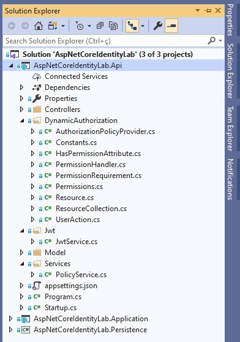
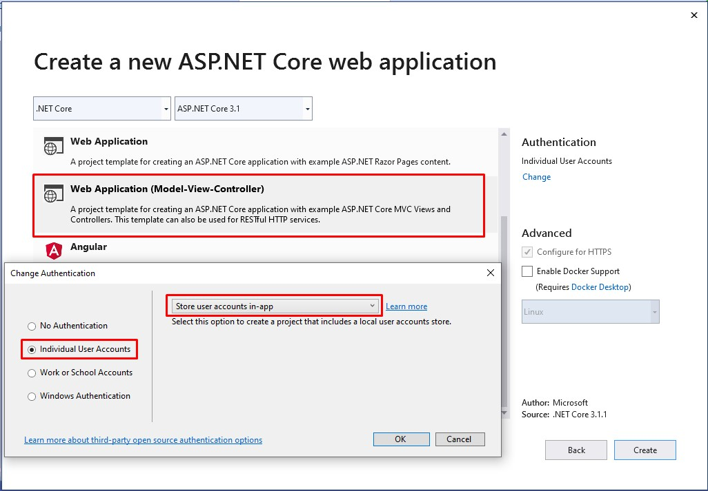
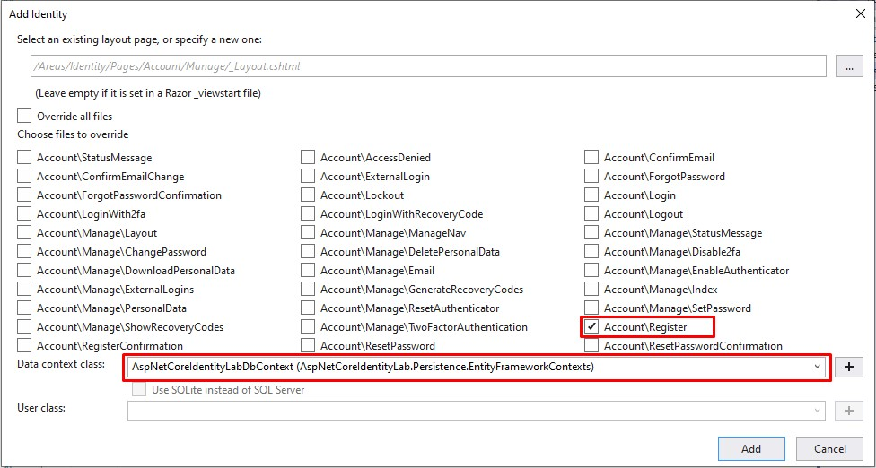

# ASP.NET Core Identity Lab

Aplicação criada com o principal objetivo de explorar as funcionalidades e características do ASP.NET Core Identity.

Nesta aplicação, vários cenários reais de uso foram testados baseados em uma mini aplicação.

Após os estudos de caso, as principais conclusões foram documentadas neste arquivo e servem como referência e fonte de consulta futura.


## Índice

* [Pré-requisitos](#pre-requisitos)
* [Como iniciar?](#como-iniciar)
* [Requisitos do projeto](#requisitos-do-projeto)
* [Modelo padrão de banco de dados](#modelo-padrão-de-banco-de-dados)
* [Estrutura do projeto](#estrutura-do-projeto)
    * [Versões utilizadas](#versões-utilizadas)
    * [AspNetCoreIdentityLab-Api](#AspNetCoreIdentityLab-Api)
    * [AspNetCoreIdentityLab-Application](#AspNetCoreIdentityLab-Application)
    * [AspNetCoreIdentityLab-Persistence](#AspNetCoreIdentityLab-Persistence)
* [Autenticação x Autorização](#autenticação-x-autorização)
* [Configuração básica do Identity](#configuração-básica-do-identity) 
    * [IdentityOptions](#IdentityOptions)
    * [Identity em um projeto novo](#identity-em-um-projeto-novo)
    * [Identity em um projeto MVC existente](#identity-em-um-projeto-mvc-existente)
* [Customização do banco de dados do Identity](#customização-do-banco-de-dados-do-identity)
* [Entity Framework x Outra persistência](#entity-framework-x-outra-persistência)
* [SignManager x UserManager x RoleManager](#signmanager-x-usermanager-x-rolemanager)
* [Identity Scaffolded Pages](#identity-scaffolded-pages)
* [Registrando um usuário](#registrando-um-usuário)
    * [Como customizar atributos de usuário?](#como-customizar-atributos-de-usuário)
    * [Regras de registro customizadas](#regras-de-registro-customizadas)
    * [Confirmação de conta por email](#confirmação-de-conta-por-email)

## Pré-requisitos

O que precisa ser instalado na máquina para estender e depurar o projeto:

    Visual Studio Community 2019;
    Net Core SDK 3.1;
    SQL Server

## Como iniciar?

* Instale e/ou configure todos os pré-requisitos mencionados acima;
* Clone o repositório na máquina local;
* Crie as bases de dados utilizadas na aplicação: AspNetCoreIdentityLab, AspNetCoreIdentityLabCustomModel e Authentication;
* Baixe as dependências do Nuget para a solução no Visual Studio;
* Execute as migrações para o banco de dados desejado com o comando: Update-Database -Context [ClassName of context];
* Execute o projeto AspNetCoreIdentityLab.Application MVC;

## Requisitos do projeto

Para experimentar os recursos do ASP.NET Core Identity e estabelecer as melhores e mais eficientes práticas de uso, alguns requisitos foram estabelecidos.

Esses requisitos visam aproximar o estudo de caso de um cenário de uso real, onde várias características do framework devem ser exploradas.

Abaixo estão listados quais requisitos a solução atende:

    Uso de email ou username para login;
	Customizar dados de usuários;
    Confirmação de criação de conta por email;
    Explorar IdentityOptions;
    Relembrar, recuperar e trocar senha;
    Password Hashing;
    Password Rotation;
    Captchas;
    Two Factor Authentication (2FA);
    Provedor externo de autenticação (Google, Facebook, etc);
    Bloqueio de logins concorrentes;
    Identificar acessos de diferentes ips;
    Política de senhas;
    Política de email e username;
    Alterar o schema padrão de banco de dados;
    Uso de diferentes banco de dados;
    Mecanismo de persistência customizado;
    API de autenticação;
    Log de execução;
    Roles;
    Claims;
    Policies;
    Grupos de usuários;
    Autorizações dinâmicas (Módulos, submódulos e funcionalidades);
    API de autorização;

## Modelo padrão de banco de dados

O banco de dados padrão do ASP.NET Core Identity consiste nas seguintes entidades:

|**Entidade**       |**Descrição**                                                     |
|-------------------|------------------------------------------------------------------|
|  AspNetUsers      | Representa o usuário                                             |
|  AspNetRoles      | Representa uma Role                                              |
|  AspNetUserClaims | Representa uma Claim que o usuário possui                        |
|  AspNetUserTokens | Representa um token de autenticação para o usuário               |
|  AspNetUserLogins | Associa o usuário com um login                                   |
|  AspNetRoleClaims | Representa uma Claim relacionada a todos os usuários de uma Role |
|  AspNetUserRoles  | Uma entidade associativa que relaciona usuários e Roles          |

Os tipos de entidade estão relacionados entre si das seguintes maneiras:

* Cada usuário pode ter vários UserClaims;
* Cada usuário pode ter vários UserLogins;
* Cada usuário pode ter vários UserTokens;
* Cada Role pode ter várias RoleClaims associados;
* Cada usuário pode ter várias Roles associadas e cada Role pode ser associada a vários usuários. Este é um relacionamento muitos para muitos que requer uma tabela associativa no banco de dados. A tabela associativa é representada pela entidade AspNetUserRoles.


## Estrutura do projeto

A solução `AspNetCoreIdentityLab` é dividida em três projetos: `AspNetCoreIdentityLab.Api`, `AspNetCoreIdentityLab.Application` e `AspNetCoreIdentityLab.Persistence`. Nas próximas seções os projetos são detalhados.

### Versões utilizadas

>Net Core 3.1

>[ASP.NET Core Identity UI 3.1.1](https://www.nuget.org/packages/Microsoft.AspNetCore.Identity.UI/3.1.1)

>[VisualStudio Web CodeGeneration Design 3.1.4](https://www.nuget.org/packages/Microsoft.VisualStudio.Web.CodeGeneration.Design/3.1.4)

>[Entity Framework Core 3.1.7](https://www.nuget.org/packages/Microsoft.EntityFrameworkCore/3.1.7)

>[Entity.Framework.Core.Sql.Server 3.1.7](https://www.nuget.org/packages/Microsoft.EntityFrameworkCore.SqlServer/3.1.7)

>[Microsoft.EntityFrameworkCore.Tools 3.1.7](https://www.nuget.org/packages/Microsoft.EntityFrameworkCore.Tools/3.1.7)

>[Microsoft.Extensions.Logging.Console 3.1.7](https://www.nuget.org/packages/Microsoft.Extensions.Logging.Console/3.1.7)

>[Microsoft.AspNetCore.Authentication.Facebook 3.1.10](https://www.nuget.org/packages/Microsoft.AspNetCore.Authentication.Facebook/3.1.10)

>[Microsoft.AspNetCore.Authentication.Google 3.1.10](https://www.nuget.org/packages/Microsoft.AspNetCore.Authentication.Google/3.1.10)

>[Dapper 2.0.35](https://www.nuget.org/packages/Dapper/2.0.35)

>[Microsoft.AspNetCore.Authentication.JwtBearer 3.1.11](https://www.nuget.org/packages/Microsoft.AspNetCore.Authentication.JwtBearer/3.1.11)

### AspNetCoreIdentityLab-Api

É uma `ASP.NET Core Web Application` com **API template** que tem a responsabilidade de expor uma api rest para autenticação e autorização.



A principais namespaces são: `Controllers`, `DynamicAuthorization`, `Jwt`, `Model` e `Services`.

* [Controllers](./AspNetCoreIdentityLab.Api/Controllers): classes que representam os endpoints da api de autenticação e autorização.

* [DynamicAuthorization](./AspNetCoreIdentityLab.Api/DynamicAuthorization): classes usadas para modelar a autorização dinâmica que podem ser usadas para autorizar módulos, submódulos e funcionalidades sem a necessidade de criar novas políticas no código-fonte.

* [Jwt](./AspNetCoreIdentityLab.Api/Jwt): classes responsáveis por gerar o JWT Token.

* [Model](./AspNetCoreIdentityLab.Api/Model): classes que representam os dados da api usados nos controllers.

* [Services](./AspNetCoreIdentityLab.Api/Services): classes que encapsulam regras mais complexas usadas nos controllers.

### AspNetCoreIdentityLab-Application

É uma `ASP.NET Core Web Application` com **MVC template** que tem a responsabilidade de manter as funcionalidade de registro de usuário, login de usuário, Two-Factor Authentication (2FA), etc.


As principais namespaces são: `Pages`, `Controllers`, `CustomAuthorization`, `Models`, `Services` e `Views`.

* [Pages](./AspNetCoreIdentityLab.Application/Areas/Identity/Pages): razor pages com as funcionalidades do ASP.NET Core Identity. Estas funcionalides foram geradas pela ferramenta scaffold do ASP.NET Core;

* [Controllers](./AspNetCoreIdentityLab.Application/Controllers): alguns controladores usados para autorização e impersonation user;

* [CustomAuthorization](./AspNetCoreIdentityLab.Application/CustomAuthorization): classes usadas para criar políticas de autorização customizadas e atributos de autorização customizados;

* [Models](./AspNetCoreIdentityLab.Application/Models): models usados no impersonation user;

* [Services](./AspNetCoreIdentityLab.Application/Services): classes que implementam regras mais complexas usadas nos controladores;

* [Views](./AspNetCoreIdentityLab.Application/Views): algumas views compartilhadas usadas na aplicação.

### AspNetCoreIdentityLab-Persistence

É uma `.Net Core Class Library` que tem a responsabilidade de manter as configurações do EF Core e realizar as operações nas bases de dados.


As principais namespaces são: `DataTransferObjects`, `EntityFrameworkContexts` e `Migrations`.

* [DataTransferObjects](./AspNetCoreIdentityLab.Persistence/DataTransferObjects): classes que representam os models que mapeiam as tabelas em cada banco de dados.

* [EntityFrameworkContexts](./AspNetCoreIdentityLab.Persistence/EntityFrameworkContexts): classes que configuram a conexão com os banco de dados. Neste estudo de caso, três bancos de dados são utilizados.

* [Migrations](./AspNetCoreIdentityLab.Persistence/Migrations): classes que representam as migrações que serão aplicadas em cada banco de dados.

## Autenticação x Autorização

>**Autenticação:** O processo que responde à pergunta: quem é você no aplicativo?

>**Autorização:** O processo que responde à pergunta: O que você pode fazer no aplicativo?

## Configuração básica do Identity

Nesta seção serão mostradas as opções e instruções básicas para configurar o ASP.NET Core Identity em um projeto.

### IdentityOptions

Representa as opções que você pode usar para configurar o ASP.NET Core Identity.

**ClaimsIdentity**
* `RoleClaimType`: define a ClaimType usada pelas Roles;
* `UserNameClaimType`: define a ClaimType usada pelo username;
* `UserIdClaimType`: define a ClaimType usada pelo UserId;
* `SecurityStampClaimType`: define a ClaimType usada pelo SecurityStamp;

**User**
* `AllowedUserNameCharacters`: configura o conjunto de caracteres que podem ser usadas na criação do username. Valor padrão: abcdefghijklmnopqrstuvwxyzABCDEFGHIJKLMNOPQRSTUVWXYZ0123456789-._@+;
* `RequireUniqueEmail`: define se um email único deve ser informado por um usuário na criação de uma conta. Valor padrão: false;

**Password**
* `RequiredLength`: define o tamanho mínimo para a senha. Valor padrão: 6;
* `RequiredUniqueChars`: define o número mínimo de caracteres únicos que devem ser usadas na senha. Valor padrão: 1;
* `RequireNonAlphanumeric`: define se caracteres especiais devem ser usados na senha. Valor padrão: true;
* `RequireLowercase`: define se caracteres minúsculos devem ser usados na senha. Valor padrão: true;
* `RequireUppercase`: define se caracteres maiúsculos devem ser usados na senha. Valor padrão: true;
* `RequireDigit`: define se caracteres numéricos devem ser usados na senha. Valor padrão: true;

**Lockout**
* `AllowedForNewUsers`: define se um usuário novo pode ser bloqueado. Valor padrão: true;
* `MaxFailedAccessAttempts`: define o número de tentativas de acesso malsucedidas permitidas antes de um usuário ser bloqueado. Valor padrão: 5;
* `DefaultLockoutTimeSpan`: define o período de bloqueio para um usuário. Valor padrão: 5 minutos;

**SignIn**
* `RequireConfirmedEmail`: define se um e-mail confirmado é necessário para logar. Valor padrão: false;
* `RequireConfirmedPhoneNumber`: define se um número de telefone confirmado é necessário para logar. Valor padrão: false;
* `RequireConfirmedAccount`: define se uma conta confirmada é necessária para logar.. Valor padrão: false;

**Tokens**
* `ProviderMap`: define os valores que serão usados para construir UserTokenProviders com a chave usada como providerName. Valor padrão: Empty;
* `EmailConfirmationTokenProvider`: define o nome do provider usado para gerar tokens **no processo de confirmação de email** do usuário. Valor padrão: Default;
* `PasswordResetTokenProvider`: define o nome do provider usado para gerar tokens **no processo de troca de senha** do usuário. Valor padrão: Default;
* `ChangeEmailTokenProvider`: define o nome do provider usado para gerar tokens **no processo de troca de email** do usuário. Valor padrão: Default;
* `ChangePhoneNumberTokenProvider`: define o nome do provider usado para gerar tokens **no processo de troca de número de telefone** do usuário. Valor padrão: Phone;
* `AuthenticatorTokenProvider`: define o nome do provider usado para **validar 2FA numbers**. Valor padrão: Authenticator;
* `AuthenticatorIssuer`: define o nome do issuer usado para o authenticator issuer. Valor padrão: Microsoft.AspNetCore.Identity.UI;

**Stores**
* `MaxLengthForKeys`: se utiliza um número positivo, configura o tamanho usado no OnModelCreating para definir o tamanho máximo para propriedades do tipo chave, como o campo UserId;
* `ProtectPersonalData`: define se todos os dados de identificação pessoal dos usuários devem ser protegidos;

### Identity em um projeto novo

Para usar o ASP.NET Core Identity em um novo projeto, algumas configurações precisam ser feitas durante e após a criação do projeto.

Um **Asp Net Core Web Application** projeto precisa ser criado usando as opções da imagem:



Depois disso, a string de conexão do banco de dados precisa ser alterada em `appsettings.json` e as migrações executadas com o comando `Update-Database`.

No entanto, o autor **recomenda separar a lógica de acesso ao banco de dados da lógica do aplicativo**. O objetivo é organizar melhor a solução de acordo com o [princípio SRP](https://blog.cleancoder.com/uncle-bob/2014/05/08/SingleReponsibilityPrinciple.html).

Para isso, um projeto de acesso a dados precisa ser criado e o projeto de aplicação com o ASP.NET Core Identity deve usar esta camada de acesso a dados.

Para usar um projeto separado de acesso a dados é necessário adicionar um [projeto do tipo class library](./AspNetCoreIdentityLab.Persistence). Este projeto fará o acesso ao banco de dados e contém as dependências do Entity Framework ou outra persistência.

A solução neste repositório usa um projeto de acesso a dados separado, por isso é um bom exemplo de uso. No entanto, para simplificar a configuração da solução, algumas etapas estão listadas abaixo:

* Remova **ApplicationDbContext** do projeto ASP.NET Core MVC;
* Remova a pasta **Migrations** do projeto ASP.NET Core MVC;
* Remova a pasta **Data** do projeto ASP.NET Core MVC;
* Remova **Connection Strings** do arquivo `appsettings.json`;
* Adicionar um projeto de **acesso à dados** do tipo class library e suas [dependências](#versões-utilizadas) à solução;
* Adicione uma **referência ao projeto** de persistência criado acima no projeto ASP.NET Core MVC;
* Altere a configuração do **DbContext** em `ConfigureServices` na classe` Startup.cs` para usar o DbContext criado no projeto de persistência;
* Adicionar um **user model** que herda da classe** ASP.NET Core `IdentityUser`;
* Execute o comando Add-Migration para criar a migração;
* Execute o comando Update-Database para criar a [estrutura de banco de dados do Identity](#modelo-padrão-de-banco-de-dados);

** É possível alterar os tipos de chaves nos models User e IdentityRole. Isso é útil para alterar o tipo destes campos no banco de dados. Abaixo são mostrados exemplos dos models User e IdentityRole com chaves do tipo int.

``` C#
public class User : IdentityUser<int>
{
    
}

public class AspNetCoreIdentityLabDbContext : IdentityDbContext<User, IdentityRole<int>, int>
{
    private const string ConnectionString = "";

    protected override void OnConfiguring(DbContextOptionsBuilder optionsBuilder)
    {
        if (optionsBuilder.IsConfigured) return;

        optionsBuilder.UseSqlServer(ConnectionString);
    }
}
```

Como foi dito o projeto [AspNetCoreIdentityLab.Persistence](./AspNetCoreIdentityLab.Persistence) neste repositório é um bom exemplo de projeto de persistência a ser seguido;

### Identity em um projeto MVC existente

* Adicionar [ASP.NET Core Identity Entity Framework Core](https://www.nuget.org/packages/Microsoft.AspNetCore.Identity.EntityFrameworkCore) ao projeto;
* Adicionar [Entity Framework Core SqlServer](https://www.nuget.org/packages/Microsoft.EntityFrameworkCore.SqlServer) ao projeto;
* Adicionar [Entity Framework Core Tools](https://www.nuget.org/packages/Microsoft.EntityFrameworkCore.Tools) ao projeto;
* Adicionar [User model](./AspNetCoreIdentityLab.Persistence/DataTransferObjects/User.cs) ao projeto;
* Adicionar [DbContext](./AspNetCoreIdentityLab.Persistence/EntityFrameworkContexts/AspNetCoreIdentityLabDbContext.cs) ao projeto;
* Adicionar o código abaixo no método `ConfigureServices` na classe `Startup.cs`;
``` C#
services.AddDefaultIdentity<YourUserModel>()
        .AddEntityFrameworkStores<YourDbContext>()
        .AddDefaultTokenProviders();
```
* Adicionar o código abaixo no método `Configure` na classe `Startup.cs`;
``` C#
app.UseAuthentication();
```
* Executar o comando Add-Migration para criar a migração do Identity;
* Executar o comando Update-Database para criar a [estrutura de banco de dados do Identity](#modelo-padrão-de-banco-de-dados);

## Customização do banco de dados do Identity

E se o desenvolvedor precisar alterar o nome das tabelas? Usar outro nome de esquema ou usar um banco de dados separado para autenticação? Como o desenvolvedor deve proceder?

É possível usar a EF Core Fluent API e a configuração do DBContext para alterar a estrutura de banco de dados padrão do ASP.NET Core Identity. Coisas como um nome de esquema diferente ou nomes de tabelas diferentes.

Para isso, os nomes das tabelas e esquema personalizados são mostrados [neste DBContext](./AspNetCoreIdentityLab.Persistence/EntityFrameworkContexts/AspNetCoreIdentityLabCustomModelDbContext.cs). Uma [migração relacionada](./AspNetCoreIdentityLab.Persistence/Migrations/AspNetCoreIdentityLabCustomModel/20210112191330_DatabaseInitialStructure.cs) foi criada para gerar uma estrutura de banco de dados inicial.

Também é possível usar bancos de dados diferentes. Um exemplo é mostrado em [API de autenticação](#autenticação-rest-api) e [API de autorização](#autorização-rest-api) que usa bancos de dados diferentes com DBContexts diferentes para armazenar os dados.

Outras informações para personalizar o banco de dados do ASP.NET Core Identity podem ser encontradas neste [excelente guia](https://docs.microsoft.com/en-US/aspnet/core/security/authentication/customize-identity-model?view=aspnetcore-3.1).

## Entity Framework x Outra persistência

A maior parte do conteúdo sobre ASP.NET Core Identity recomenda o uso de [Entity Framework Core](https://github.com/stenionobres/EntityFrameworkCoreLab) como mecanismo de persistência.

No entanto, é possível usar outro mecanismo de persistência para manipular os dados do usuário. Para isso é necessário implementar algumas interfaces nomeadas com o sufixo [Store](https://github.com/dotnet/aspnetcore/tree/master/src/Identity/Extensions.Core/src): IUserStore, IUserLoginStore, IUserClaimStore, IUserPasswordStore, IStampSecurity , IUserEmailStore, IUserLockoutStore, IUserPhoneNumberStore, IQueryableUserStore, IUserTwoFactorStore, IUserAuthenticationTokenStore, IUserAuthenticatorKeyStore, IUserTwoFactorReceryCodeStore, IRoleStoreClaimorecoveryCodeStore, IRoleStoreClaimorecoveryCodeStore, IRoleStoreClaimorecoveryCodeStore. Essas interfaces são usadas pelas classes **SignInManager**, **UserManager** e **RoleManager** para manipular os dados armazenados pelo ASP.NET Core Identity.

Para exemplificar esse recurso uma implementação usando o micro-ORM [Dapper](https://github.com/StackExchange/Dapper) foi feita. Mas, outro mecanismo de persistência pode ser usado como [ADO.NET](https://docs.microsoft.com/en-US/dotnet/framework/data/adonet/ado-net-code-examples) or [Cosmos DB](https://docs.microsoft.com/en-us/azure/cosmos-db/).

Para isso uma opção chamada `PersistenceWithDapper` foi adicionada em `appsettings.json`, quando o valor é verdadeiro as classes [UserStoreService](./AspNetCoreIdentityLab.Application/Services/UserStoreService.cs) e [UserStore](./AspNetCoreIdentityLab.Persistence/IdentityStores/UserStore.cs) são carregadas pela injeção de dependência do ASP.NET Core.

Com base nisso, as classes `SignInManager` e` UserManager` podem usar a nova classe de persistência. É importante dizer que a classe `UserStoreService` não implementa todas as interfaces de armazenamento, **apenas as interfaces necessárias para o processo de registro e login do usuário**.

Para mais detalhes sobre o design original no ASP.NET Core Identity as classes [UserStoreBase](https://github.com/dotnet/aspnetcore/blob/master/src/Identity/Extensions.Stores/src/UserStoreBase.cs), [UserStore](https://github.com/dotnet/aspnetcore/blob/master/src/Identity/EntityFrameworkCore/src/UserStore.cs), [RoleStoreBase](https://github.com/dotnet/aspnetcore/blob/master/src/Identity/Extensions.Stores/src/RoleStoreBase.cs) and [RoleStore](https://github.com/dotnet/aspnetcore/blob/master/src/Identity/EntityFrameworkCore/src/RoleStore.cs) podem ser verificadas.

>Uma forma de facilitar a criação da estrutura de banco de dados, quando outro mecanismo de persistência for usado com um banco de dados relacional, é configurar o projeto com Entity Framework Core, gerar a migração, aplicar a migração com tabelas e campos no banco de dados e depois remover a dependência com o EF Core para só então usar outro mecanismo de persistência como mostrado acima.

## SignManager x UserManager x RoleManager

O objetivo desta seção é falar sobre as classes de serviços mais importantes do Identity: SignManager, UserManager e RoleManager.

Essas classes são responsáveis por gerenciar todo o processo de persistência de usuários, autenticação e lidar com Roles e Claims. Entender os principais serviços dessas classes é essencial para usar corretamente o ASP.NET Core Identity. Ao longo desta documentação, muitos exemplos de como usar essas classes serão mostrados.

* **SignManager**: fornece as APIs para login do usuário;
* **UserManager**: fornece as APIs para gerenciar o usuário e sua persistência;
* **RoleManager**: fornece as APIs para gerenciar Roles e sua persistência.

## Identity Scaffolded Pages

Uma maneira de acessar muitos exemplos de código do ASP.NET Core Identity é usar os **Scaffolded Items**. Este recurso fornece código-fonte e páginas que implementam diversos processos como: registrar usuário, esquecer a senha, alterar a senha, etc.

As imagens abaixo mostram como acessar este recurso:


Essas opções podem ser úteis para saber como muitos desses processos são implementados usando o ASP.NET Core Identity. Muitos dos recursos apresentados neste guia usaram páginas de scaffold. O código gerado pode ser acessado no namespace [Account](./AspNetCoreIdentityLab.Application/Areas/Identity/Pages/Account).

## Registrando um usuário

Para registrar um usuário com ASP.NET Core Identity uma instância da classe `UserManager` com o método `CreateAsync` deve ser usada.

``` C#
var user = new User { UserName = "Username", Email = "Email" };
var result = await _userManager.CreateAsync(user, "Password");
if (result.Succeeded)
{

}
```

O campo de nome de usuário pode ser preenchido com um e-mail ou nome de usuário alfanumérico, por exemplo: username@email.com ou exampleofusername. **No entanto, o uso de um e-mail como nome de usuário é mais recomendado**. O objetivo de um e-mail como nome de usuário é facilitar a recuperação da senha e notificar o usuário quando preciso.

Uma maneira simples de acessar um código-fonte do processo de registro é gerar uma página scaffold. A imagem abaixo mostra a opção para gerar a página de registro:



É importante dizer que é necessário escolher o DbContext para gerar a página. O código fonte gerado pode ser acessado em [Register.cshtml](./AspNetCoreIdentityLab.Application/Areas/Identity/Pages/Account/Register.cshtml) e [Register.cshtml.cs](./AspNetCoreIdentityLab.Application/Areas/Identity/Pages/Account/Register.cshtml.cs).

### Como customizar atributos de usuário?

O ASP.NET Core Identity fornece recursos para personalizar os atributos do usuário. Para isso, o modelo do usuário deve ser estendido. O exemplo abaixo mostra o campo personalizado `Occupation`:

``` C#
public class User : IdentityUser<int>
{
    public string Occupation { get; set; }
}
```

O campo `Occupation` é adicionado em conjunto com os campos padrões do usuário mostrados em [Modelo padrão de banco de dados](#modelo-padrão-de-banco-de-dados). Para aplicar o campo padrão ao banco de dados uma migração deve ser criada e executada.

### Regras de registro customizadas

Em muitos casos, é necessário adicionar regras personalizadas a serem aplicadas no registro do usuário. Essas regras mudam de negócio para negócio.

Para adicionar regras personalizadas, a interface `IUserValidator <TUser>` deve ser usada. Um exemplo é mostrado na classe [CustomUserValidator](./AspNetCoreIdentityLab.Application/IdentityValidators/CustomUserValidator.cs). Este exemplo mostra uma regra de que o nome de usuário deve ter pelo menos 6 caracteres.

A regra personalizada é configurada no método `ConfigureServices` na classe [Startup](./AspNetCoreIdentityLab.Application/Startup.cs).

### Confirmação de conta por email

ASP.NET Core Identity fornece confirmação de conta por email, para isso algumas configurações são necessárias. Inicialmente, as opções de `SignIn` em` IdentityOptions` devem ser alteradas.

``` C#
identityOptions.SignIn.RequireConfirmedAccount = true;
identityOptions.SignIn.RequireConfirmedEmail = true;
```

Uma classe que implementa a interface `IEmailSender` deve ser criada. Esta classe deve usar algumas credenciais SMTP por exemplo [SendGrid](https://sendgrid.com/).

Com o objetivo de apresentar uma ideia de desenvolvimento o [Gmail](https://www.hostinger.com.br/tutoriais/aprenda-a-utilizar-o-smtp-google/) SMTP foi usado nesse projeto. A classe [EmailSmtpSender](./AspNetCoreIdentityLab.Application/EmailSenders/EmailSmtpSender.cs) mostra como o email pode ser enviado.

As credenciais do SMTP foram salvas usando o [Secret Manager tool](https://docs.microsoft.com/en-us/aspnet/core/security/app-secrets?view=aspnetcore-3.1&tabs=windows). Este recurso pode ser acessado com o botão direito no projeto AspNetCoreIdentityLab.Application opção **Manage User Secrets**, isto é mostrado na imagem abaixo:


O código fonte usa uma configuração no `secrets.json` como essa:

``` JSON
{
    "EmailSmtpSender": {
        "Host": "smtp.gmail.com",
        "Port": 587,
        "EnableSSL": true,
        "UserName": "yourEmailAddress",
        "Password": "yourEmailPassword"
    }
}
```

A configuração abaixo é usada no `ConfigureServices` método na classe `Startup`:

``` C#
services.AddTransient<IEmailSender, EmailSmtpSender>(email => GetEmailConfiguration());
```

Na classe [Register](./AspNetCoreIdentityLab.Application/Areas/Identity/Pages/Account/Register.cshtml.cs) é apresentado um exemplo que usa as opções `SignIn` para enviar um email de confirmação de criação de conta.

>É importante saber que se já houver contas criadas sem confirmação de e-mail e a configuração for alterada para account confirmation, essas contas não farão login. O valor do campo **EmailConfirmed na tabela AspNetUsers** deve ser alterado para o valor = 1.