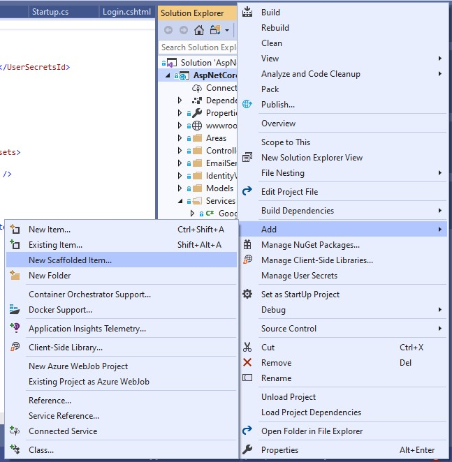
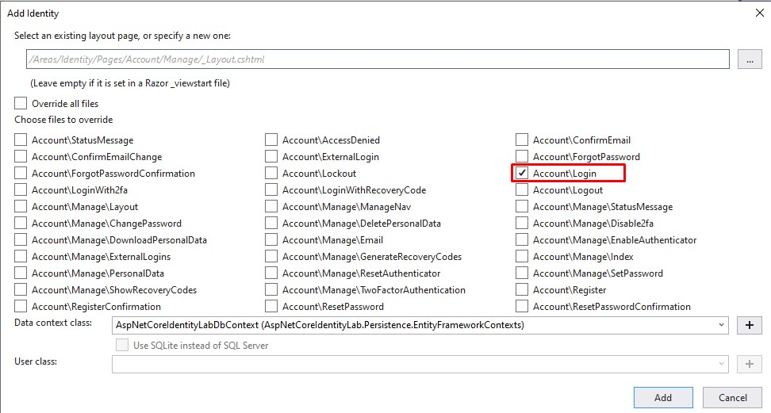
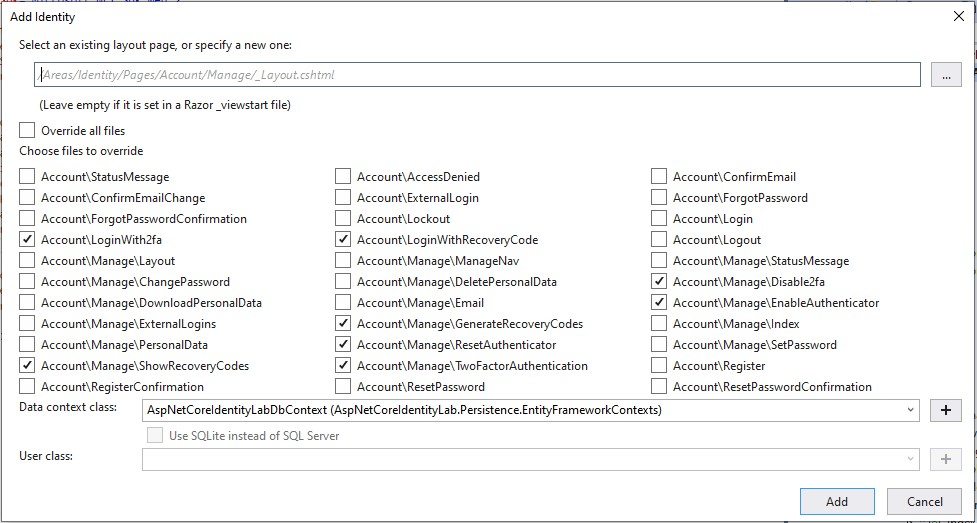
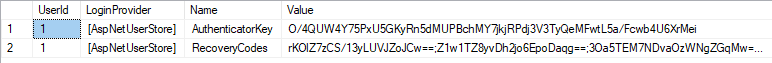
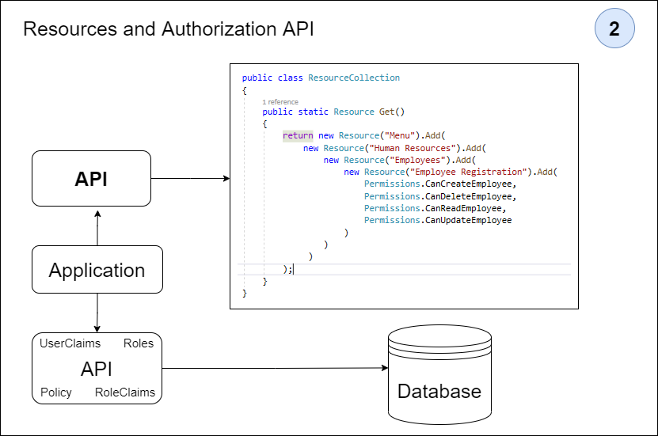
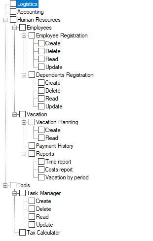
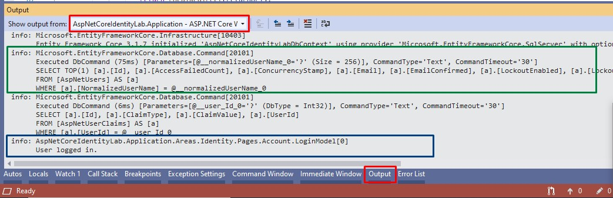

# ASP.NET Core Identity Lab

Aplicação criada com o principal objetivo de explorar as funcionalidades e características do ASP.NET Core Identity.

Nesta aplicação, vários cenários reais de uso foram testados baseados em uma mini aplicação.

Após os estudos de caso, as principais conclusões foram documentadas neste arquivo e servem como referência e fonte de consulta futura.


## Índice

* [Pré-requisitos](#pre-requisitos)
* [Como iniciar?](#como-iniciar)
* [Requisitos do projeto](#requisitos-do-projeto)
* [Modelo padrão de banco de dados](#modelo-padrão-de-banco-de-dados)
* [Estrutura do projeto](#estrutura-do-projeto)
    * [Versões utilizadas](#versões-utilizadas)
    * [AspNetCoreIdentityLab-Api](#AspNetCoreIdentityLab-Api)
    * [AspNetCoreIdentityLab-Application](#AspNetCoreIdentityLab-Application)
    * [AspNetCoreIdentityLab-Persistence](#AspNetCoreIdentityLab-Persistence)
* [Autenticação x Autorização](#autenticação-x-autorização)
* [Configuração básica do Identity](#configuração-básica-do-identity) 
    * [IdentityOptions](#IdentityOptions)
    * [Identity em um projeto novo](#identity-em-um-projeto-novo)
    * [Identity em um projeto MVC existente](#identity-em-um-projeto-mvc-existente)
* [Customização do banco de dados do Identity](#customização-do-banco-de-dados-do-identity)
* [Entity Framework x Outra persistência](#entity-framework-x-outra-persistência)
* [SignManager x UserManager x RoleManager](#signmanager-x-usermanager-x-rolemanager)
* [Identity Scaffolded Pages](#identity-scaffolded-pages)
* [Registrando um usuário](#registrando-um-usuário)
    * [Como customizar atributos de usuário?](#como-customizar-atributos-de-usuário)
    * [Regras de registro customizadas](#regras-de-registro-customizadas)
    * [Confirmação de conta por email](#confirmação-de-conta-por-email)
* [Autenticando um usuário](#autenticando-um-usuário)
    * [Remember x Recover x Reset password](#remember-x-recover-x-reset-password)
    * [Password Hashing](#password-hashing)
    * [Password Rotation](#password-rotation)
    * [Logins concorrentes](#logins-concorrentes)
    * [Expirar sessão de login](#expirar-sessão-de-login)
    * [Bloqueio de conta](#bloqueio-de-conta)
    * [Google reCaptcha](#google-recaptcha)
    * [Autenticação de dois fatores 2FA](#autenticação-de-dois-fatores-2FA)
    * [Autenticação com provedores externos](#autenticação-com-provedores-externos)
    * [Identificando logins do mesmo usuário de diferentes IPS](#identificando-logins-do-mesmo-usuário-de-diferentes-IPS)
    * [User Impersonation](#user-impersonation)
* [Autorizando um usuário](#autorizando-um-usuário)
    * [Claims](#claims)
    * [Roles](#roles)
    * [Policies](#policies)
    * [Serviço de autorização](#serviço-de-autorização)
    * [Atributo de autorização customizado](#atributo-de-autorização-customizado)
* [Api REST de autenticação](#api-rest-de-autenticação)
    * [Configuração](#configuração)
    * [Json Web Token (JWT)](#json-web-token-jwt)
    * [Recursos da API](#recursos-da-api)
* [Api REST de autorização](#api-rest-de-autorização)
* [Autorizações dinâmicas](#autorizações-dinâmicas)
    * [Tipos de autorização](#tipos-de-autorização)
    * [Como as autorizações dinâmicas funcionam?](#como-as-autorizações-dinâmicas-funcionam)
    * [Estrutura das classes de recurso](#estrutura-das-classes-de-recurso)
    * [Estrutura do banco de dados](#estrutura-do-banco-de-dados)
* [Log de ações](#log-de-ações)

## Pré-requisitos

O que precisa ser instalado na máquina para estender e depurar o projeto:

    Visual Studio Community 2019;
    Net Core SDK 3.1;
    SQL Server

## Como iniciar?

* Instale e/ou configure todos os pré-requisitos mencionados acima;
* Clone o repositório na máquina local;
* Crie as bases de dados utilizadas na aplicação: AspNetCoreIdentityLab, AspNetCoreIdentityLabCustomModel e Authentication;
* Baixe as dependências do Nuget para a solução no Visual Studio;
* Execute as migrações para o banco de dados desejado com o comando: Update-Database -Context [ClassName of context];
* Execute o projeto AspNetCoreIdentityLab.Application MVC;

## Requisitos do projeto

Para experimentar os recursos do ASP.NET Core Identity e estabelecer as melhores e mais eficientes práticas de uso, alguns requisitos foram estabelecidos.

Esses requisitos visam aproximar o estudo de caso de um cenário de uso real, onde várias características do framework devem ser exploradas.

Abaixo estão listados quais requisitos a solução atende:

    Uso de email ou username para login;
	Customizar dados de usuários;
    Confirmação de criação de conta por email;
    Explorar IdentityOptions;
    Relembrar, recuperar e trocar senha;
    Password Hashing;
    Password Rotation;
    Captchas;
    Autenticação de dois fatores (2FA);
    Provedor externo de autenticação (Google, Facebook, etc);
    Bloqueio de logins concorrentes;
    Identificar acessos de diferentes ips;
    Política de senhas;
    Política de email e username;
    Alterar o schema padrão de banco de dados;
    Uso de diferentes banco de dados;
    Mecanismo de persistência customizado;
    API de autenticação;
    Log de execução;
    Roles;
    Claims;
    Policies;
    Grupos de usuários;
    Autorizações dinâmicas (Módulos, submódulos e funcionalidades);
    API de autorização;

## Modelo padrão de banco de dados

O banco de dados padrão do ASP.NET Core Identity consiste nas seguintes entidades:

|**Entidade**       |**Descrição**                                                     |
|-------------------|------------------------------------------------------------------|
|  AspNetUsers      | Representa o usuário                                             |
|  AspNetRoles      | Representa uma Role                                              |
|  AspNetUserClaims | Representa uma Claim que o usuário possui                        |
|  AspNetUserTokens | Representa um token de autenticação para o usuário               |
|  AspNetUserLogins | Associa o usuário com um login                                   |
|  AspNetRoleClaims | Representa uma Claim relacionada a todos os usuários de uma Role |
|  AspNetUserRoles  | Uma entidade associativa que relaciona usuários e Roles          |

Os tipos de entidade estão relacionados entre si das seguintes maneiras:

* Cada usuário pode ter vários UserClaims;
* Cada usuário pode ter vários UserLogins;
* Cada usuário pode ter vários UserTokens;
* Cada Role pode ter várias RoleClaims associados;
* Cada usuário pode ter várias Roles associadas e cada Role pode ser associada a vários usuários. Este é um relacionamento muitos para muitos que requer uma tabela associativa no banco de dados. A tabela associativa é representada pela entidade AspNetUserRoles.


## Estrutura do projeto

A solução `AspNetCoreIdentityLab` é dividida em três projetos: `AspNetCoreIdentityLab.Api`, `AspNetCoreIdentityLab.Application` e `AspNetCoreIdentityLab.Persistence`. Nas próximas seções os projetos são detalhados.

### Versões utilizadas

>Net Core 3.1

>[ASP.NET Core Identity UI 3.1.1](https://www.nuget.org/packages/Microsoft.AspNetCore.Identity.UI/3.1.1)

>[VisualStudio Web CodeGeneration Design 3.1.4](https://www.nuget.org/packages/Microsoft.VisualStudio.Web.CodeGeneration.Design/3.1.4)

>[Entity Framework Core 3.1.7](https://www.nuget.org/packages/Microsoft.EntityFrameworkCore/3.1.7)

>[Entity.Framework.Core.Sql.Server 3.1.7](https://www.nuget.org/packages/Microsoft.EntityFrameworkCore.SqlServer/3.1.7)

>[Microsoft.EntityFrameworkCore.Tools 3.1.7](https://www.nuget.org/packages/Microsoft.EntityFrameworkCore.Tools/3.1.7)

>[Microsoft.Extensions.Logging.Console 3.1.7](https://www.nuget.org/packages/Microsoft.Extensions.Logging.Console/3.1.7)

>[Microsoft.AspNetCore.Authentication.Facebook 3.1.10](https://www.nuget.org/packages/Microsoft.AspNetCore.Authentication.Facebook/3.1.10)

>[Microsoft.AspNetCore.Authentication.Google 3.1.10](https://www.nuget.org/packages/Microsoft.AspNetCore.Authentication.Google/3.1.10)

>[Dapper 2.0.35](https://www.nuget.org/packages/Dapper/2.0.35)

>[Microsoft.AspNetCore.Authentication.JwtBearer 3.1.11](https://www.nuget.org/packages/Microsoft.AspNetCore.Authentication.JwtBearer/3.1.11)

### AspNetCoreIdentityLab-Api

É uma `ASP.NET Core Web Application` com **API template** que tem a responsabilidade de expor uma api rest para autenticação e autorização.


A principais namespaces são: `Controllers`, `DynamicAuthorization`, `Jwt`, `Model` e `Services`.

* [Controllers](./AspNetCoreIdentityLab.Api/Controllers): classes que representam os endpoints da api de autenticação e autorização.

* [DynamicAuthorization](./AspNetCoreIdentityLab.Api/DynamicAuthorization): classes usadas para modelar a autorização dinâmica que podem ser usadas para autorizar módulos, submódulos e funcionalidades sem a necessidade de criar novas políticas no código-fonte.

* [Jwt](./AspNetCoreIdentityLab.Api/Jwt): classes responsáveis por gerar o JWT Token.

* [Model](./AspNetCoreIdentityLab.Api/Model): classes que representam os dados da api usados nos controllers.

* [Services](./AspNetCoreIdentityLab.Api/Services): classes que encapsulam regras mais complexas usadas nos controllers.

### AspNetCoreIdentityLab-Application

É uma `ASP.NET Core Web Application` com **MVC template** que tem a responsabilidade de manter as funcionalidade de registro de usuário, login de usuário, Autenticação de dois fatores (2FA), etc.


As principais namespaces são: `Pages`, `Controllers`, `CustomAuthorization`, `Models`, `Services` e `Views`.

* [Pages](./AspNetCoreIdentityLab.Application/Areas/Identity/Pages): razor pages com as funcionalidades do ASP.NET Core Identity. Estas funcionalides foram geradas pela ferramenta scaffold do ASP.NET Core;

* [Controllers](./AspNetCoreIdentityLab.Application/Controllers): alguns controladores usados para autorização e impersonation user;

* [CustomAuthorization](./AspNetCoreIdentityLab.Application/CustomAuthorization): classes usadas para criar políticas de autorização customizadas e atributos de autorização customizados;

* [Models](./AspNetCoreIdentityLab.Application/Models): models usados no impersonation user;

* [Services](./AspNetCoreIdentityLab.Application/Services): classes que implementam regras mais complexas usadas nos controladores;

* [Views](./AspNetCoreIdentityLab.Application/Views): algumas views compartilhadas usadas na aplicação.

### AspNetCoreIdentityLab-Persistence

É uma `.Net Core Class Library` que tem a responsabilidade de manter as configurações do EF Core e realizar as operações nas bases de dados.


As principais namespaces são: `DataTransferObjects`, `EntityFrameworkContexts` e `Migrations`.

* [DataTransferObjects](./AspNetCoreIdentityLab.Persistence/DataTransferObjects): classes que representam os models que mapeiam as tabelas em cada banco de dados.

* [EntityFrameworkContexts](./AspNetCoreIdentityLab.Persistence/EntityFrameworkContexts): classes que configuram a conexão com os banco de dados. Neste estudo de caso, três bancos de dados são utilizados.

* [Migrations](./AspNetCoreIdentityLab.Persistence/Migrations): classes que representam as migrações que serão aplicadas em cada banco de dados.

## Autenticação x Autorização

>**Autenticação:** O processo que responde à pergunta: quem é você no aplicativo?

>**Autorização:** O processo que responde à pergunta: O que você pode fazer no aplicativo?

## Configuração básica do Identity

Nesta seção serão mostradas as opções e instruções básicas para configurar o ASP.NET Core Identity em um projeto.

### IdentityOptions

Representa as opções que você pode usar para configurar o ASP.NET Core Identity.

**ClaimsIdentity**
* `RoleClaimType`: define a ClaimType usada pelas Roles;
* `UserNameClaimType`: define a ClaimType usada pelo username;
* `UserIdClaimType`: define a ClaimType usada pelo UserId;
* `SecurityStampClaimType`: define a ClaimType usada pelo SecurityStamp;

**User**
* `AllowedUserNameCharacters`: configura o conjunto de caracteres que podem ser usadas na criação do username. Valor padrão: abcdefghijklmnopqrstuvwxyzABCDEFGHIJKLMNOPQRSTUVWXYZ0123456789-._@+;
* `RequireUniqueEmail`: define se um email único deve ser informado por um usuário na criação de uma conta. Valor padrão: false;

**Password**
* `RequiredLength`: define o tamanho mínimo para a senha. Valor padrão: 6;
* `RequiredUniqueChars`: define o número mínimo de caracteres únicos que devem ser usadas na senha. Valor padrão: 1;
* `RequireNonAlphanumeric`: define se caracteres especiais devem ser usados na senha. Valor padrão: true;
* `RequireLowercase`: define se caracteres minúsculos devem ser usados na senha. Valor padrão: true;
* `RequireUppercase`: define se caracteres maiúsculos devem ser usados na senha. Valor padrão: true;
* `RequireDigit`: define se caracteres numéricos devem ser usados na senha. Valor padrão: true;

**Lockout**
* `AllowedForNewUsers`: define se um usuário novo pode ser bloqueado. Valor padrão: true;
* `MaxFailedAccessAttempts`: define o número de tentativas de acesso malsucedidas permitidas antes de um usuário ser bloqueado. Valor padrão: 5;
* `DefaultLockoutTimeSpan`: define o período de bloqueio para um usuário. Valor padrão: 5 minutos;

**SignIn**
* `RequireConfirmedEmail`: define se um e-mail confirmado é necessário para logar. Valor padrão: false;
* `RequireConfirmedPhoneNumber`: define se um número de telefone confirmado é necessário para logar. Valor padrão: false;
* `RequireConfirmedAccount`: define se uma conta confirmada é necessária para logar.. Valor padrão: false;

**Tokens**
* `ProviderMap`: define os valores que serão usados para construir UserTokenProviders com a chave usada como providerName. Valor padrão: Empty;
* `EmailConfirmationTokenProvider`: define o nome do provider usado para gerar tokens **no processo de confirmação de email** do usuário. Valor padrão: Default;
* `PasswordResetTokenProvider`: define o nome do provider usado para gerar tokens **no processo de troca de senha** do usuário. Valor padrão: Default;
* `ChangeEmailTokenProvider`: define o nome do provider usado para gerar tokens **no processo de troca de email** do usuário. Valor padrão: Default;
* `ChangePhoneNumberTokenProvider`: define o nome do provider usado para gerar tokens **no processo de troca de número de telefone** do usuário. Valor padrão: Phone;
* `AuthenticatorTokenProvider`: define o nome do provider usado para **validar 2FA numbers**. Valor padrão: Authenticator;
* `AuthenticatorIssuer`: define o nome do issuer usado para o authenticator issuer. Valor padrão: Microsoft.AspNetCore.Identity.UI;

**Stores**
* `MaxLengthForKeys`: se utiliza um número positivo, configura o tamanho usado no OnModelCreating para definir o tamanho máximo para propriedades do tipo chave, como o campo UserId;
* `ProtectPersonalData`: define se todos os dados de identificação pessoal dos usuários devem ser protegidos;

### Identity em um projeto novo

Para usar o ASP.NET Core Identity em um novo projeto, algumas configurações precisam ser feitas durante e após a criação do projeto.

Um **Asp Net Core Web Application** projeto precisa ser criado usando as opções da imagem:


Depois disso, a string de conexão do banco de dados precisa ser alterada em `appsettings.json` e as migrações executadas com o comando `Update-Database`.

No entanto, o autor **recomenda separar a lógica de acesso ao banco de dados da lógica do aplicativo**. O objetivo é organizar melhor a solução de acordo com o [princípio SRP](https://blog.cleancoder.com/uncle-bob/2014/05/08/SingleReponsibilityPrinciple.html).

Para isso, um projeto de acesso a dados precisa ser criado e o projeto de aplicação com o ASP.NET Core Identity deve usar esta camada de acesso a dados.

Para usar um projeto separado de acesso a dados é necessário adicionar um [projeto do tipo class library](./AspNetCoreIdentityLab.Persistence). Este projeto fará o acesso ao banco de dados e contém as dependências do Entity Framework ou outra persistência.

A solução neste repositório usa um projeto de acesso a dados separado, por isso é um bom exemplo de uso. No entanto, para simplificar a configuração da solução, algumas etapas estão listadas abaixo:

* Remova **ApplicationDbContext** do projeto ASP.NET Core MVC;
* Remova a pasta **Migrations** do projeto ASP.NET Core MVC;
* Remova a pasta **Data** do projeto ASP.NET Core MVC;
* Remova **Connection Strings** do arquivo `appsettings.json`;
* Adicionar um projeto de **acesso à dados** do tipo class library e suas [dependências](#versões-utilizadas) à solução;
* Adicione uma **referência ao projeto** de persistência criado acima no projeto ASP.NET Core MVC;
* Altere a configuração do **DbContext** em `ConfigureServices` na classe` Startup.cs` para usar o DbContext criado no projeto de persistência;
* Adicionar um **user model** que herda da classe** ASP.NET Core `IdentityUser`;
* Execute o comando Add-Migration para criar a migração;
* Execute o comando Update-Database para criar a [estrutura de banco de dados do Identity](#modelo-padrão-de-banco-de-dados);

** É possível alterar os tipos de chaves nos models User e IdentityRole. Isso é útil para alterar o tipo destes campos no banco de dados. Abaixo são mostrados exemplos dos models User e IdentityRole com chaves do tipo int.

``` C#
public class User : IdentityUser<int>
{
    
}

public class AspNetCoreIdentityLabDbContext : IdentityDbContext<User, IdentityRole<int>, int>
{
    private const string ConnectionString = "";

    protected override void OnConfiguring(DbContextOptionsBuilder optionsBuilder)
    {
        if (optionsBuilder.IsConfigured) return;

        optionsBuilder.UseSqlServer(ConnectionString);
    }
}
```

Como foi dito o projeto [AspNetCoreIdentityLab.Persistence](./AspNetCoreIdentityLab.Persistence) neste repositório é um bom exemplo de projeto de persistência a ser seguido;

### Identity em um projeto MVC existente

* Adicionar [ASP.NET Core Identity Entity Framework Core](https://www.nuget.org/packages/Microsoft.AspNetCore.Identity.EntityFrameworkCore) ao projeto;
* Adicionar [Entity Framework Core SqlServer](https://www.nuget.org/packages/Microsoft.EntityFrameworkCore.SqlServer) ao projeto;
* Adicionar [Entity Framework Core Tools](https://www.nuget.org/packages/Microsoft.EntityFrameworkCore.Tools) ao projeto;
* Adicionar [User model](./AspNetCoreIdentityLab.Persistence/DataTransferObjects/User.cs) ao projeto;
* Adicionar [DbContext](./AspNetCoreIdentityLab.Persistence/EntityFrameworkContexts/AspNetCoreIdentityLabDbContext.cs) ao projeto;
* Adicionar o código abaixo no método `ConfigureServices` na classe `Startup.cs`;
``` C#
services.AddDefaultIdentity<YourUserModel>()
        .AddEntityFrameworkStores<YourDbContext>()
        .AddDefaultTokenProviders();
```
* Adicionar o código abaixo no método `Configure` na classe `Startup.cs`;
``` C#
app.UseAuthentication();
```
* Executar o comando Add-Migration para criar a migração do Identity;
* Executar o comando Update-Database para criar a [estrutura de banco de dados do Identity](#modelo-padrão-de-banco-de-dados);

## Customização do banco de dados do Identity

E se o desenvolvedor precisar alterar o nome das tabelas? Usar outro nome de esquema ou usar um banco de dados separado para autenticação? Como o desenvolvedor deve proceder?

É possível usar a EF Core Fluent API e a configuração do DBContext para alterar a estrutura de banco de dados padrão do ASP.NET Core Identity. Coisas como um nome de esquema diferente ou nomes de tabelas diferentes.

Para isso, os nomes das tabelas e esquema personalizados são mostrados [neste DBContext](./AspNetCoreIdentityLab.Persistence/EntityFrameworkContexts/AspNetCoreIdentityLabCustomModelDbContext.cs). Uma [migração relacionada](./AspNetCoreIdentityLab.Persistence/Migrations/AspNetCoreIdentityLabCustomModel/20210112191330_DatabaseInitialStructure.cs) foi criada para gerar uma estrutura de banco de dados inicial.

Também é possível usar bancos de dados diferentes. Um exemplo é mostrado em [API de autenticação](#autenticação-rest-api) e [API de autorização](#autorização-rest-api) que usa bancos de dados diferentes com DBContexts diferentes para armazenar os dados.

Outras informações para personalizar o banco de dados do ASP.NET Core Identity podem ser encontradas neste [excelente guia](https://docs.microsoft.com/en-US/aspnet/core/security/authentication/customize-identity-model?view=aspnetcore-3.1).

## Entity Framework x Outra persistência

A maior parte do conteúdo sobre ASP.NET Core Identity recomenda o uso de [Entity Framework Core](https://github.com/stenionobres/EntityFrameworkCoreLab) como mecanismo de persistência.

No entanto, é possível usar outro mecanismo de persistência para manipular os dados do usuário. Para isso é necessário implementar algumas interfaces nomeadas com o sufixo [Store](https://github.com/dotnet/aspnetcore/tree/master/src/Identity/Extensions.Core/src): IUserStore, IUserLoginStore, IUserClaimStore, IUserPasswordStore, IStampSecurity , IUserEmailStore, IUserLockoutStore, IUserPhoneNumberStore, IQueryableUserStore, IUserTwoFactorStore, IUserAuthenticationTokenStore, IUserAuthenticatorKeyStore, IUserTwoFactorReceryCodeStore, IRoleStoreClaimorecoveryCodeStore, IRoleStoreClaimorecoveryCodeStore, IRoleStoreClaimorecoveryCodeStore. Essas interfaces são usadas pelas classes **SignInManager**, **UserManager** e **RoleManager** para manipular os dados armazenados pelo ASP.NET Core Identity.

Para exemplificar esse recurso uma implementação usando o micro-ORM [Dapper](https://github.com/StackExchange/Dapper) foi feita. Mas, outro mecanismo de persistência pode ser usado como [ADO.NET](https://docs.microsoft.com/en-US/dotnet/framework/data/adonet/ado-net-code-examples) or [Cosmos DB](https://docs.microsoft.com/en-us/azure/cosmos-db/).

Para isso uma opção chamada `PersistenceWithDapper` foi adicionada em `appsettings.json`, quando o valor é verdadeiro as classes [UserStoreService](./AspNetCoreIdentityLab.Application/Services/UserStoreService.cs) e [UserStore](./AspNetCoreIdentityLab.Persistence/IdentityStores/UserStore.cs) são carregadas pela injeção de dependência do ASP.NET Core.

Com base nisso, as classes `SignInManager` e` UserManager` podem usar a nova classe de persistência. É importante dizer que a classe `UserStoreService` não implementa todas as interfaces de armazenamento, **apenas as interfaces necessárias para o processo de registro e login do usuário**.

Para mais detalhes sobre o design original no ASP.NET Core Identity as classes [UserStoreBase](https://github.com/dotnet/aspnetcore/blob/master/src/Identity/Extensions.Stores/src/UserStoreBase.cs), [UserStore](https://github.com/dotnet/aspnetcore/blob/master/src/Identity/EntityFrameworkCore/src/UserStore.cs), [RoleStoreBase](https://github.com/dotnet/aspnetcore/blob/master/src/Identity/Extensions.Stores/src/RoleStoreBase.cs) and [RoleStore](https://github.com/dotnet/aspnetcore/blob/master/src/Identity/EntityFrameworkCore/src/RoleStore.cs) podem ser verificadas.

>Uma forma de facilitar a criação da estrutura de banco de dados, quando outro mecanismo de persistência for usado com um banco de dados relacional, é configurar o projeto com Entity Framework Core, gerar a migração, aplicar a migração com tabelas e campos no banco de dados e depois remover a dependência com o EF Core para só então usar outro mecanismo de persistência como mostrado acima.

## SignManager x UserManager x RoleManager

O objetivo desta seção é falar sobre as classes de serviços mais importantes do Identity: SignManager, UserManager e RoleManager.

Essas classes são responsáveis por gerenciar todo o processo de persistência de usuários, autenticação e lidar com Roles e Claims. Entender os principais serviços dessas classes é essencial para usar corretamente o ASP.NET Core Identity. Ao longo desta documentação, muitos exemplos de como usar essas classes serão mostrados.

* **SignManager**: fornece as APIs para login do usuário;
* **UserManager**: fornece as APIs para gerenciar o usuário e sua persistência;
* **RoleManager**: fornece as APIs para gerenciar Roles e sua persistência.

## Identity Scaffolded Pages

Uma maneira de acessar muitos exemplos de código do ASP.NET Core Identity é usar os **Scaffolded Items**. Este recurso fornece código-fonte e páginas que implementam diversos processos como: registrar usuário, esquecer a senha, alterar a senha, etc.

As imagens abaixo mostram como acessar este recurso:




Essas opções podem ser úteis para saber como muitos desses processos são implementados usando o ASP.NET Core Identity. Muitos dos recursos apresentados neste guia usaram páginas de scaffold. O código gerado pode ser acessado no namespace [Account](./AspNetCoreIdentityLab.Application/Areas/Identity/Pages/Account).

## Registrando um usuário

Para registrar um usuário com ASP.NET Core Identity uma instância da classe `UserManager` com o método `CreateAsync` deve ser usada.

``` C#
var user = new User { UserName = "Username", Email = "Email" };
var result = await _userManager.CreateAsync(user, "Password");
if (result.Succeeded)
{

}
```

O campo de nome de usuário pode ser preenchido com um e-mail ou nome de usuário alfanumérico, por exemplo: username@email.com ou exampleofusername. **No entanto, o uso de um e-mail como nome de usuário é mais recomendado**. O objetivo de um e-mail como nome de usuário é facilitar a recuperação da senha e notificar o usuário quando preciso.

Uma maneira simples de acessar um código-fonte do processo de registro é gerar uma página scaffold. A imagem abaixo mostra a opção para gerar a página de registro:


É importante dizer que é necessário escolher o DbContext para gerar a página. O código fonte gerado pode ser acessado em [Register.cshtml](./AspNetCoreIdentityLab.Application/Areas/Identity/Pages/Account/Register.cshtml) e [Register.cshtml.cs](./AspNetCoreIdentityLab.Application/Areas/Identity/Pages/Account/Register.cshtml.cs).

### Como customizar atributos de usuário?

O ASP.NET Core Identity fornece recursos para personalizar os atributos do usuário. Para isso, o modelo do usuário deve ser estendido. O exemplo abaixo mostra o campo personalizado `Occupation`:

``` C#
public class User : IdentityUser<int>
{
    public string Occupation { get; set; }
}
```

O campo `Occupation` é adicionado em conjunto com os campos padrões do usuário mostrados em [Modelo padrão de banco de dados](#modelo-padrão-de-banco-de-dados). Para aplicar o campo padrão ao banco de dados uma migração deve ser criada e executada.

### Regras de registro customizadas

Em muitos casos, é necessário adicionar regras personalizadas a serem aplicadas no registro do usuário. Essas regras mudam de negócio para negócio.

Para adicionar regras personalizadas, a interface `IUserValidator <TUser>` deve ser usada. Um exemplo é mostrado na classe [CustomUserValidator](./AspNetCoreIdentityLab.Application/IdentityValidators/CustomUserValidator.cs). Este exemplo mostra uma regra de que o nome de usuário deve ter pelo menos 6 caracteres.

A regra personalizada é configurada no método `ConfigureServices` na classe [Startup](./AspNetCoreIdentityLab.Application/Startup.cs).

### Confirmação de conta por email

ASP.NET Core Identity fornece confirmação de conta por email, para isso algumas configurações são necessárias. Inicialmente, as opções de `SignIn` em` IdentityOptions` devem ser alteradas.

``` C#
identityOptions.SignIn.RequireConfirmedAccount = true;
identityOptions.SignIn.RequireConfirmedEmail = true;
```

Uma classe que implementa a interface `IEmailSender` deve ser criada. Esta classe deve usar algumas credenciais SMTP por exemplo [SendGrid](https://sendgrid.com/).

Com o objetivo de apresentar uma ideia de desenvolvimento o [Gmail](https://www.hostinger.com.br/tutoriais/aprenda-a-utilizar-o-smtp-google/) SMTP foi usado nesse projeto. A classe [EmailSmtpSender](./AspNetCoreIdentityLab.Application/EmailSenders/EmailSmtpSender.cs) mostra como o email pode ser enviado.

As credenciais do SMTP foram salvas usando o [Secret Manager tool](https://docs.microsoft.com/en-us/aspnet/core/security/app-secrets?view=aspnetcore-3.1&tabs=windows). Este recurso pode ser acessado com o botão direito no projeto AspNetCoreIdentityLab.Application opção **Manage User Secrets**, isto é mostrado na imagem abaixo:


O código fonte usa uma configuração no `secrets.json` como essa:

``` JSON
{
    "EmailSmtpSender": {
        "Host": "smtp.gmail.com",
        "Port": 587,
        "EnableSSL": true,
        "UserName": "yourEmailAddress",
        "Password": "yourEmailPassword"
    }
}
```

A configuração abaixo é usada no `ConfigureServices` método na classe `Startup`:

``` C#
services.AddTransient<IEmailSender, EmailSmtpSender>(email => GetEmailConfiguration());
```

Na classe [Register](./AspNetCoreIdentityLab.Application/Areas/Identity/Pages/Account/Register.cshtml.cs) é apresentado um exemplo que usa as opções `SignIn` para enviar um email de confirmação de criação de conta.

>É importante saber que se já houver contas criadas sem confirmação de e-mail e a configuração for alterada para account confirmation, essas contas não farão login. O valor do campo **EmailConfirmed na tabela AspNetUsers** deve ser alterado para o valor = 1.

## Autenticando um usuário

A autenticação é o processo que responde à pergunta, **Quem é você no aplicativo?** Nesta seção, serão mostrados tópicos importantes sobre autenticação de usuário usando o ASP.NET Core Identity.

O código básico para autenticação foi baseado na página razor scaffold abaixo e pode ser visto nas classes [Login.cshtml](./AspNetCoreIdentityLab.Application/Areas/Identity/Pages/Account/Login.cshtml) e [Login.cshtml.cs](./AspNetCoreIdentityLab.Application/Areas/Identity/Pages/Account/Login.cshtml.cs).



### Remember x Recover x Reset password

As páginas scaffold destacadas na imagem abaixo são um bom exemplo de código fonte para gestão de senhas usando o ASP.NET Core Identity.


O código fonte relacionado está nos arquivos de mesmo nome dentro da namespace [Account](./AspNetCoreIdentityLab.Application/Areas/Identity/Pages/Account).

### Password Hashing

O Password Hasher padrão do ASP.NET Core Identity usa o algoritmo **PBKDF2**. A implementação usa a api [ASP.NET Core Data Protection](https://docs.microsoft.com/en-us/aspnet/core/security/data-protection/introduction?view=aspnetcore-3.1) de criptografia.

As características do Password Hasher são as seguintes:

|                 |                         |
| :-------------- | :---------------------: | 
| **Algorithm**   | PBKDF2 with HMAC-SHA256 |
| **Salt**        | 128-bit                 |
| **Subkey**      | 256-bit                 |
| **Iterations**  | 10.000                  |

O [artigo](https://andrewlock.net/exploring-the-asp-net-core-identity-passwordhasher/) de Andrew Lock apresenta mais detalhes sobre o PBKDF2 Password Hasher.

É possível alterar o algoritmo usado pelo Password Hasher. Para isso, consulte o artigo de Scott Brady [Improving the ASP.NET Core Identity Password Hasher](https://www.scottbrady91.com/ASPNET-Identity/Improving-the-ASPNET-Core-Identity-Password-Hasher). É importante dizer que a alteração do algoritmo padrão deve ser utilizada somente se sua equipe tiver bons conhecimentos sobre segurança e criptografia.

### Password Rotation

Password Rotation refere-se à alteração/redefinição de senha(s). Limitar a vida útil de uma senha reduz o risco e a eficácia de ataques e explorações baseados em senha, condensando a janela de tempo durante a qual uma senha roubada pode ser válida.

A frequência de rotação deve variar com base na idade da senha, uso e importância da segurança. Por exemplo, uma senha para uma conta de usuário padrão pode exigir apenas a rotação em `intervalos de 60 dias`, um processo que pode ser forçado através da expiração da senha.

Até o momento o ASP.NET Core Identity **não implementa Password Rotation por padrão**. Este [github issue](https://github.com/dotnet/aspnetcore/issues/5716) fala sobre o assunto.

### Logins concorrentes

Alguns aplicativos precisam bloquear sessões de login simultâneas, ou seja, o mesmo usuário não pode criar mais de uma sessão de login no aplicativo.

Esse comportamento é difícil de ser feito na maioria dos aplicativos porque para alguns cenários é complicado saber se o usuário desligou a sessão no cliente.

No momento, o ASP.NET Core Identity não oferece recursos para evitar diretamente a sessão de login simultânea. No entanto, um bom recurso para evitar a sessão de login simultânea é [Autenticação de dois fatores 2FA](#autenticação-de-dois-fatores-2FA).

### Expirar sessão de login

Um recurso que melhora a segurança em um aplicativo é forçar a expiração da sessão de login. Para implementar isso, uma configuração foi adicionada na classe [appsettings.json](./AspNetCoreIdentityLab.Application/appsettings.json) e na classe [Startup](./AspNetCoreIdentityLab.Application/Startup.cs). Abaixo o código é apresentado:

``` JSON
{
  "LoginExpireTimeInMinutes": 3 
}
```

``` C#
public void ConfigureServices(IServiceCollection services)
{
    services.ConfigureApplicationCookie(cookieOptions => GetCookieAuthenticationOptions(cookieOptions));
}

private void GetCookieAuthenticationOptions(CookieAuthenticationOptions cookieOptions)
{
    var loginExpireTimeInMinutes = Convert.ToDouble(Configuration["LoginExpireTimeInMinutes"]);

    cookieOptions.ExpireTimeSpan = TimeSpan.FromMinutes(loginExpireTimeInMinutes);
    cookieOptions.LoginPath = "/Identity/Account/Login";
    cookieOptions.SlidingExpiration = true;
}
```

Em resumo, o desenvolvedor pode alterar o tempo de expiração da sessão do usuário. A configuração é feita em minutos.

### Bloqueio de conta

Um recurso importante do ASP.NET Core Identity é o **bloqueio de conta de usuário**.

Este recurso bloqueia o login do usuário após uma série de tentativas de login sem sucesso. Este é um comportamento importante para evitar ataques de [força bruta](https://en.wikipedia.org/wiki/Brute-force_attack), no entanto, esse recurso tem uma desvantagem que é facilitar ataques de [negação de serviço](https://en.wikipedia.org/wiki/Denial-of-service_attack) caso o atacante tenha uma lista de contas de e-mail de usuário.

Para implementar esse recurso, algumas opções devem ser configuradas no arquivo [Startup.cs](./AspNetCoreIdentityLab.Application/Startup.cs) e o parâmetro `lockoutOnFailure` deve ser verdadeiro na chamada do método `PasswordSignInAsync` na classe [Login.cshtml.cs](./AspNetCoreIdentityLab.Application/Areas/Identity/Pages/Account/Login.cshtml.cs). Neste exemplo, após a falha do terceiro acesso, o usuário será bloqueado por 5 minutos. Os snippets de código são mostrados abaixo:

``` C#
private void GetDefaultIdentityOptions(IdentityOptions identityOptions)
{
    identityOptions.Lockout.AllowedForNewUsers = true;
    identityOptions.Lockout.MaxFailedAccessAttempts = 3;
    identityOptions.Lockout.DefaultLockoutTimeSpan = TimeSpan.FromMinutes(5);
}
```

``` C#
var result = await _signInManager.PasswordSignInAsync(Input.EmailOrUsername, 
                                                      Input.Password, Input.RememberMe, 
                                                      lockoutOnFailure: true);
```

### Google reCaptcha

É possível usar o **Google reCaptcha** em um formulário de login do ASP.NET Core Identity. Para isso é necessário obter as chaves da API do Google e configurar o reCaptcha na conta do Google.

Primeiro, você precisa obter as chaves de API preenchendo este [formulário](https://www.google.com/recaptcha/admin/create). Selecione a opção `reCAPTCHA v2` e adicione o termo` locahost` na seção de domínio. Isso é útil para testes em modo de desenvolvimento.

Após, aceite os termos de uso e salve os dados que será obtida a `SiteKey` e a `SecretKey`. O código fonte usa uma configuração no secrets.json como esta:

``` JSON
{
    "reCAPTCHA": {
        "SiteKey": "",
        "SecretKey": ""
    }
}
```

Uma configuração no secrets.json semelhante foi feita em [Confirmação da conta por email](#confirmação-de-conta-por-email).

A configuração do reCaptcha foi feita adicionando o código html e javascript abaixo em [Login.cshtml](./AspNetCoreIdentityLab.Application/Areas/Identity/Pages/Account/Login.cshtml).

``` html
<div class="g-recaptcha" data-sitekey="@configuration["reCAPTCHA:SiteKey"]"></div>
```

``` javascript
<script src="https://www.google.com/recaptcha/api.js" async defer></script>
```

A chamada para a API do Google é feita pela classe [GoogleRecaptchaService](./AspNetCoreIdentityLab.Application/Services/GoogleRecaptchaService.cs). Para usar a classe GoogleRecaptchaService e o recurso httpClient é necessário adicionar o código abaixo em `Startup.cs`.

``` C#
public void ConfigureServices(IServiceCollection services)
{
    services.AddHttpClient();
    services.AddTransient<GoogleRecaptchaService>();
}
```

### Autenticação de dois fatores 2FA

A autenticação de dois fatores (2FA) é um método de autenticação eletrônica em que um usuário de computador tem acesso a um site ou aplicativo somente após apresentar com sucesso duas ou mais evidências (ou fatores) para um mecanismo de autenticação: conhecimento (algo apenas o usuário sabe), posse (algo que apenas o usuário possui) e herança (algo que apenas o usuário é). (Wikipedia)

Alguns aplicativos podem ser usados para gerar um token para ser usado na autenticação como: [Authy](https://authy.com/), [Google Authenticator](https://play.google.com/store/apps/details?id=com.google.android.apps.authenticator2) e [Microsoft Authenticator](https://www.microsoft.com/en-us/account/authenticator).

As razor pages scaffold que podem ser usadas no projeto para 2FA são mostradas abaixo:



Essas páginas são úteis para personalizar o código padrão ou para fornecer alguns exemplos de como usar os recursos do ASP.NET Core Identity.

A página [EnableAuthenticator](./AspNetCoreIdentityLab.Application/Areas/Identity/Pages/Account/Manage/EnableAuthenticator.cshtml) fornece o token a ser inserido no two factor authenticator aplicativo. No entanto, um recurso importante que não existe por padrão é o Qrcode a ser scaneado pelo aplicativo.

Para fornecer o recurso de QRCode a lib [QRCode.js](https://davidshimjs.github.io/qrcodejs/) foi adicionada ao projeto e usada na página EnableAuthenticator.

O caminho para acessar o token de registro é clicar no email do usuário no topo da página > Two-factor authentication menu > Setup authenticator app.


Assim, o usuário pode escanear o QrCode ou inserir o token no aplicativo 2FA.

Quando o usuário coloca o token no aplicativo 2FA e conclui o processo de registro, alguns tokens são salvos no banco de dados na tabela **AspNetUserTokens**. Esses tokens são **AuthenticatorKey** e **RecoveryCodes**.

Abaixo estão alguns exemplos desses tokens:


O usuário provavelmente está atualizado com 2FA, mas a segurança pode ser melhorada criptografando tokens armazenados no banco de dados.

Para isso, é utilizada a classe [AesEncryptor](./AspNetCoreIdentityLab.Application/Tools/AesEncryptor.cs). Esta classe foi desenvolvida usando o algoritmo AES. Para criptografar tokens, é necessário substituir alguns métodos da classe **UserManager**. Uma nova classe [UserManager](./AspNetCoreIdentityLab.Application/Custom/UserManager.cs) foi criada. Esta classe herda da classe UserManager original e alguns métodos foram sobreescritos.

Abaixo estão alguns exemplos de tokens criptografados:



É necessário registrar o novo UserManager na classe `Startup.cs`. O uso do método `AddUserManager` em `ConfigureServices`, conforme mostrado no código abaixo, permite o uso da nova classe UserManager.

``` C#
public void ConfigureServices(IServiceCollection services)
{
    services.AddDefaultIdentity<User>(options => GetDefaultIdentityOptions(options))
            .AddUserManager<UserManager>()
            .AddUserValidator<CustomUserValidator>()
            .AddPasswordValidator<CustomPasswordValidator>()
            .AddEntityFrameworkStores<AspNetCoreIdentityLabDbContext>();
}
```

A classe [UserManager](./AspNetCoreIdentityLab.Application/Custom/UserManager.cs) usa uma configuração para saber se a criptografia está habilitada e a chave de criptografia que deve ser usada. Abaixo é mostrada uma configuração que deve ser adicionada ao arquivo `secrets.json`. O autor recomenda que a configuração `EncryptionEnabled` seja sempre verdadeira e `EncryptionKey` deve ser qualquer valor de string.

``` JSON
{
    "TwoFactorAuthentication": {
        "EncryptionEnabled": true,
        "EncryptionKey": "b14ca5898a4e413315a1916"
    }
}
```

### Autenticação com provedores externos

Esta seção demonstra como criar usuários para fazer login usando OAuth 2.0 com credenciais de provedores de autenticação externos.

Estes signin com provedores externos são muito convenientes para os usuários e transferem muitas das complexidades do gerenciamento do processo de signin para terceiros.

Diversas redes sociais e empresas tem provedores de autenticação. Os principais são: [Facebook](https://www.nuget.org/packages/Microsoft.AspNetCore.Authentication.Facebook), [Google](https://www.nuget.org/packages/Microsoft.AspNetCore.Authentication.Google), [Microsoft](https://www.nuget.org/packages/Microsoft.AspNetCore.Authentication.MicrosoftAccount/) e [Twitter](https://www.nuget.org/packages/Microsoft.AspNetCore.Authentication.Twitter).

>Outros provedores de autenticação de redes sociais são listados nesta [página](https://github.com/aspnet-contrib/AspNet.Security.OAuth.Providers).

As razor pages que podem ser usadas no projeto para signin com provedores externos são mostradas abaixo:


Para exemplos, a autenticação usando os provedores do Facebook e Google serão apresentadas:

* **Facebook**

Para configurar o uso do provedor externo do Facebook, você precisa adicionar o pacote nuget ao projeto. O link está listado em [Versões utilizadas](#versões-utilizadas). Depois disso, um aplicativo precisa ser criado na [página de desenvolvedores do Facebook](https://developers.facebook.com/apps/). Esta [página da Microsoft](https://docs.microsoft.com/en-us/aspnet/core/security/authentication/social/facebook-logins?view=aspnetcore-3.1) apresenta um bom passo a passo sobre como criar o aplicativo no Facebook.

Quando o aplicativo é criado na página de desenvolvedores do Facebook, as chaves **AppId** e **AppSecret** são geradas e devem ser inseridas no arquivo `secrets.json` do projeto. A seguir são apresentadas as configurações utilizadas no secrets.json do projeto.

``` JSON
{
    "SocialNetworkAuthentication": {
        "Facebook": {
            "AppId": "",
            "AppSecret": ""
        }
    }
}
```

Após a criação do aplicativo e configuração do secrets.json, o arquivo `Startup.cs` deve ser configurado. Para isso o código abaixo deve ser adicionado no método `ConfigureServices` no arquivo Startup.cs.

``` C#
public void ConfigureServices(IServiceCollection services)
{
    services.AddAuthentication()
            .AddFacebook(facebookOptions => GetFacebookOptions(facebookOptions));
}

private void GetFacebookOptions(FacebookOptions facebookOptions)
{
    facebookOptions.AppId = Configuration["SocialNetworkAuthentication:Facebook:AppId"];
    facebookOptions.AppSecret = Configuration["SocialNetworkAuthentication:Facebook:AppSecret"];
    facebookOptions.SaveTokens = true;
}
```

Outra etapa importante é salvar os tokens do Facebook gerados na autenticação. Para isso, o código abaixo foi adicionado ao método `OnPostConfirmationAsync` do arquivo [ExternalLogin.cshtml.cs](./AspNetCoreIdentityLab.Application/Areas/Identity/Pages/Account/ExternalLogin.cshtml.cs). Os tokens são salvos na tabela **AspNetUserTokens**. Se a chamada para o método `SetAuthenticationTokenAsync` já existe, esta etapa deve ser ignorada.

``` C#
foreach (var token in info.AuthenticationTokens)
{
    await _userManager.SetAuthenticationTokenAsync(user, info.LoginProvider, token.Name, token.Value);
}
```

* **Google**

Assim como a configuração do Facebook, o pacote nuget do Google deve ser adicionado ao projeto e está listado na seção [Versões utilizadas](#versões-utilizadas). Depois disso, um aplicativo precisa ser criado na [página de desenvolvedores do Google](https://console.developers.google.com/). Duas etapas devem ser concluídas, adicionar o aplicativo e configurar o cliente OAuth como Servidor Web.

Quando o aplicativo é criado na página de desenvolvedores do Google, as chaves **ClientId** e **ClientSecret** são geradas e devem ser inseridas no arquivo `secrets.json` do projeto. A seguir são apresentadas as configurações utilizadas no secrets.json do projeto.

``` JSON
{
    "SocialNetworkAuthentication": {
        "Google": {
            "ClientId": "",
            "ClientSecret": ""
        }
    }
}
```

Após a criação do aplicativo e configuração do secrets.json, o arquivo `Startup.cs` deve ser configurado. Para isso o código abaixo deve ser adicionado no método `ConfigureServices` no arquivo Startup.cs.

``` C#
public void ConfigureServices(IServiceCollection services)
{
    services.AddAuthentication()
            .AddGoogle(googleOptions => GetGoogleOptions(googleOptions));
}

private void GetGoogleOptions(GoogleOptions googleOptions)
{
    googleOptions.ClientId = Configuration["SocialNetworkAuthentication:Google:ClientId"];
    googleOptions.ClientSecret = Configuration["SocialNetworkAuthentication:Google:ClientSecret"];
    googleOptions.SaveTokens = true;
}
```

Outra etapa importante é salvar os tokens do Google gerados na autenticação. Para isso, o código abaixo foi adicionado ao método `OnPostConfirmationAsync` do arquivo [ExternalLogin.cshtml.cs](./AspNetCoreIdentityLab.Application/Areas/Identity/Pages/Account/ExternalLogin.cshtml.cs). Os tokens são salvos na tabela **AspNetUserTokens**. Se a chamada para o método `SetAuthenticationTokenAsync` já existe, esta etapa deve ser ignorada.

``` C#
foreach (var token in info.AuthenticationTokens)
{
    await _userManager.SetAuthenticationTokenAsync(user, info.LoginProvider, token.Name, token.Value);
}
```

### Identificando logins do mesmo usuário de diferentes IPS

Alguns aplicativos bloqueiam ou notificam logins do mesmo usuário em IPs diferentes. É uma regra de segurança.

Um exemplo deste recurso é fornecido pelas classes [UserLoginIp](./AspNetCoreIdentityLab.Persistence/DataTransferObjects/UserLoginIp.cs), [UserLoginIPService](./AspNetCoreIdentityLab.Application/Services/UserLoginIPService.cs) and [UserLoginIPMapper](./AspNetCoreIdentityLab.Persistence/Mappers/UserLoginIPMapper.cs).

Basicamente a aplicação compara o IP de login com o IP do último login salvo na tabela `UserLoginIp`. Se os IPs forem diferentes, um e-mail é enviado ao usuário.

### User Impersonation

Impersonation é quando um usuário administrador está conectado com os mesmos privilégios de um usuário, mas sem saber sua senha ou outras credenciais. Isso significa que o usuário de suporte experimentará o sistema como se fosse o usuário personificado. A User Impersonation **é útil em sistemas SaaS** para investigar/corrigir problemas que os clientes encontram.

Impersonation é baseada em escolher algum usuário e logar com este usuário no aplicativo. Para isso, uma lista de usuários foi adicionada na [Home page](./AspNetCoreIdentityLab.Application/Views/Home/Index.cshtml). Com esta lista é possível escolher um usuário para personificar.

O [Home controller](./AspNetCoreIdentityLab.Application/Controllers/HomeController.cs) tem duas actions chamadas `ImpersonateUser` e `StopImpersonation` que são auto explicativas.

Abaixo é mostrada uma imagem que mostra a funcionalidade de Impersonation:


Além disso, uma classe chamada [ImpersonateExtensions](./AspNetCoreIdentityLab.Application/Tools/ImpersonateExtensions.cs) foi adicionada para gerar o nome do perfil do usuário conectado. Para completar a solução, uma configuração teve que ser feita no `Startup.cs` para evitar o término do Impersonation na atualização do SecurityStampToken.

## Autorizando um usuário

A autorização é o processo que responde à pergunta **O que o usuário pode fazer no aplicativo?** Por exemplo, um usuário administrativo tem permissão para excluir um documento. No entanto, um usuário não administrativo está autorizado apenas a ler os documentos.

O processo de autorização é independente da autenticação, de modo que as classes de autorização pertencem apenas ao ASP.NET Core. Isso permite que essas classes possam ser usadas sem o ASP.NET Core Identity. Apesar disso, os dois conjuntos de classes são frequentemente usados juntos.

Os componentes de autorização podem ser usados no código adicionando os atributos **AuthorizeAttribute** e **AllowAnonymousAttribute**, como o código abaixo:

``` C#
[Authorize]
public class ExampleController : Controller
{
    public ActionResult FirstAction()
    {

    }

    [AllowAnonymous]
    public ActionResult SecondAction()
    {

    }
}
```

Para entender melhor as configurações de autorização, os conceitos de **Claims, Roles e Policies** precisam ser definidos. Esses conceitos serão apresentados nas próximas seções.

### Claims

Uma Claim em geral é um par chave/valor que representa um atributo do usuário. Por exemplo: uma data de nascimento ou idade.

O código a seguir é um bom exemplo de como associar uma Claim ao usuário:

``` C#
var user = await _userManager.FindByNameAsync("email@example.com");
var ageClaim = new Claim(type: "Age", value: "25");
await _userManager.AddClaimAsync(user, ageClaim);
```

A autorização baseada em Claims, na sua forma mais simples, verifica o valor de uma Claim e permite o acesso a um recurso com base nesse valor.

A autorização por meio de Claims é baseada em policies, o desenvolvedor deve construir e registrar uma policy expressando os requisitos das Claims. Nesta [seção](#policies) as policies são mais detalhadas, no entanto, abaixo é mostrado como criar uma policy básica que usa uma Claim específica.

``` C#
public void ConfigureServices(IServiceCollection services)
{
    services.AddAuthorization(options =>
    {
        options.AddPolicy("HasJob", policy => policy.RequireClaim("Occupation"));
        options.AddPolicy("Developers", policy => policy.RequireClaim("Occupation", "Software Developer"));
    });
}
```

A policy **HasJob** verifica se o usuário tem a Claim `Occupation` e a policy **Developers** verifica se o usuário tem o valor de `Software Developer` na Claim Occupation. Abaixo é mostrado como usar essas policies:

``` C#
[Authorize(Policy = "HasJob")]
public class VacationController : Controller
{
    [AllowAnonymous]
    public ActionResult VacationRules()
    {

    }

    public ActionResult VacationBalance()
    {

    }

    [Authorize(Policy = "Developers")]
    public ActionResult RequestDeveloperVacation()
    {

    }
}
```

Somente usuários que possuem a Claim `Occupation` definida na policy HasJob podem acessar o VacationController, exceto pela action `VacationRules` que permite o acesso de todos os usuários. A action `RequestDeveloperVacation` tem duas policies aplicadas: HasJob e Developers. A action `VacationBalance` respeita apenas a policy HasJob.

### Roles

Uma Role é um tipo de atributo que pode ser aplicado a um usuário. As Roles contêm um conjunto de permissões para realizar um conjunto de atividades no aplicativo. Exemplo de roles: Administrador, Gerente e Supervisor. Uma Role também pode ser vista como um grupo de usuários.

O código a seguir é um bom exemplo de como associar uma role ao usuário:

``` C#
var user = await _userManager.FindByNameAsync("email@example.com");
var adminRole = new IdentityRole<int>("Admin");
await _roleManager.CreateAsync(adminRole);
await _userManager.AddToRoleAsync(user, "Admin");
```

As Roles podem ter as próprias Claims que podem ser usadas para regras de autorização mais complexas. O código a seguir mostra como atribuir uma Claim a uma Role:

``` C#
var claim = new Claim(type: "ProfileId", value: "3");
var adminRole = await _roleManager.FindByNameAsync("Admin");
await _roleManager.AddClaimAsync(adminRole, claim);
```

As Roles podem ser usadas no atributo `Authorize` dentro dos controladores. Múltiplas roles também podem ser utilizadas.

``` C#
[Authorize(Roles = "Admin")]
public class AdministrationController : Controller
{

}

[Authorize(Roles = "HRManager, Finance")]
public class SalaryController : Controller
{

}

[Authorize(Roles = "PowerUser")]
[Authorize(Roles = "ControlPanelUser")]
public class ControlPanelController : Controller
{

}
```

A configuração acima feita em `SalaryController` só permite que usuários com role HRManager **OU** a role Finance acessem as actions do controlador. Além disso, a configuração feita em `ControlPanelController` só permite que usuários com a role PowerUser **E** a role ControlPanelUser acessem as actions do controlador. É importante observar que uma configuração representa o conector OR e outra representa o conector AND.

Outra maneira de usar Roles é com Policies. Abaixo estão alguns exemplos de como criar Policies usando Roles.

``` C#
public void ConfigureServices(IServiceCollection services)
{
    services.AddAuthorization(options =>
    {
        options.AddPolicy("Administrator", policy => policy.RequireRole("Admin"));
        options.AddPolicy("TechnicalTeam", policy => policy.RequireRole("PowerUser", "BackupAdministrator", "DBA"));
    });
}
```

### Policies

Uma Policy é um conjunto de um ou mais requisitos necessários para autorizar uma solicitação do usuário a um recurso específico. É possível definir policies com base em Claims, Roles ou ambos.

Abaixo é mostrado um código que usa Claims e Roles para definir uma Policy:

``` C#
public void ConfigureServices(IServiceCollection services)
{
    services.AddAuthorization(options => {
        options.AddPolicy("DotNetTeamManager", policy => {
                policy.RequireRole("Manager");
                policy.RequireClaim("Skill", "ASP.NET Core");
        });
    });
}

[Authorize(Policy = "DotNetTeamManager")]
public class TeamController : Controller
{

}
```

Às vezes, apenas Claims e Roles não são suficientes para definir uma Policy. Neste caso é necessário criar uma **Policy personalizada**. Para isso é necessário criar um **requirement** e um **handler**.

* Requirement: um requisito é uma coleção de parâmetros de dados usados pela policy para avaliar a identidade do usuário;
* Handler: um handler é o responsável por avaliar as propriedades dos requirements para determinar se o usuário está autorizado a acessar um recurso específico;

Para entender melhor como criar uma policy customizada, os conceitos serão detalhados com base no exemplo de policy de tempo de experiência. Mais detalhes sobre esse código podem ser vistos no namespace [CustomAuthorization](./AspNetCoreIdentityLab.Application/CustomAuthorization).

Primeiramente é necessário criar um requirement. Um requirement implementa a interface `IAuthorizationRequirement`.

``` C#
public class TimeExperienceRequirement : IAuthorizationRequirement
{
    public int TimeExperience { get; }

    public TimeExperienceRequirement(int timeExperience)
    {
        TimeExperience = timeExperience;
    }
}
```

Depois disso, um handler precisa ser criado. Um handler precisa herdar da classe `AuthorizationHandler<TRequirement>`, onde TRequirement é o requirement a ser manipulado.

``` C#
public class TimeExperienceHandler : AuthorizationHandler<TimeExperienceRequirement>
{
    protected override Task HandleRequirementAsync(AuthorizationHandlerContext context, 
                                                   TimeExperienceRequirement requirement)
    {
        var user = context.User;
        var timeExperienceClaim = user.FindFirst("TimeExperience");

        if (timeExperienceClaim != null)
        {
            var timeExperience = int.Parse(timeExperienceClaim?.Value);
            if (timeExperience >= requirement.TimeExperience)
            {
                context.Succeed(requirement);
            }
        }

        return Task.CompletedTask;
    }
}
```

Com o handler criado é necessário o cadastro na coleção de serviços.

``` C#
public void ConfigureServices(IServiceCollection services)
{
    services.AddAuthorization(options =>
    {
        options.AddPolicy("AtLeastFiveYearsExperience", policy => policy.Requirements.Add(new TimeExperienceRequirement(5)));
        options.AddPolicy("AtLeastSevenYearsExperience", policy => policy.Requirements.Add(new TimeExperienceRequirement(7)));
    });
    services.AddSingleton<IAuthorizationHandler, TimeExperienceHandler>();
}
```

Então, as policies podem ser aplicadas nos controllers.

``` C#
[Authorize(Policy = "AtLeastFiveYearsExperience")]
public class BackupController : Controller
{

    public ActionResult GetLastBackup()
    {

    }

    [Authorize(Policy = "AtLeastSevenYearsExperience")]
    public ActionResult RebuildIndexes()
    {

    }
}
```

### Serviço de autorização

Às vezes é necessário aplicar a autorização em um bloco de código em uma action do controlador por exemplo. Para isso é possível usar uma instância da interface `IAuthorizationService` diretamente.

A IAuthorizationService tem duas sobrecargas de método: uma aceitando o recurso e o nome da policy e a outra aceitando o recurso e uma lista de requirements a serem avaliados.

Abaixo um exemplo de código onde o IAuthorizationService é usado para verificar se um recurso de vídeo pode ser adicionado ao repositório.

``` C#
[HttpPost]
[Authorize]
public async Task<IActionResult> AddVideo([FromBody] VideoVM video) 
{ 
    var authorizationResult = await _authorizationService.AuthorizeAsync(User, video, "AddVideoPolicy");
 
    if (authorizationResult.Succeeded) 
    {
        VideoRepository.Videos.Add(video);
        return Ok();
    } 
    
    return new ForbidResult();
}
```

### Atributo de autorização customizado

Para usar a autorização padrão, o atributo `[Authorize]` deve ser usado nos controladores. Em alguns casos, a mesma policy com valores de parâmetros diferentes precisa ser aplicada em contextos diferentes. Em vez de criar várias policies na classe de inicialização, é possível criar um **atributo personalizado** para usar a mesma policy com diferentes valores de parâmetros.

Para isso a classe [TimeExperienceAuthorizeAttribute](./AspNetCoreIdentityLab.Application/CustomAuthorization/TimeExperienceAuthorizeAttribute.cs) foi criada extendendo a classe `AuthorizeAttribute`. Esta classe usa o enumerador [TimeExperience](./AspNetCoreIdentityLab.Application/CustomAuthorization/TimeExperience.cs) que tem as possibilidades de valores para autorização.

Para gerar as policies com diferentes valores de parâmetros a classe [CustomPolicyProvider](./AspNetCoreIdentityLab.Application/CustomAuthorization/CustomPolicyProvider.cs) foi criada. Esta classe verifica se o nome da policy corresponde com a **policy prefix** aplicada na classe [TimeExperienceAuthorizeAttribute](./AspNetCoreIdentityLab.Application/CustomAuthorization/TimeExperienceAuthorizeAttribute.cs), se verdadeiro adiciona uma instância do [TimeExperienceRequirement](./AspNetCoreIdentityLab.Application/CustomAuthorization/TimeExperienceRequirement.cs) com o valor de parâmetro para a nova policy.

Por fim é necessário registrar a classe `CustomPolicyProvider` na classe `Startup` usando o código abaixo.

``` C#
public void ConfigureServices(IServiceCollection services)
{
    services.AddTransient<IAuthorizationPolicyProvider, CustomPolicyProvider>();
}
```

Para fins de exemplo o TimeExperienceAuthorizeAttribute é usado no [BackupController](./AspNetCoreIdentityLab.Application/Controllers/BackupController.cs) com o código abaixo:

``` C#
[Authorize(Policy = "AtLeastFiveYearsExperience")]
public class BackupController : Controller
{
    //omitted code

    [TimeExperienceAuthorize(TimeExperience.LEVEL_THREE)]
    public ActionResult RemoveBackup()
    {
        return Ok("RemoveBackup");
    }
}
```

## Api REST de autenticação

A maioria das aplicações modernas possui uma API REST com o objetivo de se comunicar com outros softwares, aplicativo móvel ou front-end web.

Pensando que a maioria dos aplicativos modernos devem expor serviços em uma API REST, os serviços do ASP.NET Core Identity não podem ser diferentes.

Com base nisso, esta seção mostrará como expor os serviços de autenticação do ASP.NET Core Identity em uma API REST.

>É importante observar que este exemplo de API não pretende seguir todas as boas práticas recomendadas de design de API e provavelmente não está seguindo. O objetivo principal é apresentar uma maneira de acessar os recursos do ASP.NET Core Identity por meio de uma API.

### Configuração

Um novo projeto chamado [AspNetCoreIdentityLab.Api](./AspNetCoreIdentityLab.Api/) foi adicionado à solução. Este projeto possui algumas classes de configuração, controladores e models que fazem parte da API REST.

Inicialmente o [AuthenticationDbContext](./AspNetCoreIdentityLab.Persistence/EntityFrameworkContexts/AuthenticationDbContext.cs) foi adicionado à solução. A API de autenticação usa um banco de dados separado chamado `Authentication`. Em seguida, uma referência ao projeto de persistência foi criada e o AuthenticationDbContext configurado no método ConfigureServices da classe [Startup](./AspNetCoreIdentityLab.Api/Startup.cs) do projeto AspNetCoreIdentityLab.Api.

Feitas estas configurações a [estrutura do banco de dados](./AspNetCoreIdentityLab.Persistence/Migrations/Authentication/20210118132541_IdentityStructure.cs) pode ser gerada.

### Json Web Token (JWT)

JSON Web Tokens (JWT) é um padrão aberto da indústria para representar Claims com segurança entre as duas partes. Este padrão será usado para gerar o token após a autenticação. O token contém informações importantes para autorizar o usuário da api.

Para isto o pacote [JwtBearer](https://www.nuget.org/packages/Microsoft.AspNetCore.Authentication.JwtBearer/) foi adicionado no projeto AspNetCoreIdentityLab.Api.

A configuração do pacote é definida nos métodos `GetAuthenticationOptions` e `GetJwtBearerOptions` da classe [Startup](./AspNetCoreIdentityLab.Api/Startup.cs).

Para gerar os tokens o serviço [JwtService](./AspNetCoreIdentityLab.Api/Jwt/JwtService.cs) é usado pela aplicação.

Uma configuração para usar o JWT precisa ser definida em `secrets.json`. A seguir são apresentados os exemplos de configuração usadas no secrets.json do projeto.

``` JSON
{
  "Jwt": {
    "Issuer": "https://localhost:44328/",
    "Secret": "b14ca8998a4e4133bbce2ea2377a1916",
    "ExpirationInDays": 30
  }
}
```

### Recursos da API

O [UserController](./AspNetCoreIdentityLab.Api/Controllers/UserController.cs) tem a responsabilidade de expor a Api REST de autenticação.

Em primeiro lugar, o cliente da API deve registrar um usuário no aplicativo. Para isso deve ser solicitado o serviço **SignUp**. Na requisição deve-se utilizar o verbo http `POST` enviando o Email, Senha e Ocupação do usuário.

Depois disso, o usuário da API deve solicitar o serviço **SignIn**. Este serviço precisa do verbo http `POST` e do e-mail e senha para autenticação. Se tudo estiver certo, o serviço envia uma resposta com o token JWT.

O serviço **GetAll** necessita do verbo http `GET` e tem como resposta a lista de usuários cadastrados no banco de dados. Este serviço tem um atributo `[Authorize]` que significa que apenas solicitações feitas com token serão aceitas.

## Api REST de autorização

Assim como a API de autenticação em algumas situações é necessário expor os serviços de autorização em uma API.

Para isso, alguns controladores precisam ser criados para expor serviços que criam Roles, associar Claims a Roles e associar Claims aos usuários. Esses controladores precisam usar instâncias das classes `RoleManager` e `UserManager`. Para entender melhor o que são Roles e Claims, o tópico [Autorizando um usuário](#autorizando-um-usuário) deve ser lido.

Para mostrar exemplos alguns controladores vão ser apresentados:

* [RoleController](./AspNetCoreIdentityLab.Api/Controllers/RoleController.cs): expõe recursos para criar e consultar roles;
* [RoleClaimsController](./AspNetCoreIdentityLab.Api/Controllers/RoleClaimsController.cs): expõe recursos para associar claims a roles;
* [UserClaimsController](./AspNetCoreIdentityLab.Api/Controllers/UserClaimsController.cs): expõe recursos para associar claims to users;

>É importante observar que este exemplo de API não pretende seguir todas as boas práticas recomendadas de design de API e provavelmente não está seguindo. O objetivo principal é apresentar uma maneira de acessar os recursos do ASP.NET Core Identity por meio de uma API.

## Autorizações dinâmicas

Vários aplicativos precisam de flexibilidade em seu mecanismo de autorização, especialmente aplicativos corporativos que possuem muitos módulos, submódulos e recursos. Porém para criar uma solução de autorização com mais flexibilidade é necessário criar muitas policies no código fonte. Esta situação causa vários problemas:

* Necessidade de criar várias policies no código fonte;
* Necessidade de fazer um novo deploy na aplicação quando novas policies são criadas;
* Necessidade de editar strings em controladores;
* Necessidade de adicionar novas Roles nos controladores ao trabalhar com autorização com múltiplas Roles;
* Difícil de trabalhar com estrutura de módulos e submódulos;

Diante desses problemas, a seguir será apresentada uma **proposta de solução para autorização dinâmica**. Esta solução visa evitar os problemas acima e fornecer uma maneira fácil de autorizar usuários em módulos, submódulos, recursos e ações.

### Tipos de autorização

Na maioria dos aplicativos, os requisitos de autorização se dividem em duas partes:

* **Features**: disponibiliza aos usuários a capacidade de acessar módulos, submódulos ou recursos de aplicação;
* **Data**: configura os dados que os usuários podem visualizar, editar ou excluir. Por exemplo, você pode ver suas informações pessoais, mas não as informações pessoais de outras pessoas.

>Nesta solução, apenas o tipo **Features** é implementado porque esse tipo é o mais comum em aplicativos.

Por curiosidade, uma solução para a autorização `Data type` pode usar uma coluna chamada **OwnedBy** nas tabelas do banco de dados. Esta coluna mostra quem é o proprietário das informações, para que o aplicativo apresente as informações apenas para as pessoas certas.

### Como as autorizações dinâmicas funcionam?

* O desenvolvedor deve adicionar o nome das permissões no enumerador [Permissions](./AspNetCoreIdentityLab.Api/DynamicAuthorization/Permissions.cs). O atributo Display é usado para mostrar o nome da ação na API de recursos;
* O desenvolvedor deve adicionar o atributo `HasPermission` no [controller](./AspNetCoreIdentityLab.Api/Controllers/EmployeeController.cs) ou action que precisa ser autorizada;
* O desenvolvedor deve adicionar o recurso na classe [ResourceCollection](./AspNetCoreIdentityLab.Api/DynamicAuthorization/ResourceCollection.cs) de forma que a aplicação possa saber quais recursos estão disponíveis;
* A aplicação deve ter funcionalidades que permitam a um usuário criar Roles, associar recursos a uma Role específica, associar usuários a Roles e associar recursos a um usuário específico;
* A aplicação deve chamar a api para salvar as policies e ids das policies relacionadas a Roles e usuários;
* Em tempo de execução quando um controllador ou action são executados a classe [AuthorizationPolicyProvider](./AspNetCoreIdentityLab.Api/DynamicAuthorization/AuthorizationPolicyProvider.cs) em conjunto com [PermissionRequirement](./AspNetCoreIdentityLab.Api/DynamicAuthorization/PermissionRequirement.cs) e [PermissionHandler](./AspNetCoreIdentityLab.Api/DynamicAuthorization/PermissionHandler.cs) criam dinamicamente a policy e verifica que o usuário tem a claim necessária associada.

Para explicar como funciona essa solução de autorização dinâmica, algumas imagens serão mostradas.


A **imagem 01** mostra uma classe chamada [Permissions](./AspNetCoreIdentityLab.Api/DynamicAuthorization/Permissions.cs) que é usada para enumerar as permissões que a aplicação deve possuir. Estas permissões podem ser usadas nos [controllers](./AspNetCoreIdentityLab.Api/Controllers/EmployeeController.cs) para habilitar a autorização. É importante obsevar que o atributo [HasPermission](./AspNetCoreIdentityLab.Api/DynamicAuthorization/HasPermissionAttribute.cs) deve ser usado.

Além disso cada permissão existente no enumerador Permissions representa um recurso dentro da classe [ResourceCollection](./AspNetCoreIdentityLab.Api/DynamicAuthorization/ResourceCollection.cs). Mais detalhes são mostrados na seção [Estrutura das classes de recurso](#estrutura-das-classes-de-recurso).



A **imagem 02** mostrar um processo que transforma os dados da classe ResourceCollection em autorizações que são armazenadas nas tabelas do banco de dados do ASP.NET Core Identity. A classe [ResourceController](./AspNetCoreIdentityLab.Api/Controllers/ResourceController.cs) monta uma resposta json que pode ser usada pela aplicação para listar os recursos que podem ser autorizados a um usuário específico ou a uma Role específica.

A resposta json possui os recursos e policies para a aplicação. Portanto, o usuário administrador deve associar outros usuários a recursos ou Roles. Os controladores abaixo podem ser usados para armazenar os dados:

* [PolicyController](./AspNetCoreIdentityLab.Api/Controllers/PolicyController.cs): deve ser usado para salvar policies;
* [RoleController](./AspNetCoreIdentityLab.Api/Controllers/RoleController.cs): deve ser usado para salvar roles;
* [RoleClaimsController](./AspNetCoreIdentityLab.Api/Controllers/RoleClaimsController.cs): deve ser usado para associar claims a uma role específica;
* [UserClaimsController](./AspNetCoreIdentityLab.Api/Controllers/UserClaimsController.cs): deve ser usado para associar claims a um usuário específico.


A **imagem 03** apresenta como os dados da estrutura de autorização são organizados. Mais detalhes na seção [Estrutura do banco de dados](#estrutura-do-banco-de-dados). No entanto, em poucas linhas, as Roles podem ser entendidas como grupos de usuários e essas roles podem ter policies associadas. Da mesma forma, autorizações individuais podem ser armazenadas em Claims de um usuário com as próprias policies.

### Estrutura das classes de recurso

Sabemos que o software não trivial exige um conjunto de muitos menus e funcionalidades aninhadas. Não é difícil ver aplicações empresariais com centenas de funcionalidades. Em geral, essa organização é feita em módulos, submódulos e suas funcionalidades. E não é tudo, às vezes é necessário autorizar diferentes ações no mesmo recurso como: Create, Delete, Read e Update.

Abaixo está um pequeno exemplo de um aplicativo corporativo com módulos, submódulos, funcionalidades e suas ações:



A grande questão é: **Como modelar essa estrutura em um design de classes?** e mais **Como conectar essa estrutura com o mecanismo de autorização?**

A seguir é mostrado um diagrama básico de classes que apresenta uma estrutura de recursos. Esses recursos podem ser módulos, submódulos e funcionalidades de uma aplicação ou recursos de API que precisam ser autorizados.


A principal classe é chamada [Resource](./AspNetCoreIdentityLab.Api/DynamicAuthorization/Resource.cs). Esta classe podem representar uma funcionalidade, módulo ou submódulos incluíndo recursos de API se necessários. Uma lista de recursos e [Permissions](./AspNetCoreIdentityLab.Api/DynamicAuthorization/Permissions.cs) podem ser adicionados a um recurso específico.

A classe [Permissions](./AspNetCoreIdentityLab.Api/DynamicAuthorization/Permissions.cs) representa as permissões que são usadas nos controladores. Esta classe usa a classe [UserAction](./AspNetCoreIdentityLab.Api/DynamicAuthorization/UserAction.cs) que tem algumas constantes usadas no `Display Attribute`. 

[ResourceCollection](./AspNetCoreIdentityLab.Api/DynamicAuthorization/ResourceCollection.cs) é uma classe que representa a hierarquia de recursos aninhados. Isso deve ser usado para definir opções para relacionar funcionalidades a Roles, usuários e o menu do usuário. Abaixo é mostrado um código baseado na imagem apresentada no início da sessão.

``` C#
public class ResourceCollection
{
    public static Resource Get()
    {
         return new Resource("Menu").Add(
                new Resource("Logistics", Permissions.CanAccessLogistics),
                new Resource("Accounting", Permissions.CanAccessAccounting),
                new Resource("Human Resources").Add(
                    new Resource("Employees").Add(
                        new Resource("Employee Registration").Add(
                            Permissions.CanCreateEmployee,
                            Permissions.CanDeleteEmployee,
                            Permissions.CanReadEmployee,
                            Permissions.CanUpdateEmployee
                        ),
                        new Resource("Dependents Registration").Add(
                            Permissions.CanCreateDependents,
                            Permissions.CanDeleteDependents,
                            Permissions.CanReadDependents,
                            Permissions.CanUpdateDependents
                        )
                    ),
                    new Resource("Vacation").Add(
                        new Resource("Vacation Planning").Add(
                            Permissions.CanCreateVacationPlanning,
                            Permissions.CanReadVacationPlanning
                        ),
                        new Resource("Payment History", Permissions.CanAccessPaymentHistory),
                        new Resource("Reports").Add(
                            new Resource("Time Report", Permissions.CanAccessTimeReport),
                            new Resource("Costs Report", Permissions.CanAccessCostsReport),
                            new Resource("Vacation by Period", Permissions.CanAccessVacationByPeriod)
                        )
                    )
                )
            );
    }
}
```

### Estrutura do banco de dados

Já foi apresentado que cada `Permission` do enumerador [Permissions](./AspNetCoreIdentityLab.Api/DynamicAuthorization/Permissions.cs) é usado com o atributo [HasPermission](./AspNetCoreIdentityLab.Api/DynamicAuthorization/HasPermissionAttribute.cs) nos controladores que precisam ser autorizados.

Essas permissões representam policies que serão criadas dinamicamente em tempo de execução na aplicação. Após a associação de recursos com roles ou usuários, os ids das policies devem ser salvos no banco de dados nas tabelas `AspNetUserClaims` ou `AspNetRoleClaims` usando os campos chamados `ClaimValue`.

Uma tabela chamada `Policy` foi criada para armazenar as policies. O campo Id é baseado no índice do enumerador da classe Permissions e o campo Nome na descrição do item do enumerador. A imagem abaixo mostra a relação entre a tabela de policies e as tabelas de claims.


É importante dizer que as **chaves estrangeiras entre as tabelas não foram estabelecidas**. A tabela `Policy` serve apenas para esclarecer os dados sobre quais policies são armazenadas em outras tabelas. Elas estão relacionadas entre si por meio do campo Id da tabela Policy com o campo ClaimValue das outras tabelas.

## Log de ações

Para registrar um log, a API de log ASP.NET Core deve ser usada. Isso é possível usando a interface `ILogger`.

O código a seguir mostra como criar uma instância ILogger com o mecanismo de injeção de dependência:

``` C#
public class AboutModel : PageModel
{
    private readonly ILogger _logger;

    public AboutModel(ILogger<AboutModel> logger)
    {
        _logger = logger;
    }
    public string Message { get; set; }

    public void OnGet()
    {
        Message = $"About page visited at {DateTime.UtcNow.ToLongTimeString()}";
        _logger.LogInformation(Message);
    }
}
```

No arquivo [appsettings.json](./AspNetCoreIdentityLab.Application/appsettings.json) é possível configurar as opções de log. Por padrão os logs são apresentados na aba **Output** no Visual Studio.



Para mais informações por favor veja a [documentação](https://docs.microsoft.com/en-us/aspnet/core/fundamentals/logging/?view=aspnetcore-3.1).