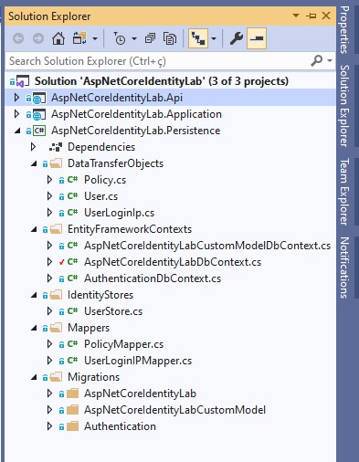

# ASP.NET Core Identity Lab

Aplicação criada com o principal objetivo de explorar as funcionalidades e características do ASP.NET Core Identity.

Nesta aplicação, vários cenários reais de uso foram testados baseados em uma mini aplicação.

Após os estudos de caso, as principais conclusões foram documentadas neste arquivo e servem como referência e fonte de consulta futura.

## Índice

* [Pré-requisitos](#pre-requisitos)
* [Como iniciar?](#como-iniciar)
* [Requisitos do projeto](#requisitos-do-projeto)
* [Modelo padrão de banco de dados](#modelo-padrão-de-banco-de-dados)
* [Estrutura do projeto](#estrutura-do-projeto)
    * [Versões utilizadas](#versões-utilizadas)
    * [AspNetCoreIdentityLab-Api](#AspNetCoreIdentityLab-Api)
    * [AspNetCoreIdentityLab-Application](#AspNetCoreIdentityLab-Application)
    * [AspNetCoreIdentityLab-Persistence](#AspNetCoreIdentityLab-Persistence)

## Pré-requisitos

O que precisa ser instalado na máquina para estender e depurar o projeto:

    Visual Studio Community 2019;
    Net Core SDK 3.1;
    SQL Server

## Como iniciar?

* Instale e/ou configure todos os pré-requisitos mencionados acima;
* Clone o repositório na máquina local;
* Crie as bases de dados utilizadas na aplicação: AspNetCoreIdentityLab, AspNetCoreIdentityLabCustomModel e Authentication;
* Baixe as dependências do Nuget para a solução no Visual Studio;
* Execute as migrações para o banco de dados desejado com o comando: Update-Database -Context [ClassName of context];
* Execute o projeto AspNetCoreIdentityLab.Application MVC;

## Requisitos do projeto

Para experimentar os recursos do ASP.NET Core Identity e estabelecer as melhores e mais eficientes práticas de uso, alguns requisitos foram estabelecidos.

Esses requisitos visam aproximar o estudo de caso de um cenário de uso real, onde várias características do framework devem ser exploradas.

Abaixo estão listados quais requisitos a solução atende:

    Uso de email ou username para login;
	Customizar dados de usuários;
    Confirmação de criação de conta por email;
    Explorar IdentityOptions;
    Relembrar, recuperar e trocar senha;
    Password Hashing;
    Password Rotation;
    Captchas;
    Two Factor Authentication (2FA);
    Provedor externo de autenticação (Google, Facebook, etc);
    Bloqueio de logins concorrentes;
    Identificar acessos de diferentes ips;
    Política de senhas;
    Política de email e username;
    Alterar o schema padrão de banco de dados;
    Uso de diferentes banco de dados;
    Mecanismo de persistência customizado;
    API de autenticação;
    Log de execução;
    Roles;
    Claims;
    Policies;
    Grupos de usuários;
    Autorizações dinâmicas (Módulos, submódulos e funcionalidades);
    API de autorização;

## Modelo padrão de banco de dados

O banco de dados padrão do ASP.NET Core Identity consiste nas seguintes entidades:

|**Entidade**       |**Descrição**                                                     |
|-------------------|------------------------------------------------------------------|
|  AspNetUsers      | Representa o usuário                                             |
|  AspNetRoles      | Representa uma Role                                              |
|  AspNetUserClaims | Representa uma Claim que o usuário possui                        |
|  AspNetUserTokens | Representa um token de autenticação para o usuário               |
|  AspNetUserLogins | Associa o usuário com um login                                   |
|  AspNetRoleClaims | Representa uma Claim relacionada a todos os usuários de uma Role |
|  AspNetUserRoles  | Uma entidade associativa que relaciona usuários e Roles          |

Os tipos de entidade estão relacionados entre si das seguintes maneiras:

* Cada usuário pode ter vários UserClaims;
* Cada usuário pode ter vários UserLogins;
* Cada usuário pode ter vários UserTokens;
* Cada Role pode ter várias RoleClaims associados;
* Cada usuário pode ter várias Roles associadas e cada Role pode ser associada a vários usuários. Este é um relacionamento muitos para muitos que requer uma tabela associativa no banco de dados. A tabela associativa é representada pela entidade AspNetUserRoles.

## Estrutura do projeto

A solução `AspNetCoreIdentityLab` é dividida em três projetos: `AspNetCoreIdentityLab.Api`, `AspNetCoreIdentityLab.Application` e `AspNetCoreIdentityLab.Persistence`. Nas próximas seções os projetos são detalhados.

### Versões utilizadas

>Net Core 3.1

>[ASP.NET Core Identity UI 3.1.1](https://www.nuget.org/packages/Microsoft.AspNetCore.Identity.UI/3.1.1)

>[VisualStudio Web CodeGeneration Design 3.1.4](https://www.nuget.org/packages/Microsoft.VisualStudio.Web.CodeGeneration.Design/3.1.4)

>[Entity Framework Core 3.1.7](https://www.nuget.org/packages/Microsoft.EntityFrameworkCore/3.1.7)

>[Entity.Framework.Core.Sql.Server 3.1.7](https://www.nuget.org/packages/Microsoft.EntityFrameworkCore.SqlServer/3.1.7)

>[Microsoft.EntityFrameworkCore.Tools 3.1.7](https://www.nuget.org/packages/Microsoft.EntityFrameworkCore.Tools/3.1.7)

>[Microsoft.Extensions.Logging.Console 3.1.7](https://www.nuget.org/packages/Microsoft.Extensions.Logging.Console/3.1.7)

>[Microsoft.AspNetCore.Authentication.Facebook 3.1.10](https://www.nuget.org/packages/Microsoft.AspNetCore.Authentication.Facebook/3.1.10)

>[Microsoft.AspNetCore.Authentication.Google 3.1.10](https://www.nuget.org/packages/Microsoft.AspNetCore.Authentication.Google/3.1.10)

>[Dapper 2.0.35](https://www.nuget.org/packages/Dapper/2.0.35)

>[Microsoft.AspNetCore.Authentication.JwtBearer 3.1.11](https://www.nuget.org/packages/Microsoft.AspNetCore.Authentication.JwtBearer/3.1.11)

### AspNetCoreIdentityLab-Api

É uma `ASP.NET Core Web Application` com **API template** que tem a responsabilidade de expor uma api rest para autenticação e autorização.

A principais namespaces são: `Controllers`, `DynamicAuthorization`, `Jwt`, `Model` e `Services`.

* [Controllers](./AspNetCoreIdentityLab.Api/Controllers): classes que representam os endpoints da api de autenticação e autorização.

* [DynamicAuthorization](./AspNetCoreIdentityLab.Api/DynamicAuthorization): classes usadas para modelar a autorização dinâmica que podem ser usadas para autorizar módulos, submódulos e funcionalidades sem a necessidade de criar novas políticas no código-fonte.

* [Jwt](./AspNetCoreIdentityLab.Api/Jwt): classes responsáveis por gerar o JWT Token.

* [Model](./AspNetCoreIdentityLab.Api/Model): classes que representam os dados da api usados nos controllers.

* [Services](./AspNetCoreIdentityLab.Api/Services): classes que encapsulam regras mais complexas usadas nos controllers.

### AspNetCoreIdentityLab-Application

É uma `ASP.NET Core Web Application` com **MVC template** que tem a responsabilidade de manter as funcionalidade de registro de usuário, login de usuário, Two-Factor Authentication (2FA), etc.

As principais namespaces são: `Pages`, `Controllers`, `CustomAuthorization`, `Models`, `Services` e `Views`.

* [Pages](./AspNetCoreIdentityLab.Application/Areas/Identity/Pages): razor pages com as funcionalidades do ASP.NET Core Identity. Estas funcionalides foram geradas pela ferramenta scaffold do ASP.NET Core;

* [Controllers](./AspNetCoreIdentityLab.Application/Controllers): alguns controladores usados para autorização e impersonation user;

* [CustomAuthorization](./AspNetCoreIdentityLab.Application/CustomAuthorization): classes usadas para criar políticas de autorização customizadas e atributos de autorização customizados;

* [Models](./AspNetCoreIdentityLab.Application/Models): models usados no impersonation user;

* [Services](./AspNetCoreIdentityLab.Application/Services): classes que implementam regras mais complexas usadas nos controladores;

* [Views](./AspNetCoreIdentityLab.Application/Views): algumas views compartilhadas usadas na aplicação.

### AspNetCoreIdentityLab-Persistence

É uma `.Net Core Class Library` que tem a responsabilidade de manter as configurações do EF Core e realizar as operações nas bases de dados.

As principais namespaces são: `DataTransferObjects`, `EntityFrameworkContexts` e `Migrations`.

* [DataTransferObjects](./AspNetCoreIdentityLab.Persistence/DataTransferObjects): classes que representam os models que mapeiam as tabelas em cada banco de dados.

* [EntityFrameworkContexts](./AspNetCoreIdentityLab.Persistence/EntityFrameworkContexts): classes que configuram a conexão com os banco de dados. Neste estudo de caso, três bancos de dados são utilizados.

* [Migrations](./AspNetCoreIdentityLab.Persistence/Migrations): classes que representam as migrações que serão aplicadas em cada banco de dados.