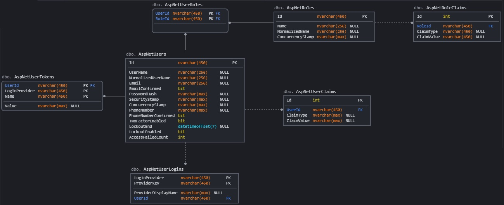
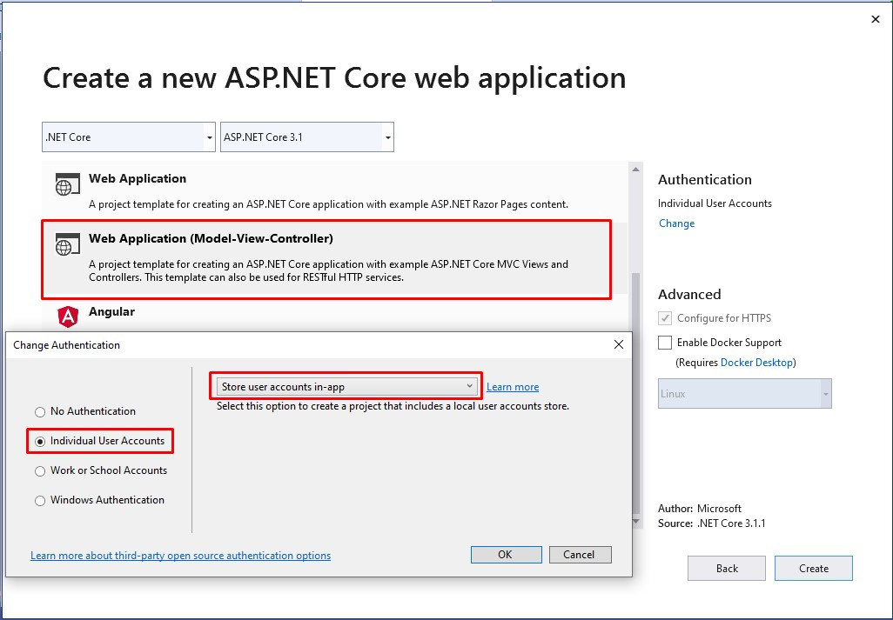
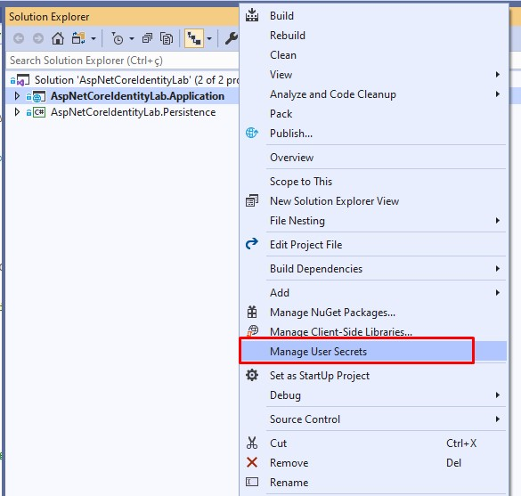

# ASP.NET Core Identity Lab

Read this documentation in other languages: [Portuguese (pt-BR)](README-pt-BR.md)

Application created with the main objective of exploring the features and characteristics of the ASP.NET Core Identity.

In this application, several real usage scenarios were tested based on a mini application.

After the case studies, the main conclusions were documented in this file and serve as a reference for use and source of consultation.

## Table of contents

* [Prerequisites](#prerequisites)
* [Getting Started](#getting-started)
* [Project Requirements](#project-requirements)
* [Identity Default Database Model](#identity-default-database-model)
* [Project Structure](#project-structure)
    * [Used Packages](#used-packages)
    * [AspNetCoreIdentityLab-Application](#AspNetCoreIdentityLab-Application)
    * [AspNetCoreIdentityLab-Persistence](#AspNetCoreIdentityLab-Persistence)
* [Authentication x Authorization](#authentication-x-authorization)
* [Identity Basic Configuration](#identity-basic-configuration) 
    * [IdentityOptions](#IdentityOptions)
    * [Add Identity to new project](#add-identity-to-new-project)
    * [Add Identity to existing MVC project](#add-identity-to-existing-mvc-project)
* Entity Framework x Another persistence
* [Registering an user](#registering-an-user)
    * [How to customize user atributes?](#how-to-customize-user-atributes?)
    * [Custom register rules](#custom-register-rules)
    * [Account confirmation by email](#account-confirmation-by-email)
* Logging
* Fast tips
* Lessons learned
* References used
* [Authors](#authors)

## Prerequisites

What needs to be installed on the machine to extend and debug the project:

    Visual Studio Community 2019;
    Net Core SDK 3.1;
    SQL Server

## Getting Started

* Install and/or configure all the prerequisites mentioned above;
* Clone the repository on the local machine;
* Create the databases used in the application: AspNetCoreIdentityLab;
* Download Nuget dependencies for the solution in Visual Studio;
* Run the migrations to the desired database with the command: Update-Database -Context [ClassName of context];
* Execute the AspNetCoreIdentityLab.Application MVC project;

## Project Requirements

In order to experience the features of the ASP.NET Core Identity and establish the best and most efficient usage practices, some requirements have been established.

These requirements aim to bring the case study closer to a real use scenario where several characteristics of the framework must be explored.

Below are listed which requirements the solution meets:

    Use of email or username to login;
	Custom user data;
	Account confirmation by email;
    Explore IdentityOptions;
    Remember, recover and reset password;
    Password Rotation;
    Captchas;
    Two Factor Authentication (2FA);
    Use of authentication providers (Google, Facebook, Github, Microsoft, Twitter);
    Block concurrent logins;
    Track logins of different ips;
    Single SingOn / Windows authentication;
    Password Policy;
    Email and Username Policy;
	Change database schema;
	Use diferents databases;
	Custom storage providers;
    Create an Authentication API;
    Logging;
    WS-Federation;
    Roles;
    Claims;
    Policies;
    User groups;
    Authorization levels (Groups of functionalities, functionalities, functions);
    Create an Authorization API;

## Identity Default Database Model

The Asp Net Core Identity default database consists of the following entity types:

|**Entity Name**    |**Description**                                               |
|-------------------|--------------------------------------------------------------|
|  AspNetUsers      | Represents the user                                          |
|  AspNetRoles      | Represents a role                                            |
|  AspNetUserClaims | Represents a claim that a user possesses                     |
|  AspNetUserTokens | Represents an authentication token for a user                |
|  AspNetUserLogins | Associates a user with a login                               |
|  AspNetRoleClaims | Represents a claim that's granted to all users within a role |
|  AspNetUserRoles  | A join entity that associates users and roles                |

The entity types are related to each other in the following ways:

* Each User can have many UserClaims;
* Each User can have many UserLogins;
* Each User can have many UserTokens;
* Each Role can have many associated RoleClaims;
* Each User can have many associated Roles, and each Role can be associated with many Users. This is a many-to-many relationship that requires a join table in the database. The join table is represented by the UserRole entity.



## Project Structure

The solution `AspNetCoreIdentityLab` is divided into two projects: `AspNetCoreIdentityLab.Application` and `AspNetCoreIdentityLab.Persistence`. Below each of the projects are detailed.

### Used Packages

>Net Core 3.1

>[Asp Net Core Identity UI 3.1.1](https://www.nuget.org/packages/Microsoft.AspNetCore.Identity.UI/3.1.1)

>[VisualStudio Web CodeGeneration Design 3.1.4](https://www.nuget.org/packages/Microsoft.VisualStudio.Web.CodeGeneration.Design/3.1.4)

>[Entity Framework Core 3.1.7](https://www.nuget.org/packages/Microsoft.EntityFrameworkCore/3.1.7)

>[Entity.Framework.Core.Sql.Server 3.1.7](https://www.nuget.org/packages/Microsoft.EntityFrameworkCore.SqlServer/3.1.7)

>[Microsoft.EntityFrameworkCore.Tools 3.1.7](https://www.nuget.org/packages/Microsoft.EntityFrameworkCore.Tools/3.1.7)

>[Microsoft.Extensions.Logging.Console 3.1.7](https://www.nuget.org/packages/Microsoft.Extensions.Logging.Console/3.1.7)

### AspNetCoreIdentityLab-Application

### AspNetCoreIdentityLab-Persistence

It is a `.Net Core Class Library` which has the responsibility to maintain the EF Core configurations and carry out the operations in the databases.

The main namespaces are: `DataTransferObjects`, `EntityFrameworkContexts` and `Migrations`.

* **DataTransferObjects**: classes that represent the models that map the tables in each database.

* **EntityFrameworkContexts**: classes that configure access to databases. In this case study, three databases were used.

* **Migrations**: classes that represent the migrations that will be applied in each database.

## Authentication x Authorization

>**Authentication:** The process that answer the question, Who are you in the application?

>**Authorization:** The process that answer the question, What can you do in the application?

## Identity Basic Configuration 

### IdentityOptions

Represents the options that you can use to configure Asp Net Core Identity.

**ClaimsIdentity**
* `RoleClaimType`: sets the ClaimType used for a Role claim;
* `UserNameClaimType`: sets the ClaimType used for the user name claim;
* `UserIdClaimType`: sets the ClaimType used for the user identifier claim;
* `SecurityStampClaimType`: sets the ClaimType used for the security stamp claim;

**User**
* `AllowedUserNameCharacters`: configures a set of characteres that can be used on username creation. Default value: abcdefghijklmnopqrstuvwxyzABCDEFGHIJKLMNOPQRSTUVWXYZ0123456789-._@+;
* `RequireUniqueEmail`: sets if a unique email should be informed by user on account creation. Default value: false;

**Password**
* `RequiredLength`: sets minimum length for password. Default value: 6;
* `RequiredUniqueChars`: sets the minimum number of unique characters must be used on password. Default value: 1;
* `RequireNonAlphanumeric`: sets if especial characteres must be used on password. Default value: true;
* `RequireLowercase`: sets if lowercase characteres must be used on password. Default value: true;
* `RequireUppercase`: sets if uppercase characteres must be used on password. Default value: true;
* `RequireDigit`: sets if numeric characteres must be used on password. Default value: true;

**Lockout**
* `AllowedForNewUsers`: sets if a new user can be locked out. Default value: true;
* `MaxFailedAccessAttempts`: sets the number of failed access attempts allowed before a user is locked. Default value: 5;
* `DefaultLockoutTimeSpan`: sets the TimeSpan a user is locked out for when a lockout occurs. Default value: 5 minutes;

**SignIn**
* `RequireConfirmedEmail`: sets if a confirmed email is required to sign in. Default value: false;
* `RequireConfirmedPhoneNumber`: sets if a confirmed phone number is required to sign in. Default value: false;
* `RequireConfirmedAccount`: sets if a confirmed account is required to sign in. Default value: false;

**Tokens**
* `ProviderMap`:
* `EmailConfirmationTokenProvider`:
* `PasswordResetTokenProvider`:
* `ChangeEmailTokenProvider`:
* `ChangePhoneNumberTokenProvider`:
* `AuthenticatorTokenProvider`:
* `AuthenticatorIssuer`:

**Stores**
* `MaxLengthForKeys`: if set to a positive number, configures the length used on OnModelCreating to set the max length for any properties used as keys, like UserId;
* `ProtectPersonalData`: sets if the all personally identifying data for a user must protected;

### Add Identity to new project

To use Asp Net Core Identity in a new project some settings need to be made during and after creating the project.

An **Asp Net Core Web Application** project need to be created with the image options:



After that the database connection string need be changed in `appsettings.json` and the migrations executed with `Update-Database` command. 

However the author **recommends separate the database access logic from application logic**. The objective is better organize the solution aplying the [SRP principle](https://blog.cleancoder.com/uncle-bob/2014/05/08/SingleReponsibilityPrinciple.html).

For this a data access project need to be created and the application project with Identity must use this data access layer.

To use a separeted data access project it's necessary add a [project of class library type](./AspNetCoreIdentityLab.Persistence). This project will do access on database and contains the Entity Framework dependencies or another persistence as well.

The solution in this repository uses a separated data access project so it is a good example to use. However to simplify the solution configuration some steps are listed below:

* Remove **ApplicationDbContext** from Asp Net Core MVC project;
* Remove **Migrations** folder from Asp Net Core MVC project;
* Remove **Data** folder from Asp Net Core MVC project;
* Remove **Connection Strings** from `appsettings.json` file;
* Add **Data Access** class library project and your [dependencies](#used-packages) to solution;
* Add **Project Reference** to persistence project created above on Asp Net Core MVC project;
* Change **DbContext configuration** on `ConfigureServices` in `Startup.cs` class to use persistence project DbContext; 
* Add **User model** inheriting of Asp Net Core `IdentityUser` class**;
* Run Add-Migration command to create Identity migration;
* Run Update-Database to create [Identity database structure](#identity-default-database-model);

** It's possible change the keys types on User and IdentityRole models. This is useful to change the database type for this fields. Below is showed examples with User and IdentityRole models with int keys.

``` C#
public class User : IdentityUser<int>
{
    
}

public class AspNetCoreIdentityLabDbContext : IdentityDbContext<User, IdentityRole<int>, int>
{
    private const string ConnectionString = "";

    protected override void OnConfiguring(DbContextOptionsBuilder optionsBuilder)
    {
        if (optionsBuilder.IsConfigured) return;

        optionsBuilder.UseSqlServer(ConnectionString);
    }
}
```

How was said the [AspNetCoreIdentityLab.Persistence](./AspNetCoreIdentityLab.Persistence) project in this repository is a good example to follow;

### Add Identity to existing MVC project

* Add [Asp Net Core Identity](https://www.nuget.org/packages/Microsoft.AspNetCore.Identity) to project;
* Add [Asp Net Core Identity Entity Framework Core](https://www.nuget.org/packages/Microsoft.AspNetCore.Identity.EntityFrameworkCore) to project;
* Add [Entity Framework Core SqlServer](https://www.nuget.org/packages/Microsoft.EntityFrameworkCore.SqlServer) to project;
* Add [Entity Framework Core Tools](https://www.nuget.org/packages/Microsoft.EntityFrameworkCore.Tools) to project;
* Add [User model](./AspNetCoreIdentityLab.Persistence/DataTransferObjects/User.cs) to project;
* Add [DbContext](./AspNetCoreIdentityLab.Persistence/DataTransferObjects/AspNetCoreIdentityLabDbContext.cs) to project;
* Add code below in `ConfigureServices` method in `Startup.cs` class;
``` C#
services.AddDefaultIdentity<YourUserModel>()
        .AddEntityFrameworkStores<YourDbContext>()
        .AddDefaultTokenProviders();
```
* Add code below in `Configure` method in `Startup.cs` class;
``` C#
app.UseAuthentication();
```
* Run Add-Migration command to create Identity migration;
* Run Update-Database to create [Identity database structure](#identity-default-database-model);

## Registering an user

To register an user on Asp Net Core Identity the `UserManager` class instance with `CreateAsync` method must be used. 

``` C#
var user = new User { UserName = "Username", Email = "Email" };
var result = await _userManager.CreateAsync(user, "Password");
if (result.Succeeded)
{

}
```

The username field can be filled with an email or alphanumeric username, example: username@email.com or exampleofusername. **However the use of an email as username is most recommended**. The purpose of an email as username is to facilitate password recover.

### How to customize user atributes?

Asp Net Core Identity provides resources to customize user atributes. For this, the user model must be extended. The example below shows an `Occupation` custom field:

``` C#
public class User : IdentityUser<int>
{
    public string Occupation { get; set; }
}
```

The `Occupation` field is added to default user fields showed in [Identity Default Database Model](#identity-default-database-model). For apply the custom field a migration must be created and applied in database.

### Custom register rules

In many cases is necessary add custom rules to be applied on user register. These rules change from business to business. 

To add custom rules the `IUserValidator<TUser>` interface must be used. An example is showed on [CustomUserValidator](./AspNetCoreIdentityLab.Application/IdentityValidators/CustomUserValidator.cs) class. This examples shows a rule that username must be at least 6 characters.

The custom rule is configured on `ConfigureServices` method in [Startup](./AspNetCoreIdentityLab.Application/Startup.cs) class.

### Account confirmation by email

Asp Net Core Identity provides account confirmation by email, for this some configurations are needed.
In the first the `SignIn` options on `IdentityOptions` should be changed.

``` C#
identityOptions.SignIn.RequireConfirmedAccount = true;
identityOptions.SignIn.RequireConfirmedEmail = true;
```

A class that implements the `IEmailSender` interface must be created. This class should use some SMTP credentials like [SendGrid](https://sendgrid.com/).

With a developer purpose the [Gmail](https://www.hostinger.com.br/tutoriais/aprenda-a-utilizar-o-smtp-google/) SMTP was used in this project. The [EmailSmtpSender](./AspNetCoreIdentityLab.Application/EmailSenders/EmailSmtpSender.cs) class shows how to email could be send.

The SMTP credentials was saved using [Secret Manager tool](https://docs.microsoft.com/en-us/aspnet/core/security/app-secrets?view=aspnetcore-3.1&tabs=windows). This resource can be acessed with right click on AspNetCoreIdentityLab.Application project option **Manage User Secrets**, that is showed in a image below:



The source code uses a usersecrets.json configuration like that:

``` JSON
{
    "EmailSmtpSender": {
        "Host": "smtp.gmail.com",
        "Port": 587,
        "EnableSSL": true,
        "UserName": "yourEmailAddress",
        "Password": "yourEmailPassword"
    }
}
```

The configuration below is used on `ConfigureServices` method in `Startup` class:

``` C#
services.AddTransient<IEmailSender, EmailSmtpSender>(email => GetEmailConfiguration());
```

In the [Register](./AspNetCoreIdentityLab.Application/Areas/Identity/Pages/Account/Register.cshtml.cs) class is showed an example that uses `SignIn` options to send account confirmation email.

>Is important to know that if there are accounts already created without email confirmation and the configuration is changed to account confirmation, these accounts will not log in. The **EmailConfirmed flag in the AspNetUsers table** must be changed to the value = 1.

## Authors

* **Stenio Nobres** - [Github](https://github.com/stenionobres)