# ASP.NET Core Identity Lab

Read this documentation in other languages: [Portuguese (pt-BR)](README-pt-BR.md)

Application created with the main objective of exploring the features and characteristics of the ASP.NET Core Identity.

In this application, several real usage scenarios were tested based on a mini application.

After the case studies, the main conclusions were documented in this file and serve as a reference for use and source of consultation.

## Table of contents

* [Prerequisites](#prerequisites)
* [Getting Started](#getting-started)
* [Project Requirements](#project-requirements)
* [Identity Default Database Model](#identity-default-database-model)
* [Solution Structure](#solution-structure)
    * [Used Packages](#used-packages)
    * [AspNetCoreIdentityLab-Api](#AspNetCoreIdentityLab-Api)
    * [AspNetCoreIdentityLab-Application](#AspNetCoreIdentityLab-Application)
    * [AspNetCoreIdentityLab-Persistence](#AspNetCoreIdentityLab-Persistence)
* [Authentication x Authorization](#authentication-x-authorization)
* [Identity Basic Configuration](#identity-basic-configuration) 
    * [IdentityOptions](#IdentityOptions)
    * [Add Identity to new project](#add-identity-to-new-project)
    * [Add Identity to existing MVC project](#add-identity-to-existing-mvc-project)
* [Identity Database Customization](#identity-database-customization)
* [Entity Framework x Another persistence](#entity-framework-x-another-persistence)
* [SignManager x UserManager x RoleManager](#signmanager-x-usermanager-x-rolemanager)
* [Identity Scaffolded Pages](#identity-scaffolded-pages)
* [Registering an user](#registering-an-user)
    * [How to customize user atributes?](#how-to-customize-user-atributes?)
    * [Custom register rules](#custom-register-rules)
    * [Account confirmation by email](#account-confirmation-by-email)
* [Authenticating a user](#authenticating-a-user)
    * [Password Hashing](#password-hashing)
    * [Password Rotation](#password-rotation)
    * [Concurrent login session](#concurrent-login-session)
    * [Login session expiration](#login-session-expiration)
    * [User account lockout](#user-account-lockout)
    * [Google reCaptcha](#google-recaptcha)
    * [Two-factor authentication 2FA](#two-factor-authentication-2FA)
    * [Authentication with external providers](#authentication-with-external-providers)
    * [Identifying same user login from different locations (IPs)](#identifying-same-user-login-from-different-locations-ips)
    * [User Impersonation](#user-impersonation)
* [Authorizing a user](#authorizing-a-user)
    * [Claims](#claims)
    * [Roles](#roles)
    * [Policies](#policies)
    * [Authorization service](#authorization-service)
    * [Custom Authorization Attribute](#custom-authorization-attribute)
* [Authentication REST API](#authentication-rest-api)
    * [Configuration](#configuration)
    * [Json Web Token (JWT)](#json-web-token-jwt)
    * [API resources](#api-resources)
* [Authorization REST API](#authorization-rest-api)
* [Dynamic Authorization](#dynamic-authorization)
    * [Applications authorization types](#applications-authorization-types)
    * [How Dynamic Authorization works?](#how-dynamic-authorization-works)
    * [Resource class structure](#resource-class-structure)
    * [Policy database structure](#policy-database-structure)
* [Logging](#logging)
* Fast tips
* Lessons learned
* [References used](#references-used)
* [Authors](#authors)

## Prerequisites

What needs to be installed on the machine to extend and debug the project:

    Visual Studio Community 2019;
    Net Core SDK 3.1;
    SQL Server

## Getting Started

* Install and/or configure all the prerequisites mentioned above;
* Clone the repository on the local machine;
* Create the databases used in the application: AspNetCoreIdentityLab, AspNetCoreIdentityLabCustomModel and Authentication;
* Download Nuget dependencies for the solution in Visual Studio;
* Run the migrations to the desired database with the command: Update-Database -Context [ClassName of context];
* Execute the AspNetCoreIdentityLab.Application MVC project;

## Project Requirements

In order to experience the features of the ASP.NET Core Identity and establish the best and most efficient usage practices, some requirements have been established.

These requirements aim to bring the case study closer to a real use scenario where several characteristics of the framework must be explored.

Below are listed which requirements the solution meets:

    Use of email or username to login;
	Custom user data;
	Account confirmation by email;
    Explore IdentityOptions;
    Remember, recover and reset password;
    Password Hashing;
    Password Rotation;
    Captchas;
    Two Factor Authentication (2FA);
    Use of authentication providers (Google, Facebook, etc);
    Block concurrent logins;
    Track logins of different ips;
    Password Policy;
    Email and Username Policy;
	Change database schema;
	Use diferents databases;
	Custom storage providers;
    Create an Authentication API;
    Logging;
    Roles;
    Claims;
    Policies;
    User groups;
    Dynamic Authorization (Groups of features, features and functions);
    Create an Authorization API;

## Identity Default Database Model

The ASP.NET Core Identity default database consists of the following entity types:

|**Entity Name**    |**Description**                                               |
|-------------------|--------------------------------------------------------------|
|  AspNetUsers      | Represents the user                                          |
|  AspNetRoles      | Represents a role                                            |
|  AspNetUserClaims | Represents a claim that a user possesses                     |
|  AspNetUserTokens | Represents an authentication token for a user                |
|  AspNetUserLogins | Associates a user with a login                               |
|  AspNetRoleClaims | Represents a claim that's granted to all users within a role |
|  AspNetUserRoles  | A join entity that associates users and roles                |

The entity types are related to each other in the following ways:

* Each User can have many UserClaims;
* Each User can have many UserLogins;
* Each User can have many UserTokens;
* Each Role can have many associated RoleClaims;
* Each User can have many associated Roles, and each Role can be associated with many Users. This is a many-to-many relationship that requires a join table in the database. The join table is represented by the UserRole entity.


## Solution Structure

The solution `AspNetCoreIdentityLab` is divided into three projects: `AspNetCoreIdentityLab.Api`, `AspNetCoreIdentityLab.Application` and `AspNetCoreIdentityLab.Persistence`. In the next sections the projects are detailed.

### Used Packages

>Net Core 3.1

>[ASP.NET Core Identity UI 3.1.1](https://www.nuget.org/packages/Microsoft.AspNetCore.Identity.UI/3.1.1)

>[VisualStudio Web CodeGeneration Design 3.1.4](https://www.nuget.org/packages/Microsoft.VisualStudio.Web.CodeGeneration.Design/3.1.4)

>[Entity Framework Core 3.1.7](https://www.nuget.org/packages/Microsoft.EntityFrameworkCore/3.1.7)

>[Entity.Framework.Core.Sql.Server 3.1.7](https://www.nuget.org/packages/Microsoft.EntityFrameworkCore.SqlServer/3.1.7)

>[Microsoft.EntityFrameworkCore.Tools 3.1.7](https://www.nuget.org/packages/Microsoft.EntityFrameworkCore.Tools/3.1.7)

>[Microsoft.Extensions.Logging.Console 3.1.7](https://www.nuget.org/packages/Microsoft.Extensions.Logging.Console/3.1.7)

>[Microsoft.AspNetCore.Authentication.Facebook 3.1.10](https://www.nuget.org/packages/Microsoft.AspNetCore.Authentication.Facebook/3.1.10)

>[Microsoft.AspNetCore.Authentication.Google 3.1.10](https://www.nuget.org/packages/Microsoft.AspNetCore.Authentication.Google/3.1.10)

>[Dapper 2.0.35](https://www.nuget.org/packages/Dapper/2.0.35)

>[Microsoft.AspNetCore.Authentication.JwtBearer 3.1.11](https://www.nuget.org/packages/Microsoft.AspNetCore.Authentication.JwtBearer/3.1.11)

### AspNetCoreIdentityLab-Api

It's a `ASP.NET Core Web Application` with **API template** which has the responsibility to exposes api services for authentication and authorization.

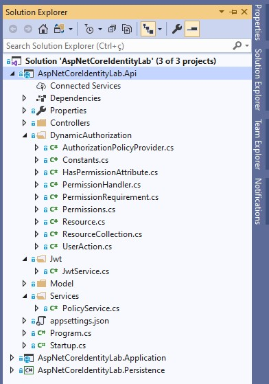

The main namespaces are: `Controllers`, `DynamicAuthorization`, `Jwt`, `Model` and `Services`.

* [Controllers](./AspNetCoreIdentityLab.Api/Controllers): classes that represent the api endpoints for authentication and authorization.

* [DynamicAuthorization](./AspNetCoreIdentityLab.Api/DynamicAuthorization): classes used to model dynamic authorization that can be used to authorize modules, submodules and resources without needed to create new policies in the source code. 

* [Jwt](./AspNetCoreIdentityLab.Api/Jwt): classes responsible for generating JWT Token.

* [Model](./AspNetCoreIdentityLab.Api/Model): model classes that represents api data used on controllers.

* [Services](./AspNetCoreIdentityLab.Api/Services): classes that encapsulates more complex rules used on controllers.

### AspNetCoreIdentityLab-Application

It's an `ASP.NET Core Web Application` with **MVC template** which has the responsibility to maintain the features of user registration, user login, Two-Factor Authentication features, etc.

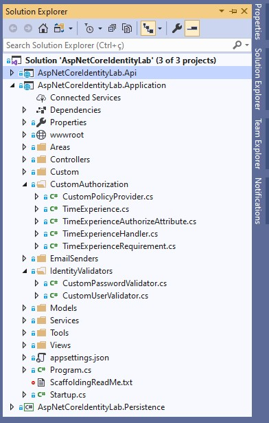

The main namespaces are: `Pages`, `Controllers`, `CustomAuthorization`, `Models`, `Services` and `Views`.

* [Pages](./AspNetCoreIdentityLab.Application/Areas/Identity/Pages): razor pages with the ASP.NET Core Identity features. This features was generated by ASP.NET Core scaffolded tool;

* [Controllers](./AspNetCoreIdentityLab.Application/Controllers): some controllers used on authorization and impersonation user;

* [CustomAuthorization](./AspNetCoreIdentityLab.Application/CustomAuthorization): classes used to create custom policies and custom authorization attribute;

* [Models](./AspNetCoreIdentityLab.Application/Models): models used on impersonation user;

* [Services](./AspNetCoreIdentityLab.Application/Services): classes that encapsulates more complex rules used on controllers;

* [Views](./AspNetCoreIdentityLab.Application/Views): some shared views used on application.

### AspNetCoreIdentityLab-Persistence

It is a `.Net Core Class Library` which has the responsibility to maintain the EF Core configurations and carry out the operations in the databases.

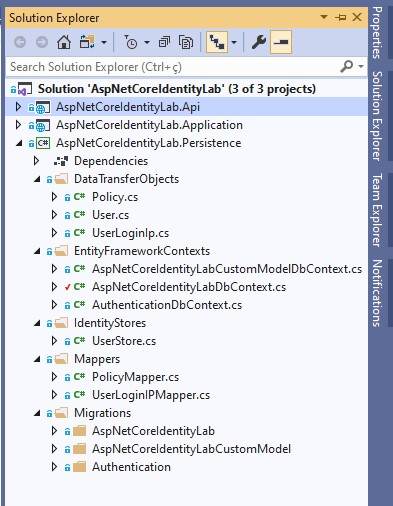

The main namespaces are: `DataTransferObjects`, `EntityFrameworkContexts` and `Migrations`.

* [DataTransferObjects](./AspNetCoreIdentityLab.Persistence/DataTransferObjects): classes that represent the models that map the tables in each database.

* [EntityFrameworkContexts](./AspNetCoreIdentityLab.Persistence/EntityFrameworkContexts): classes that configure access to databases. In this case study, three databases were used.

* [Migrations](./AspNetCoreIdentityLab.Persistence/Migrations): classes that represent the migrations that will be applied in each database.

## Authentication x Authorization

>**Authentication:** The process that answer the question, Who are you in the application?

>**Authorization:** The process that answer the question, What can you do in the application?

## Identity Basic Configuration 

In this section will be showed the options and basic instructions to configure the ASP.NET Core Identity in a project.

### IdentityOptions

Represents the options that you can use to configure ASP.NET Core Identity.

**ClaimsIdentity**
* `RoleClaimType`: sets the ClaimType used for a Role claim;
* `UserNameClaimType`: sets the ClaimType used for the user name claim;
* `UserIdClaimType`: sets the ClaimType used for the user identifier claim;
* `SecurityStampClaimType`: sets the ClaimType used for the security stamp claim;

**User**
* `AllowedUserNameCharacters`: configures a set of characteres that can be used on username creation. Default value: abcdefghijklmnopqrstuvwxyzABCDEFGHIJKLMNOPQRSTUVWXYZ0123456789-._@+;
* `RequireUniqueEmail`: sets if a unique email should be informed by user on account creation. Default value: false;

**Password**
* `RequiredLength`: sets minimum length for password. Default value: 6;
* `RequiredUniqueChars`: sets the minimum number of unique characters must be used on password. Default value: 1;
* `RequireNonAlphanumeric`: sets if especial characteres must be used on password. Default value: true;
* `RequireLowercase`: sets if lowercase characteres must be used on password. Default value: true;
* `RequireUppercase`: sets if uppercase characteres must be used on password. Default value: true;
* `RequireDigit`: sets if numeric characteres must be used on password. Default value: true;

**Lockout**
* `AllowedForNewUsers`: sets if a new user can be locked out. Default value: true;
* `MaxFailedAccessAttempts`: sets the number of failed access attempts allowed before a user is locked. Default value: 5;
* `DefaultLockoutTimeSpan`: sets the TimeSpan a user is locked out for when a lockout occurs. Default value: 5 minutes;

**SignIn**
* `RequireConfirmedEmail`: sets if a confirmed email is required to sign in. Default value: false;
* `RequireConfirmedPhoneNumber`: sets if a confirmed phone number is required to sign in. Default value: false;
* `RequireConfirmedAccount`: sets if a confirmed account is required to sign in. Default value: false;

**Tokens**
* `ProviderMap`: sets the values that will be used to construct UserTokenProviders with the key used as the providerName. Default value: Empty;
* `EmailConfirmationTokenProvider`: sets the name of the provider used to generate tokens in the user's **confirmation email process**. Default value: Default;
* `PasswordResetTokenProvider`: sets the name of the provider used to generate tokens in the user's **password change process**. Default value: Default;
* `ChangeEmailTokenProvider`: sets the name of the provider used to generate tokens in the user's **email change process**. Default value: Default;
* `ChangePhoneNumberTokenProvider`: sets the name of the provider used to generate tokens in the user's **phone number change process**. Default value: Phone;
* `AuthenticatorTokenProvider`: sets the name of provider used to **validate 2FA values**. Default value: Authenticator;
* `AuthenticatorIssuer`: sets the name of the issuer used for the authenticator issuer. Default value: Microsoft.AspNetCore.Identity.UI;

**Stores**
* `MaxLengthForKeys`: if set to a positive number, configures the length used on OnModelCreating to set the max length for any properties used as keys, like UserId;
* `ProtectPersonalData`: sets if the all personally identifying data for a user must protected;

### Add Identity to new project

To use ASP.NET Core Identity in a new project some settings need to be made during and after creating the project.

An **Asp Net Core Web Application** project need to be created with the image options:


After that the database connection string need be changed in `appsettings.json` and the migrations executed with `Update-Database` command. 

However the author **recommends separate the database access logic from application logic**. The objective is better organize the solution aplying the [SRP principle](https://blog.cleancoder.com/uncle-bob/2014/05/08/SingleReponsibilityPrinciple.html).

For this a data access project need to be created and the application project with Identity must use this data access layer.

To use a separeted data access project it's necessary add a [project of class library type](./AspNetCoreIdentityLab.Persistence). This project will do access on database and contains the Entity Framework dependencies or another persistence as well.

The solution in this repository uses a separated data access project so it is a good example to use. However to simplify the solution configuration some steps are listed below:

* Remove **ApplicationDbContext** from Asp Net Core MVC project;
* Remove **Migrations** folder from Asp Net Core MVC project;
* Remove **Data** folder from Asp Net Core MVC project;
* Remove **Connection Strings** from `appsettings.json` file;
* Add **Data Access** class library project and your [dependencies](#used-packages) to solution;
* Add **Project Reference** to persistence project created above on Asp Net Core MVC project;
* Change **DbContext configuration** on `ConfigureServices` in `Startup.cs` class to use persistence project DbContext; 
* Add **User model** inheriting of Asp Net Core `IdentityUser` class**;
* Run Add-Migration command to create Identity migration;
* Run Update-Database to create [Identity database structure](#identity-default-database-model);

** It's possible change the keys types on User and IdentityRole models. This is useful to change the database type for this fields. Below is showed examples with User and IdentityRole models with int keys.

``` C#
public class User : IdentityUser<int>
{
    
}

public class AspNetCoreIdentityLabDbContext : IdentityDbContext<User, IdentityRole<int>, int>
{
    private const string ConnectionString = "";

    protected override void OnConfiguring(DbContextOptionsBuilder optionsBuilder)
    {
        if (optionsBuilder.IsConfigured) return;

        optionsBuilder.UseSqlServer(ConnectionString);
    }
}
```

How was said the [AspNetCoreIdentityLab.Persistence](./AspNetCoreIdentityLab.Persistence) project in this repository is a good example to follow;

### Add Identity to existing MVC project

* Add [ASP.NET Core Identity Entity Framework Core](https://www.nuget.org/packages/Microsoft.AspNetCore.Identity.EntityFrameworkCore) to project;
* Add [Entity Framework Core SqlServer](https://www.nuget.org/packages/Microsoft.EntityFrameworkCore.SqlServer) to project;
* Add [Entity Framework Core Tools](https://www.nuget.org/packages/Microsoft.EntityFrameworkCore.Tools) to project;
* Add [User model](./AspNetCoreIdentityLab.Persistence/DataTransferObjects/User.cs) to project;
* Add [DbContext](./AspNetCoreIdentityLab.Persistence/DataTransferObjects/AspNetCoreIdentityLabDbContext.cs) to project;
* Add code below in `ConfigureServices` method in `Startup.cs` class;
``` C#
services.AddDefaultIdentity<YourUserModel>()
        .AddEntityFrameworkStores<YourDbContext>()
        .AddDefaultTokenProviders();
```
* Add code below in `Configure` method in `Startup.cs` class;
``` C#
app.UseAuthentication();
```
* Run Add-Migration command to create Identity migration;
* Run Update-Database to create [Identity database structure](#identity-default-database-model);

## Identity Database Customization

And if developer need to change the tables name? Use another schema name or use a separate database for authentication? How developer should proceed?

It's possible to use the EF Core Fluent API and DBContext's configuration to change the ASP.NET Core Identity default database structure. Things like a different schema name or diferent table names.

For this, custom table names and schema are shown in [this DBContext](./AspNetCoreIdentityLab.Persistence/EntityFrameworkContexts/AspNetCoreIdentityLabCustomModelDbContext.cs). A [related migration](./AspNetCoreIdentityLab.Persistence/Migrations/AspNetCoreIdentityLabCustomModel/20210112191330_DatabaseInitialStructure.cs) was created for generate a initial database structure.

To use different databases it's possible too. An example is shown in [Authentication API](#authentication-rest-api) and [Authorization API](#authorization-rest-api) that uses different databases with different DBContexts to store the data.

Other information can be founded in this [excellent guide](https://docs.microsoft.com/en-US/aspnet/core/security/authentication/customize-identity-model?view=aspnetcore-3.1) to customize ASP.NET Core Identity database. 

## Entity Framework x Another persistence

The most content about ASP.NET Core Identity recommends the use of [Entity Framework Core](https://github.com/stenionobres/EntityFrameworkCoreLab) how persistence mechanism.

However, it's possible to use another persistence mechanism to manipulate the user's data. For this it's necessary implements some interfaces named with suffix [Store](https://github.com/dotnet/aspnetcore/tree/master/src/Identity/Extensions.Core/src): IUserStore, IUserLoginStore, IUserClaimStore, IUserPasswordStore, IUserSecurityStampStore, IUserEmailStore, IUserLockoutStore, IUserPhoneNumberStore, IQueryableUserStore, IUserTwoFactorStore, IUserAuthenticationTokenStore, IUserAuthenticatorKeyStore, IUserTwoFactorRecoveryCodeStore, IRoleStore, IQueryableRoleStore, IRoleClaimStore. These interfaces are used by **SignInManager** and **UserManager** classes to maniputate the user's data.

To exemplify this feature an implementation using micro-ORM [Dapper](https://github.com/StackExchange/Dapper) was made. But, another persistence mechanism can be used like [ADO.NET](https://docs.microsoft.com/en-US/dotnet/framework/data/adonet/ado-net-code-examples) or [Cosmos DB](https://docs.microsoft.com/en-us/azure/cosmos-db/).

For this a option named `PersistenceWithDapper` was added on `appsettings.json`, when the value is true the [UserStoreService](./AspNetCoreIdentityLab.Application/Services/UserStoreService.cs) and [UserStore](./AspNetCoreIdentityLab.Persistence/IdentityStores/UserStore.cs) classes are loaded in ASP.NET Core dependency injection.

Based on that the `SignInManager` and `UserManager` classes can to use the new persistence class. It's important to say that `UserStoreService` class don't implements all store interfaces, **only the necessary interfaces for register and login user process**. 

For more details how the original classes are designed in ASP.NET Core Identity the [UserStoreBase](https://github.com/dotnet/aspnetcore/blob/master/src/Identity/Extensions.Stores/src/UserStoreBase.cs), [UserStore](https://github.com/dotnet/aspnetcore/blob/master/src/Identity/EntityFrameworkCore/src/UserStore.cs), [RoleStoreBase](https://github.com/dotnet/aspnetcore/blob/master/src/Identity/Extensions.Stores/src/RoleStoreBase.cs) and [RoleStore](https://github.com/dotnet/aspnetcore/blob/master/src/Identity/EntityFrameworkCore/src/RoleStore.cs) classes can be verified.

>A way to facilitate the creation of database structure when another persistence mechanism will be used with a relational database is to configure the project with Entity Framework Core, generate the migration, apply the migration with tables and fields on the database and after that remove the EF Core dependency and uses another persistence mechanism as showed above.

## SignManager x UserManager x RoleManager

The objective of this section is talk about the most important Identity services classes: SignManager, UserManager and RoleManager.

These classes are responsible to manager all process of store users, authentication and deal with roles and claims. Understand the mainly services of these classes is essential for uses correctly the ASP.NET Core Identity. Throughout this documentation many examples of how to use these classes will be shown.

* **SignManager**: provides the APIs for user sign in;
* **UserManager**: provides the APIs for managing user in a persistence store;
* **RoleManager**: provides the APIs for managing roles in a persistence store.

## Identity Scaffolded Pages

One way to access code examples of many ASP.NET Core Identity features is to use the **Scaffolded Items**. This resource provides source code and pages that implements many process like: register user, forgot password, change password, etc.

The images below shown how to access this resource:

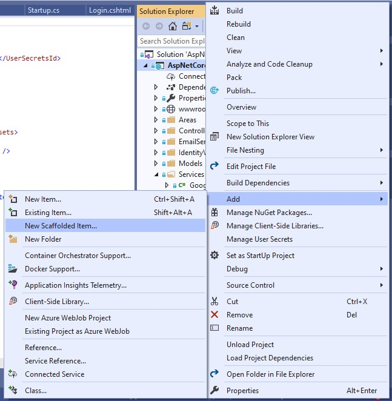

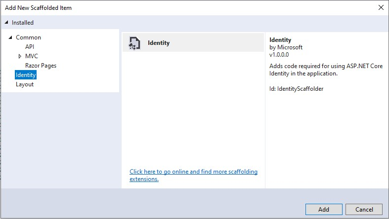

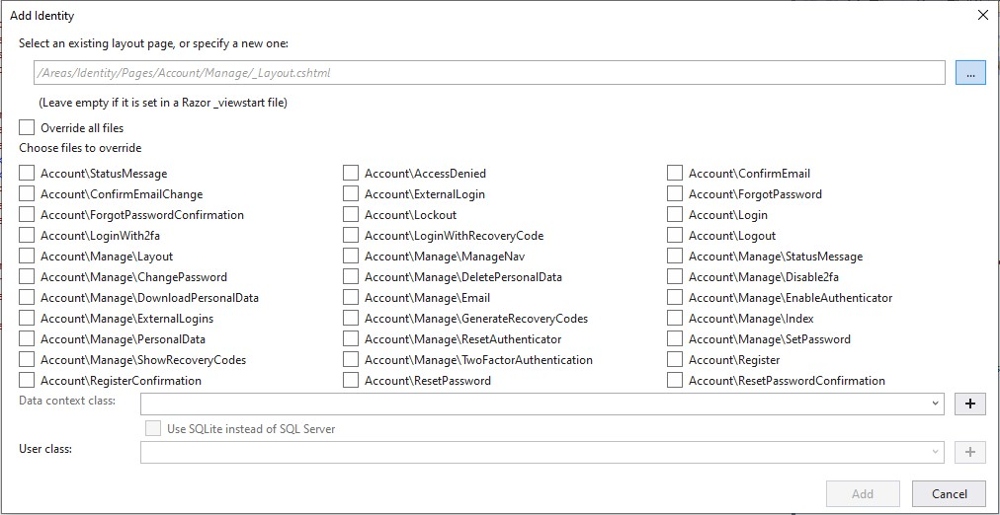

This options can be useful for knows how to many of these process are implemented using ASP.NET Core Identity. Many features presented in this guide used scaffolded pages. The generated code can be accessed in the namespace [Account](./AspNetCoreIdentityLab.Application/Areas/Identity/Pages/Account).

## Registering an user

To register an user on ASP.NET Core Identity the `UserManager` class instance with `CreateAsync` method must be used. 

``` C#
var user = new User { UserName = "Username", Email = "Email" };
var result = await _userManager.CreateAsync(user, "Password");
if (result.Succeeded)
{

}
```

The username field can be filled with an email or alphanumeric username, example: username@email.com or exampleofusername. **However the use of an email as username is most recommended**. The purpose of an email as username is to facilitate password recover.

A simple way to access a source code of register process is generate a scaffolded page. The image below shown the option for generate the register page:

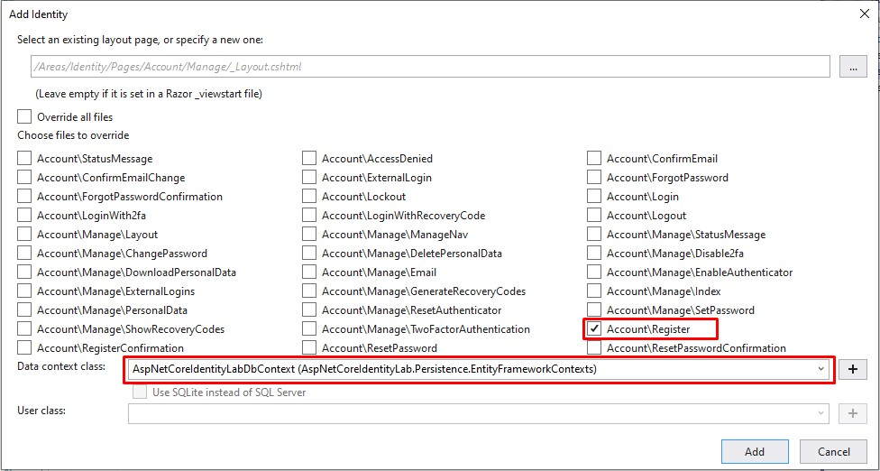

It's important to say that is necessary choose the DbContext to generate the page. The source code generated can be accessed on [Register.cshtml](./AspNetCoreIdentityLab.Application/Areas/Identity/Pages/Account/Register.cshtml) and [Register.cshtml.cs](./AspNetCoreIdentityLab.Application/Areas/Identity/Pages/Account/Register.cshtml.cs).

### How to customize user atributes?

ASP.NET Core Identity provides resources to customize user atributes. For this, the user model must be extended. The example below shows an `Occupation` custom field:

``` C#
public class User : IdentityUser<int>
{
    public string Occupation { get; set; }
}
```

The `Occupation` field is added to default user fields showed in [Identity Default Database Model](#identity-default-database-model). For apply the custom field a migration must be created and applied in database.

### Custom register rules

In many cases is necessary add custom rules to be applied on user register. These rules change from business to business. 

To add custom rules the `IUserValidator<TUser>` interface must be used. An example is showed on [CustomUserValidator](./AspNetCoreIdentityLab.Application/IdentityValidators/CustomUserValidator.cs) class. This examples shows a rule that username must be at least 6 characters.

The custom rule is configured on `ConfigureServices` method in [Startup](./AspNetCoreIdentityLab.Application/Startup.cs) class.

### Account confirmation by email

ASP.NET Core Identity provides account confirmation by email, for this some configurations are needed.
In the first the `SignIn` options on `IdentityOptions` should be changed.

``` C#
identityOptions.SignIn.RequireConfirmedAccount = true;
identityOptions.SignIn.RequireConfirmedEmail = true;
```

A class that implements the `IEmailSender` interface must be created. This class should use some SMTP credentials like [SendGrid](https://sendgrid.com/).

With a developer purpose the [Gmail](https://www.hostinger.com.br/tutoriais/aprenda-a-utilizar-o-smtp-google/) SMTP was used in this project. The [EmailSmtpSender](./AspNetCoreIdentityLab.Application/EmailSenders/EmailSmtpSender.cs) class shows how to email could be send.

The SMTP credentials was saved using [Secret Manager tool](https://docs.microsoft.com/en-us/aspnet/core/security/app-secrets?view=aspnetcore-3.1&tabs=windows). This resource can be acessed with right click on AspNetCoreIdentityLab.Application project option **Manage User Secrets**, that is showed in a image below:


The source code uses a `secrets.json` configuration like that:

``` JSON
{
    "EmailSmtpSender": {
        "Host": "smtp.gmail.com",
        "Port": 587,
        "EnableSSL": true,
        "UserName": "yourEmailAddress",
        "Password": "yourEmailPassword"
    }
}
```

The configuration below is used on `ConfigureServices` method in `Startup` class:

``` C#
services.AddTransient<IEmailSender, EmailSmtpSender>(email => GetEmailConfiguration());
```

In the [Register](./AspNetCoreIdentityLab.Application/Areas/Identity/Pages/Account/Register.cshtml.cs) class is showed an example that uses `SignIn` options to send account confirmation email.

>Is important to know that if there are accounts already created without email confirmation and the configuration is changed to account confirmation, these accounts will not log in. The **EmailConfirmed flag in the AspNetUsers table** must be changed to the value = 1.

## Authenticating a user

Authentication is the process that answer the question, **Who are you in the application?** In this section will be shown important topics about user authentication using ASP.NET Core Identity.

The source code for authentication was based on scaffolded page below and can be seen in the classes [Login.cshtml](./AspNetCoreIdentityLab.Application/Areas/Identity/Pages/Account/Login.cshtml) and [Login.cshtml.cs](./AspNetCoreIdentityLab.Application/Areas/Identity/Pages/Account/Login.cshtml.cs).

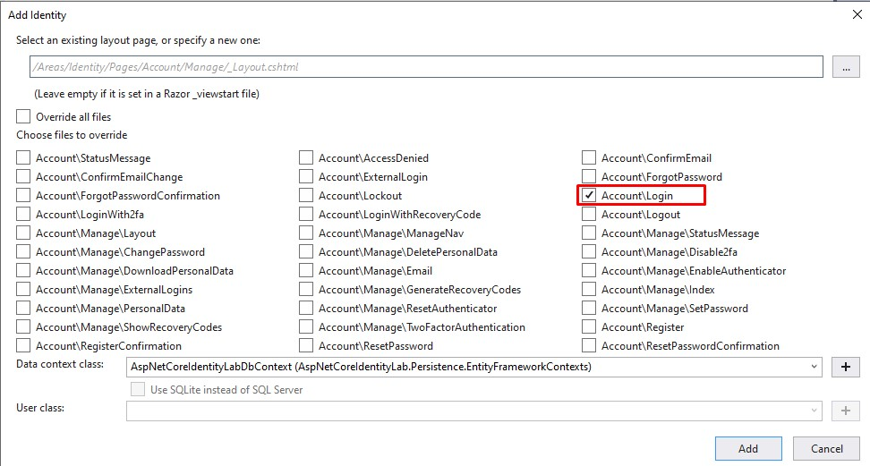

### Password Hashing

The default password hasher for ASP.NET Core Identity uses **PBKDF2** algorithm. The implementation uses the [ASP.NET Core Data Protection](https://docs.microsoft.com/en-us/aspnet/core/security/data-protection/introduction?view=aspnetcore-3.1) cryptographic API.

The characteristics of the password hasher are as follows:

|                 |                         |
| :-------------- | :---------------------: | 
| **Algorithm**   | PBKDF2 with HMAC-SHA256 |
| **Salt**        | 128-bit                 |
| **Subkey**      | 256-bit                 |
| **Iterations**  | 10.000                  |

The Andrew Lock’s [article](https://andrewlock.net/exploring-the-asp-net-core-identity-passwordhasher/) presents more details about default PBKDF2 password hasher.

It's possible change the algorithm used by password hasher. For this check out Scott Brady [Improving the ASP.NET Core Identity Password Hasher](https://www.scottbrady91.com/ASPNET-Identity/Improving-the-ASPNET-Core-Identity-Password-Hasher) article. It's important to say that the change of the default algorithm should be used only if your team has a good knowledge about security and cryptography.

### Password Rotation

Password rotation refers to the changing/resetting of a password(s). Limiting the lifespan of a password reduces the risk from and effectiveness of password-based attacks and exploits, by condensing the window of time during which a stolen password may be valid.

The frequency of rotation should vary based on the password age, usage, and security importance. For instance, a password for a standard user account may only require rotation at `60-day intervals`, a process that can be forced through password expiration.

The ASP.NET Core Identity **don't implements Password Rotation by default** at the moment. This [github issue](https://github.com/dotnet/aspnetcore/issues/5716) talks about the subject.

### Concurrent login session

Some applications needs block concurrent login sessions, in other words, the same user can't create more than one login session in the application.

This behavior is hard to be done in the most of applications because for some scenarios is complicated to know if the user turned off the session on client.

At the moment ASP.NET Core Identity don't offers features to avoid concurrent login session directly. However a good feature to avoid concurrent login session is [Two-Factor Authentication](#two-factor-authentication-2FA).

### Login session expiration

A feature that improves security in an application is force login session expiration. To implements this a configuration was added on [appsettings.json](./AspNetCoreIdentityLab.Application/appsettings.json) and in [Startup](./AspNetCoreIdentityLab.Application/Startup.cs) class. Below the code is showed:

``` JSON
{
  "LoginExpireTimeInMinutes": 3 
}
```

``` C#
public void ConfigureServices(IServiceCollection services)
{
    services.ConfigureApplicationCookie(cookieOptions => GetCookieAuthenticationOptions(cookieOptions));
}

private void GetCookieAuthenticationOptions(CookieAuthenticationOptions cookieOptions)
{
    var loginExpireTimeInMinutes = Convert.ToDouble(Configuration["LoginExpireTimeInMinutes"]);

    cookieOptions.ExpireTimeSpan = TimeSpan.FromMinutes(loginExpireTimeInMinutes);
    cookieOptions.LoginPath = "/Identity/Account/Login";
    cookieOptions.SlidingExpiration = true;
}
```

In resume the developer can change the time expiration session of user. The configuration is made in minutes.

### User account lockout

A important feature that ASP.NET Core Identity has is **User account lockout**. 

This feature blocks user logins after a number of unsuccessfully tentatives of sign-in. This is a important behavior to avoid [brute force](https://en.wikipedia.org/wiki/Brute-force_attack) attacks, however this feature has a drawback that to facilitate [Denial-of-service](https://en.wikipedia.org/wiki/Denial-of-service_attack) attacks if the attacker has a list of user emails accounts.

To implements that feature some options must be configured on [Startup.cs](./AspNetCoreIdentityLab.Application/Startup.cs) file and the `lockoutOnFailure` parameter should be true on `PasswordSignInAsync` call in the [Login.cshtml.cs](./AspNetCoreIdentityLab.Application/Areas/Identity/Pages/Account/Login.cshtml.cs) file. In this example after the third access failed the user will be blocked by 5 minutes. The code snippets are showed below:

``` C#
private void GetDefaultIdentityOptions(IdentityOptions identityOptions)
{
    identityOptions.Lockout.AllowedForNewUsers = true;
    identityOptions.Lockout.MaxFailedAccessAttempts = 3;
    identityOptions.Lockout.DefaultLockoutTimeSpan = TimeSpan.FromMinutes(5);
}
```

``` C#
var result = await _signInManager.PasswordSignInAsync(Input.EmailOrUsername, 
                                                      Input.Password, Input.RememberMe, 
                                                      lockoutOnFailure: true);
```

### Google reCaptcha

It's possible to use the **Google reCaptcha** in a ASP.NET Core Identity form login. For this it's necessary to get the Google api keys and configure the reCaptcha in Google account.

First, you need to get the api keys filling this [form](https://www.google.com/recaptcha/admin/create). Select the `reCAPTCHA v2` option and add the `locahost` term in domain section. This is useful for tests in development mode.

After, accept the terms and save the data you will get the `SiteKey` and `SecretKey`. The source code uses a secrets.json configuration like that:

``` JSON
{
    "reCAPTCHA": {
        "SiteKey": "",
        "SecretKey": ""
    }
}
```

A similar secrets.json configuration was made on [Account confirmation by email](#account-confirmation-by-email).

The reCaptcha configuration was made adding the html and javascript code below on [Login.cshtml](./AspNetCoreIdentityLab.Application/Areas/Identity/Pages/Account/Login.cshtml).

``` html
<div class="g-recaptcha" data-sitekey="@configuration["reCAPTCHA:SiteKey"]"></div>
```

``` javascript
<script src="https://www.google.com/recaptcha/api.js" async defer></script>
```

The call to Google API is made by the [GoogleRecaptchaService](./AspNetCoreIdentityLab.Application/Services/GoogleRecaptchaService.cs) class. For use the GoogleRecaptchaService class and httpClient feature is necessary add the code below on `Startup.cs`.

``` C#
public void ConfigureServices(IServiceCollection services)
{
    services.AddHttpClient();
    services.AddTransient<GoogleRecaptchaService>();
}
```

### Two-factor authentication 2FA

Two-factor authentication (2FA) is an electronic authentication method in which a computer user is granted access to a website or application only after successfully presenting two or more pieces of evidence (or factors) to an authentication mechanism: knowledge (something only the user knows), possession (something only the user has), and inherence (something only the user is). (Wikipedia)

Some apps can be used to generate a token that can be used on authentication like: [Authy](https://authy.com/), [Google Authenticator](https://play.google.com/store/apps/details?id=com.google.android.apps.authenticator2) and [Microsoft Authenticator](https://www.microsoft.com/en-us/account/authenticator).

The scaffolded razor pages that can be used on project for 2FA are showed below:

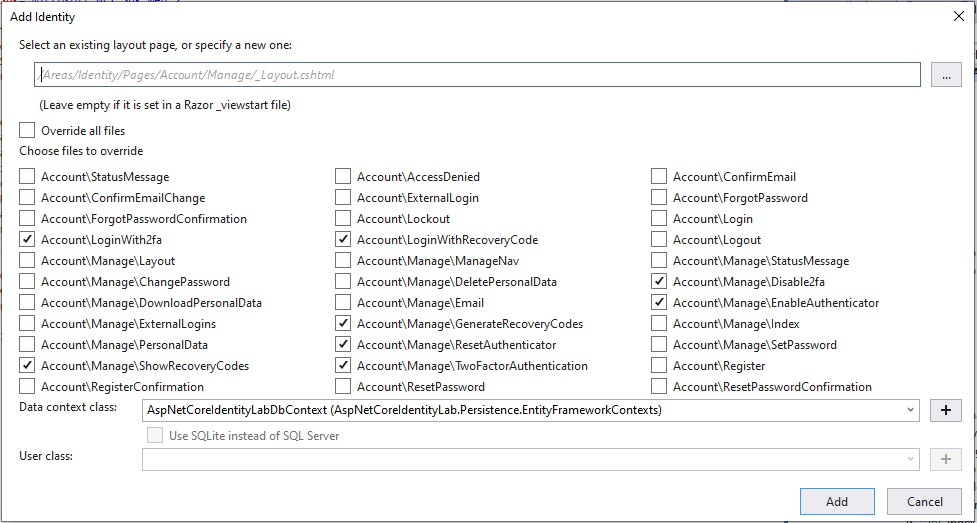

These pages are useful to customize the default code or to provide some examples of how to use ASP.NET Core Identity resources.

The page [EnableAuthenticator](./AspNetCoreIdentityLab.Application/Areas/Identity/Pages/Account/Manage/EnableAuthenticator.cshtml) provides the token to be inserted on two factor authenticator app. However, an important feature don't exists by default that is the Qrcode to be scanned by app.

To provide the QRCode feature, [QRCode.js](https://davidshimjs.github.io/qrcodejs/) lib was added to the project and used on the EnableAuthenticator page.

The path to access the registration token is click over the user email on the top page > Two-factor authentication menu > Setup authenticator app. 

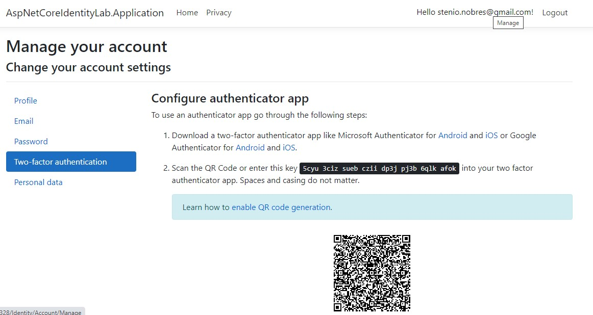

So, the user can scan the QrCode or insert the token in the 2FA app.

When the user put the token on 2FA app and completes the register process some tokens are saved on database in the **AspNetUserTokens** table. These tokens are **AuthenticatorKey** and **RecoveryCodes**.

Below are showed some examples of these tokens:

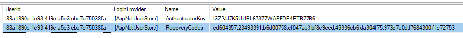

The user is probably up to date with 2FA, but security can be improved by encrypting tokens stored in the database.

For that the [AesEncryptor](./AspNetCoreIdentityLab.Application/Tools/AesEncryptor.cs) class is used. This class was developed using the AES algorithm. To encrypt tokens it's necessary override some **UserManager** class methods. A new [UserManager](./AspNetCoreIdentityLab.Application/Custom/UserManager.cs) class was created that inherits from original UserManager class and some methods have been overridden.

Below are showed some examples of encrypted tokens:

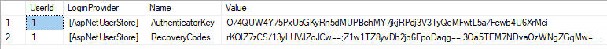

It's necessary register the new UserManager on `Startup.cs` class. The use of `AddUserManager` method on `ConfigureServices`, as showed int the code below, allows the use of new UserManager class. 

``` C#
public void ConfigureServices(IServiceCollection services)
{
    services.AddDefaultIdentity<User>(options => GetDefaultIdentityOptions(options))
            .AddUserManager<UserManager>()
            .AddUserValidator<CustomUserValidator>()
            .AddPasswordValidator<CustomPasswordValidator>()
            .AddEntityFrameworkStores<AspNetCoreIdentityLabDbContext>();
}
```

The [UserManager](./AspNetCoreIdentityLab.Application/Custom/UserManager.cs) class uses a configuration to knows if cryptography is enabled and the encryption key that should be used. Below is showed a configuration that should be added on `secrets.json` file. The author recommends that `EncryptionEnabled` configuration always be true and `EncryptionKey` should be any string value.

``` JSON
{
    "TwoFactorAuthentication": {
        "EncryptionEnabled": true,
        "EncryptionKey": "b14ca5898a4e413315a1916"
    }
}
```

### Authentication with external providers

This section demonstrates how to build users to sign-in using OAuth 2.0 with credentials from external authentication providers.

These sign-in with external providers are very convenient to users and shifts many of the complexities of managing the sign-in process onto a third party. 

So many social networks and companies has authentication providers. The mainly are: [Facebook](https://www.nuget.org/packages/Microsoft.AspNetCore.Authentication.Facebook), [Google](https://www.nuget.org/packages/Microsoft.AspNetCore.Authentication.Google), [Microsoft](https://www.nuget.org/packages/Microsoft.AspNetCore.Authentication.MicrosoftAccount/) and [Twitter](https://www.nuget.org/packages/Microsoft.AspNetCore.Authentication.Twitter). 

>Another social authentication providers are listed in this [page](https://github.com/aspnet-contrib/AspNet.Security.OAuth.Providers).

The scaffolded razor pages that can be used on project for sign-in with external providers are showed below:


For examples, authentication using Facebook and Google providers will be presented:

* **Facebook**

To configure the use of the Facebook external provider you need add the nuget package on the project. The link is listed on [Used Packages](#used-packages). After that an app needs to be created on [Facebook developers page](https://developers.facebook.com/apps/). This [Microsoft page](https://docs.microsoft.com/en-us/aspnet/core/security/authentication/social/facebook-logins?view=aspnetcore-3.1) presents a good step by step on how to create the app on Facebook. 

When the app is created on Facebook developers page the **AppId** and **AppSecret** keys are generated and should be inserted on `secrets.json` file of project. Below are presented the configuration used in the project's secrets.json.

``` JSON
{
    "SocialNetworkAuthentication": {
        "Facebook": {
            "AppId": "",
            "AppSecret": ""
        }
    }
}
```

After app creation and secrets.json configuration the `Startup.cs` file should be configured. For this the code below should be added on `ConfigureServices` method on Startup.cs file.

``` C#
public void ConfigureServices(IServiceCollection services)
{
    services.AddAuthentication()
            .AddFacebook(facebookOptions => GetFacebookOptions(facebookOptions));
}

private void GetFacebookOptions(FacebookOptions facebookOptions)
{
    facebookOptions.AppId = Configuration["SocialNetworkAuthentication:Facebook:AppId"];
    facebookOptions.AppSecret = Configuration["SocialNetworkAuthentication:Facebook:AppSecret"];
    facebookOptions.SaveTokens = true;
}
```

Another important step is save the Facebook tokens generated on authentication. For this the code below was added on `OnPostConfirmationAsync` method of [ExternalLogin.cshtml.cs](./AspNetCoreIdentityLab.Application/Areas/Identity/Pages/Account/ExternalLogin.cshtml.cs) file. The tokens are saved on **AspNetUserTokens** table. If call to `SetAuthenticationTokenAsync` method already exists this step should be ignored.

``` C#
foreach (var token in info.AuthenticationTokens)
{
    await _userManager.SetAuthenticationTokenAsync(user, info.LoginProvider, token.Name, token.Value);
}
```

* **Google**

Just like the Facebook configuration, Google nuget package should be added on project and is listed in [Used Packages](#used-packages) section. After that an app needs to be created on [Google developers page](https://console.developers.google.com/). Two steps should be concluded, add the app and configure the OAuth client as Web Server.

When the app is created on Google developers page the **ClientId** and **ClientSecret** keys are generated and should be inserted on `secrets.json` file of project. Below are presented the configuration used in the project's secrets.json.

``` JSON
{
    "SocialNetworkAuthentication": {
        "Google": {
            "ClientId": "",
            "ClientSecret": ""
        }
    }
}
```

After app creation and secrets.json configuration the `Startup.cs` file should be configured. For this the code below should be added on `ConfigureServices` method on Startup.cs file.

``` C#
public void ConfigureServices(IServiceCollection services)
{
    services.AddAuthentication()
            .AddGoogle(googleOptions => GetGoogleOptions(googleOptions));
}

private void GetGoogleOptions(GoogleOptions googleOptions)
{
    googleOptions.ClientId = Configuration["SocialNetworkAuthentication:Google:ClientId"];
    googleOptions.ClientSecret = Configuration["SocialNetworkAuthentication:Google:ClientSecret"];
    googleOptions.SaveTokens = true;
}
```

Another important step is save the Google tokens generated on authentication. For this the code below was added on `OnPostConfirmationAsync` method of [ExternalLogin.cshtml.cs](./AspNetCoreIdentityLab.Application/Areas/Identity/Pages/Account/ExternalLogin.cshtml.cs) file. The tokens are saved on **AspNetUserTokens** table. If call to `SetAuthenticationTokenAsync` method already exists this step should be ignored.

``` C#
foreach (var token in info.AuthenticationTokens)
{
    await _userManager.SetAuthenticationTokenAsync(user, info.LoginProvider, token.Name, token.Value);
}
```

### Identifying same user login from different locations (IPs)

Some applications blocks or notify same user logins from differents IPs. It's a security rule.

An example of this feature is provided by [UserLoginIp](./AspNetCoreIdentityLab.Persistence/DataTransferObjects/UserLoginIp.cs), [UserLoginIPService](./AspNetCoreIdentityLab.Application/Services/UserLoginIPService.cs) and [UserLoginIPMapper](./AspNetCoreIdentityLab.Persistence/Mappers/UserLoginIPMapper.cs) classes.

Basically the application compares the IP of login with the IP of the last login saved in `UserLoginIp` table. If the IP's are different an email is sent to user.

### User Impersonation

Impersonation is when an admin user is logged in with the same privileges as a user, but without knowing their password or other credentials. This means that the support user will experience the system as if they are the impersonated user. User impersonation **is useful in SaaS systems** for investigating/fixing problems that customers encounter.

The impersonation is based on choose some user and to sign with this user in application. For this a list of users was added in the [Home page](./AspNetCoreIdentityLab.Application/Views/Home/Index.cshtml). With this list is possible choose an user for impersonate.

The [Home controller](./AspNetCoreIdentityLab.Application/Controllers/HomeController.cs) has two actions called `ImpersonateUser` and `StopImpersonation` that are self explanatory.

Below is shown an image that showns impersonation feature: 

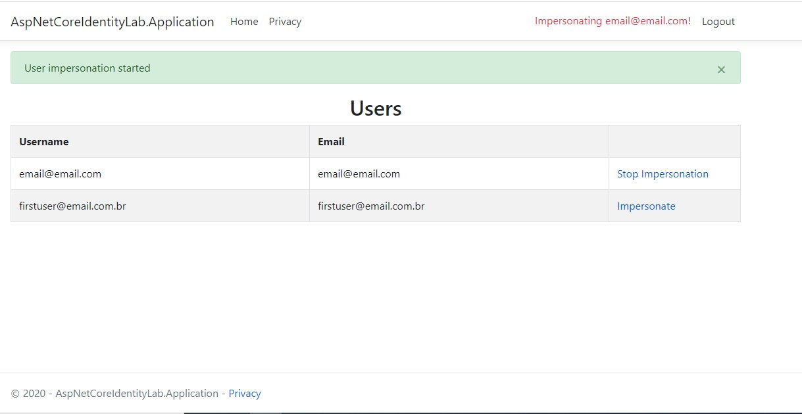

In addition, a class called [ImpersonateExtensions](./AspNetCoreIdentityLab.Application/Tools/ImpersonateExtensions.cs) was added to generate the profile name of the logged in user. To complete the solution, a configuration had to be done in `Startup.cs` to avoid ending impersonation in the SecurityStampToken update.

## Authorizing a user

Authorization is the process that answer the question, **What user can do in the application?** For example an administrative user is allowed to delete a document. However a non-administrative user is only authorized to read the documents.

The process of authorization is independent from authentication so much so that authorizing classes belongs only ASP.NET Core. This permits that these classes can be used without ASP.NET Core Identity. Despite this, the two set of classes are often used together.

Authorization components can be used in the code adding the **AuthorizeAttribute** and **AllowAnonymousAttribute** attributes, like the code below:

``` C#
[Authorize]
public class ExampleController : Controller
{
    public ActionResult FirstAction()
    {

    }

    [AllowAnonymous]
    public ActionResult SecondAction()
    {

    }
}
```

To better understand the authorization configurations the **Claims, Roles and Policies** concepts needed to be defined. These concepts will be presented in the next sections.

### Claims

A claim in general is a name value pair that represents a user attribute. For example: a date of birth or age.

The code belows is a good example of how to associate a claim to user:

``` C#
var user = await _userManager.FindByNameAsync("email@example.com");
var ageClaim = new Claim(type: "Age", value: "25");
await _userManager.AddClaimAsync(user, ageClaim);
```

Claims based authorization, at its simplest, checks the value of a claim and allows access to a resource based upon that value.

Claims authorization are policy based, the developer must build and register a policy expressing the claims requirements. In this [section](#policies) policies are better detailed however below is shown how to create a basic policy that uses a specific claim.

``` C#
public void ConfigureServices(IServiceCollection services)
{
    services.AddAuthorization(options =>
    {
        options.AddPolicy("HasJob", policy => policy.RequireClaim("Occupation"));
        options.AddPolicy("Developers", policy => policy.RequireClaim("Occupation", "Software Developer"));
    });
}
```

The policy **HasJob** verifies if the user has the `Occupation` claim and the **Developers** policy verifies if the user has the `Software Developer` value in the Occupation claim. Below is shown how to use these policies:

``` C#
[Authorize(Policy = "HasJob")]
public class VacationController : Controller
{
    [AllowAnonymous]
    public ActionResult VacationRules()
    {

    }

    public ActionResult VacationBalance()
    {

    }

    [Authorize(Policy = "Developers")]
    public ActionResult RequestDeveloperVacation()
    {

    }
}
```

Only users that has the `Occupation` claim defined on HasJob policy can access the VacationController, except by `VacationRules` action that allows all user access. The `RequestDeveloperVacation` action has two policies applied: HasJob and Developers. The `VacationBalance` action respects only HasJob policy.

### Roles

A role is a type of attribute that can be applied to a user. Roles contain a set of permission for doing a set of activities in the application. Example of roles: Admin, Manager and Supervisor. A role can also be seen as a group of users.

The code belows is a good example of how to associate a role to user:

``` C#
var user = await _userManager.FindByNameAsync("email@example.com");
var adminRole = new IdentityRole<int>("Admin");
await _roleManager.CreateAsync(adminRole);
await _userManager.AddToRoleAsync(user, "Admin");
```

Roles may have the own claims that can used to more complex authorization rules. The code belows shown how to add a claim to role:

``` C#
var claim = new Claim(type: "ProfileId", value: "3");
var adminRole = await _roleManager.FindByNameAsync("Admin");
await _roleManager.AddClaimAsync(adminRole, claim);
```

The roles can be used in `Authorize` attribute inside controllers. Multiple roles can be used too.

``` C#
[Authorize(Roles = "Admin")]
public class AdministrationController : Controller
{

}

[Authorize(Roles = "HRManager, Finance")]
public class SalaryController : Controller
{

}

[Authorize(Roles = "PowerUser")]
[Authorize(Roles = "ControlPanelUser")]
public class ControlPanelController : Controller
{

}
```

The configuration above made on `SalaryController` only allows users with HRManager role **OR** Finance role access the controller actions. In addiction the configuration made on `ControlPanelController` only allows users with PowerUser role **AND** ControlPanelUser role access the controller actions. It's important to observe that one configuration represents the OR conector and another represents the AND conector.

Another way to use roles is with policies. Below is showed some examples of how to create policies using roles.

``` C#
public void ConfigureServices(IServiceCollection services)
{
    services.AddAuthorization(options =>
    {
        options.AddPolicy("Administrator", policy => policy.RequireRole("Admin"));
        options.AddPolicy("TechnicalTeam", policy => policy.RequireRole("PowerUser", "BackupAdministrator", "DBA"));
    });
}
```

### Policies

A policy is a set of one or more requirements needed in order to authorize a user request to a specific resource. It's possible defined policies based in claims, roles or both.

Below is shown a code that uses claims and roles to define a policy:

``` C#
public void ConfigureServices(IServiceCollection services)
{
    services.AddAuthorization(options => {
        options.AddPolicy("DotNetTeamManager", policy => {
                policy.RequireRole("Manager");
                policy.RequireClaim("Skill", "ASP.NET Core");
        });
    });
}

[Authorize(Policy = "DotNetTeamManager")]
public class TeamController : Controller
{

}
```

Sometimes only claims and roles aren't enough to define a policy. In this case is needed to create a **custom policy**. For that is necessary to create a **requirement** and **handler**.

* Requirement: a requirement is a collection of data parameters used by the policy to evaluate the user Identity;
* Handler: a handler is the responsible of evaluating the properties of the requirements to determine if the user is authorized to access to a specific resource;

To better understand how to create a custom policy the concepts will be detailed based on time experience policy example. More detail about this code can be seen in [CustomAuthorization](./AspNetCoreIdentityLab.Application/CustomAuthorization) namespace.

In the first is necessary create a requirement. A requirement implements `IAuthorizationRequirement` interface.

``` C#
public class TimeExperienceRequirement : IAuthorizationRequirement
{
    public int TimeExperience { get; }

    public TimeExperienceRequirement(int timeExperience)
    {
        TimeExperience = timeExperience;
    }
}
```

After that a handler needs to be created. A handler may inherit `AuthorizationHandler<TRequirement>` class, where TRequirement is the requirement to be handled.

``` C#
public class TimeExperienceHandler : AuthorizationHandler<TimeExperienceRequirement>
{
    protected override Task HandleRequirementAsync(AuthorizationHandlerContext context, 
                                                   TimeExperienceRequirement requirement)
    {
        var user = context.User;
        var timeExperienceClaim = user.FindFirst("TimeExperience");

        if (timeExperienceClaim != null)
        {
            var timeExperience = int.Parse(timeExperienceClaim?.Value);
            if (timeExperience >= requirement.TimeExperience)
            {
                context.Succeed(requirement);
            }
        }

        return Task.CompletedTask;
    }
}
```

With handler created the registration in the services collection is necessary.

``` C#
public void ConfigureServices(IServiceCollection services)
{
    services.AddAuthorization(options =>
    {
        options.AddPolicy("AtLeastFiveYearsExperience", policy => policy.Requirements.Add(new TimeExperienceRequirement(5)));
        options.AddPolicy("AtLeastSevenYearsExperience", policy => policy.Requirements.Add(new TimeExperienceRequirement(7)));
    });
    services.AddSingleton<IAuthorizationHandler, TimeExperienceHandler>();
}
```

So, the policies can be applied on the controllers.

``` C#
[Authorize(Policy = "AtLeastFiveYearsExperience")]
public class BackupController : Controller
{

    public ActionResult GetLastBackup()
    {

    }

    [Authorize(Policy = "AtLeastSevenYearsExperience")]
    public ActionResult RebuildIndexes()
    {

    }
}
```

### Authorization service

Sometimes is necessary apply authorization in a block of code in a controller action by example. For this it's possible to use a `IAuthorizationService` instance directly. 

A IAuthorizationService has two method overloads: one accepting the resource and the policy name and the other accepting the resource and a list of requirements to evaluate.

Below a example of code where the IAuthorizationService is used to verify if a video resource can be added on repository.

``` C#
[HttpPost]
[Authorize]
public async Task<IActionResult> AddVideo([FromBody] VideoVM video) 
{ 
    var authorizationResult = await _authorizationService.AuthorizeAsync(User, video, "AddVideoPolicy");
 
    if (authorizationResult.Succeeded) 
    {
        VideoRepository.Videos.Add(video);
        return Ok();
    } 
    
    return new ForbidResult();
}
```

### Custom Authorization Attribute

To use standard authorization the `[Authorize]` attribute should be used in controllers. In some cases the same policy with different parameters values needs to be applied in different contexts. Instead of create many policies entries on Startup class is possible create a **custom attribute** for use the same policy with different parameters values.

For this the class [TimeExperienceAuthorizeAttribute](./AspNetCoreIdentityLab.Application/CustomAuthorization/TimeExperienceAuthorizeAttribute.cs) was created extending the `AuthorizeAttribute` class. This class use the [TimeExperience](./AspNetCoreIdentityLab.Application/CustomAuthorization/TimeExperience.cs) enumerator that has the possibilities of values for authorization.

To generate the policies with different parameter value the [CustomPolicyProvider](./AspNetCoreIdentityLab.Application/CustomAuthorization/CustomPolicyProvider.cs) class was created. This class checks if the policy name matchs with the **policy prefix** applied on [TimeExperienceAuthorizeAttribute](./AspNetCoreIdentityLab.Application/CustomAuthorization/TimeExperienceAuthorizeAttribute.cs) class, if true adds the [TimeExperienceRequirement](./AspNetCoreIdentityLab.Application/CustomAuthorization/TimeExperienceRequirement.cs) with the parameter value to new policy.

Lastly it's necessary register the CustomPolicyProvider class on Startup class using the code below.

``` C#
public void ConfigureServices(IServiceCollection services)
{
    services.AddTransient<IAuthorizationPolicyProvider, CustomPolicyProvider>();
}
```

For example purpose the TimeExperienceAuthorizeAttribute is being used on [BackupController](./AspNetCoreIdentityLab.Application/Controllers/BackupController.cs) with the code below:

``` C#
[Authorize(Policy = "AtLeastFiveYearsExperience")]
public class BackupController : Controller
{
    //omitted code

    [TimeExperienceAuthorize(TimeExperience.LEVEL_THREE)]
    public ActionResult RemoveBackup()
    {
        return Ok("RemoveBackup");
    }
}
```

## Authentication REST API

The most of modern applications has a REST API with the objective that communicates with other softwares or mobile app or web front-end.

Thinking that the most of modern applications must expose services in a REST API the ASP.NET Core Identity services can't different.

Based on that this section will show how to expose ASP.NET Core Identity authentication services in a REST API.

>It is important to note that this API example is not intended to follow all the rest API design best practices and is probably not following. The main objective is to present a way to access ASP.NET Core Identity resources through an API.

### Configuration

A new project called [AspNetCoreIdentityLab.Api](./AspNetCoreIdentityLab.Api/) was added to solution. This project has some configuration classes, Controllers and Models that is part of REST API.

In the first the [AuthenticationDbContext](./AspNetCoreIdentityLab.Persistence/EntityFrameworkContexts/AuthenticationDbContext.cs) was added to solution. The authentication api uses a separed database called `Authentication`. After that a reference to persistence project was created and the AuthenticationDbContext configured on ConfigureServices method of AspNetCoreIdentityLab.Api [Startup](./AspNetCoreIdentityLab.Api/Startup.cs) class. 

With this configurations the [IdentityStructure](./AspNetCoreIdentityLab.Persistence/Migrations/Authentication/20210118132541_IdentityStructure.cs) can be generated on database.

### Json Web Token (JWT)

JSON Web Tokens (JWT) are an open, industry standard for representing claims securely between two parties. This standard will be used to generate the token after the authentication. The token has important information for authorize the user of api.

For this the [JwtBearer](https://www.nuget.org/packages/Microsoft.AspNetCore.Authentication.JwtBearer/) package was added on AspNetCoreIdentityLab.Api project. 

The configuration for this package is defined on methods `GetAuthenticationOptions` and `GetJwtBearerOptions` of [Startup](./AspNetCoreIdentityLab.Api/Startup.cs) class.

To generate tokens the [JwtService](./AspNetCoreIdentityLab.Api/Jwt/JwtService.cs) is used by the application.

A configuration to use JWT needs to be defined on `secrets.json`. Below are presented the configuration example used in the project's secrets.json.

``` JSON
{
  "Jwt": {
    "Issuer": "https://localhost:44328/",
    "Secret": "b14ca8998a4e4133bbce2ea2377a1916",
    "ExpirationInDays": 30
  }
}
```

### API resources

The [UserController](./AspNetCoreIdentityLab.Api/Controllers/UserController.cs) has the responsability of expose the authentication REST API.

First of all the api client should register a user in the application. For this the **SignUp** service must be requested. In request the `POST` http verb needs to be used sending the Email, Password and Occupation of user.

After that the api user should request the **SignIn** service. This service needs the `POST` http verb and the Email and Password for authentication. If everything is right the service send a response with the JWT token.

The **GetAll** service needs a `GET` http verb and has as response the list of users registered on the database. This service has a `[Authorize]` attribute that means only requests with token will be accepted.

## Authorization REST API

Just like the authentication API in some situations it's necessary exposes authorization services in an API.

For that, some controllers need to be created to exposes services for create roles, associate claims with roles and associate claims with users. These controllers need to use instances of `RoleManager` and `UserManager` classes. To better understand what roles and claims are, the [Authorizing a user](#authorizing-a-user) topic should be read.

To show examples some controllers will be presented:

* [RoleController](./AspNetCoreIdentityLab.Api/Controllers/RoleController.cs): exposes resources to create and query roles;
* [RoleClaimsController](./AspNetCoreIdentityLab.Api/Controllers/RoleClaimsController.cs): exposes resources to associate claims to roles;
* [UserClaimsController](./AspNetCoreIdentityLab.Api/Controllers/UserClaimsController.cs): exposes resources to associate claims to users;

>It is important to note that this API example is not intended to follow all the rest API design best practices and is probably not following. The main objective is to present a way to access ASP.NET Core Identity resources through an API.

## Dynamic Authorization

Several applications need flexibility in their authorization mechanism, especially enterprise applications that has many modules, submodules and features. However for create an authorization solution with more flexibility it's necessary create so many policies in the source code. This situation causes several problems:

* Need to create many policies in the source code;
* Need to redeploy the application when new policies are created;
* Need to edit strings on controllers;
* Need to add new roles on controllers when working with multi roles authorization;
* Hard to work with modules and submodules structure;

Faced with these problems, below will be shown a **solution proposal for dynamic authorization**. This solution aims to avoid the problems above and to provide an easy way to authorize users in modules, submodules, features and actions.

### Applications authorization types

In the most of applications the authorization requirements breaks down into two parts:

* **Features**: provides for users the capacity of access modules, submodules or features of application;
* **Data**: configure the data that users can view, edit or delete. For instance, you can see your personal information, but not other people’s personal information.

>In this solution only the **Features type** is implemented because this type is the most common on applications.

For curiosity a solution for the authorization `Data type` can uses a column named **OwnedBy** in the database tables. This column tells you who owns the information, so that the app presents the information only to the right people.

### How Dynamic Authorization works?

* The developer should adds the name of permissions in the [Permissions](./AspNetCoreIdentityLab.Api/DynamicAuthorization/Permissions.cs) enum. The display attribute is used for shown the action name on Resource API;
* The developer should adds the `HasPermission` attribute on [controller](./AspNetCoreIdentityLab.Api/Controllers/EmployeeController.cs) or action that needs to be authorized;
* The developer should adds the resource on [ResourceCollection](./AspNetCoreIdentityLab.Api/DynamicAuthorization/ResourceCollection.cs) to provide a way for application knows which resources are avalaible;
* The application should have features that allows an user create roles, associate resources to a specific role, associate users with roles and associate resources with a specific user;
* The application should call the api for save the policies and policies ids related with roles and users;
* At runtime when the controller or action is called [AuthorizationPolicyProvider](./AspNetCoreIdentityLab.Api/DynamicAuthorization/AuthorizationPolicyProvider.cs) in conjunction with the [PermissionRequirement](./AspNetCoreIdentityLab.Api/DynamicAuthorization/PermissionRequirement.cs) and [PermissionHandler](./AspNetCoreIdentityLab.Api/DynamicAuthorization/PermissionHandler.cs) classes creates dynamically the policy and verify that the user has the required claim associated with it.

In order to explain how this solution for dynamic authorization works some images will be shown.

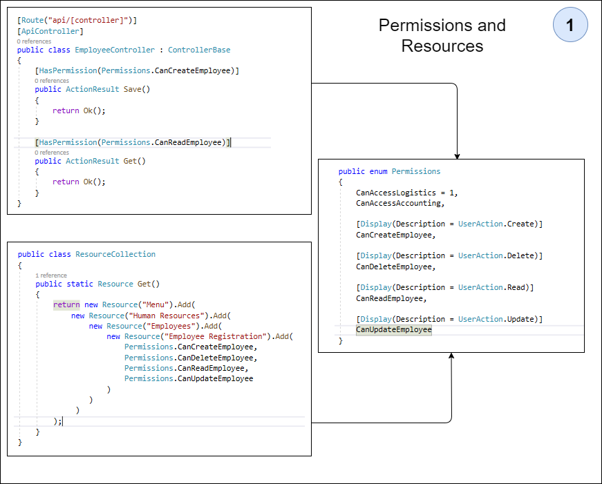

The **image 01** shown a class named [Permissions](./AspNetCoreIdentityLab.Api/DynamicAuthorization/Permissions.cs) that is used for enumerate the permissions that application should have. These permissions can be used on [controllers](./AspNetCoreIdentityLab.Api/Controllers/EmployeeController.cs) to enable authorization. It's important to observe that [HasPermission](./AspNetCoreIdentityLab.Api/DynamicAuthorization/HasPermissionAttribute.cs) attribute should be used. 

In addition each permission existing in Permissions represents a resource inside [ResourceCollection](./AspNetCoreIdentityLab.Api/DynamicAuthorization/ResourceCollection.cs) class. More details are shown in [Resource class structure](#resource-class-structure) section.

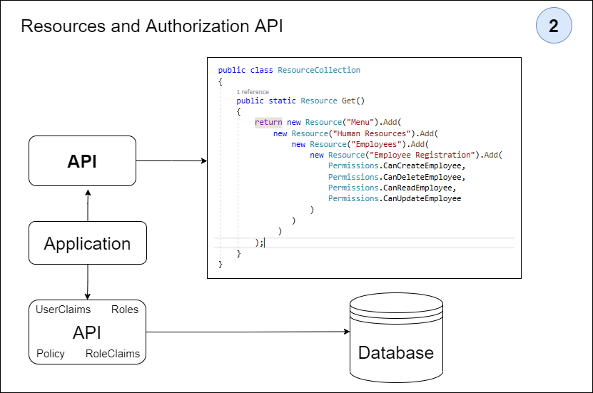

The **image 02** shown a process that transforms the data from ResourceCollection class in authorizations that are stored in database tables of ASP.NET Core Identity. The [ResourceController](./AspNetCoreIdentityLab.Api/Controllers/ResourceController.cs) class mounts a json response that can be used by the application for list the features that can be authorized to a specific user or to a specific role.

The json response has the resources and policies for application. So, the admin user should associate other users with resources or roles. The controllers below can be used to store the data:

* [PolicyController](./AspNetCoreIdentityLab.Api/Controllers/PolicyController.cs): should be used to save policies;
* [RoleController](./AspNetCoreIdentityLab.Api/Controllers/RoleController.cs): should be used to save roles;
* [RoleClaimsController](./AspNetCoreIdentityLab.Api/Controllers/RoleClaimsController.cs): should be used to save the claims for a specific role;
* [UserClaimsController](./AspNetCoreIdentityLab.Api/Controllers/UserClaimsController.cs): should be used to save the claims for a specific user.

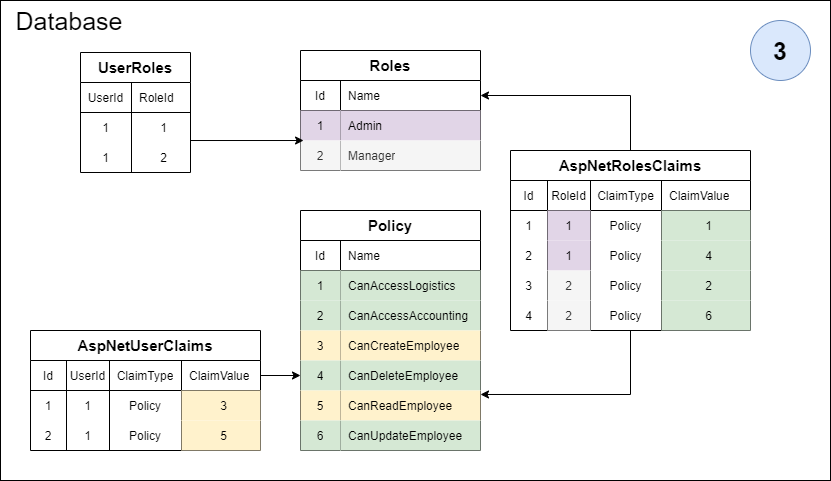

The **image 03** presents how to authorization structure data is organized. More details on [Policy database structure](#policy-database-structure) section. However in a few lines the Roles can be understood like user groups and these roles can have policies associated. As the same, individual authorizations can be stored in a user claims with the own policies.

### Resource class structure

We know that no-trivial software demands a set of many nested menu and features. It's not hard to see enterprise applications with hundred of features. In general that organization is made in modules, submodules and your features. And that's not all, sometimes is necessary authorize different actions on the same feature like: Create, Delete, Read and Update.

Below is a small example of a enterprise application with modules, sub-modules, resources and their actions:

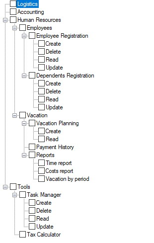

The big question is: **How to model this structure in a classes design?** and more **How to connect this structure with the authorization mechanism?**

Following is shown a basic class diagram that presents a structure of resources. These resources can be modules, submodules and features of an application or API resources that needs to be authorized.

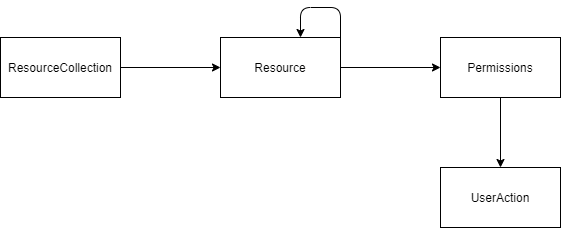

The principal class is named [Resource](./AspNetCoreIdentityLab.Api/DynamicAuthorization/Resource.cs). This class can to represent a feature, module or submodules including an API resource if needed. A list of resources and [Permissions](./AspNetCoreIdentityLab.Api/DynamicAuthorization/Permissions.cs) can be added to a specific resource.

The [Permissions](./AspNetCoreIdentityLab.Api/DynamicAuthorization/Permissions.cs) class represents the permissions that are used on controllers. This class uses the [UserAction](./AspNetCoreIdentityLab.Api/DynamicAuthorization/UserAction.cs) class that has some constants used with `Display Attribute`. 

[ResourceCollection](./AspNetCoreIdentityLab.Api/DynamicAuthorization/ResourceCollection.cs) is a class that represents the hierarchy of nested resources. This should be used to set up options for relating features to Roles, Users and the user menu. Below is shown a code based on image presented at the beginning of the session.

``` C#
public class ResourceCollection
{
    public static Resource Get()
    {
         return new Resource("Menu").Add(
                new Resource("Logistics", Permissions.CanAccessLogistics),
                new Resource("Accounting", Permissions.CanAccessAccounting),
                new Resource("Human Resources").Add(
                    new Resource("Employees").Add(
                        new Resource("Employee Registration").Add(
                            Permissions.CanCreateEmployee,
                            Permissions.CanDeleteEmployee,
                            Permissions.CanReadEmployee,
                            Permissions.CanUpdateEmployee
                        ),
                        new Resource("Dependents Registration").Add(
                            Permissions.CanCreateDependents,
                            Permissions.CanDeleteDependents,
                            Permissions.CanReadDependents,
                            Permissions.CanUpdateDependents
                        )
                    ),
                    new Resource("Vacation").Add(
                        new Resource("Vacation Planning").Add(
                            Permissions.CanCreateVacationPlanning,
                            Permissions.CanReadVacationPlanning
                        ),
                        new Resource("Payment History", Permissions.CanAccessPaymentHistory),
                        new Resource("Reports").Add(
                            new Resource("Time Report", Permissions.CanAccessTimeReport),
                            new Resource("Costs Report", Permissions.CanAccessCostsReport),
                            new Resource("Vacation by Period", Permissions.CanAccessVacationByPeriod)
                        )
                    )
                )
            );
    }
}
```

### Policy database structure

Has been shown that each `Permission` of enum [Permissions](./AspNetCoreIdentityLab.Api/DynamicAuthorization/Permissions.cs) is used with the [HasPermission](./AspNetCoreIdentityLab.Api/DynamicAuthorization/HasPermissionAttribute.cs) attribute in controllers that needs to be authorized.

These permissions represents policies that will be created dynamically at application runtime. After association of resources with Roles or Users the policies ids should be saved on database on tables `AspNetUserClaims` or `AspNetRoleClaims` using the fields named `ClaimValue`.

A table called `Policy` was created to store the policies. The Id field is based on enumerator index of Permissions class and the Name field on item description of enumerator. The image below shown the relationship between the Policy table and the tables with claims.


It is important to say that the **foreign keys between the tables have not been established**. The policy table is only for clarifying data on which policies are stored in other tables relating the Id field of the policy table to the ClaimValue field.

## Logging

To register a log the Asp Net Core logging API should be used. This is possible using the `ILogger` interface.

The code below shows how to create a ILogger instance with the dependence injection mechanism:

``` C#
public class AboutModel : PageModel
{
    private readonly ILogger _logger;

    public AboutModel(ILogger<AboutModel> logger)
    {
        _logger = logger;
    }
    public string Message { get; set; }

    public void OnGet()
    {
        Message = $"About page visited at {DateTime.UtcNow.ToLongTimeString()}";
        _logger.LogInformation(Message);
    }
}
```

In the [appsettings.json](./AspNetCoreIdentityLab.Application/appsettings.json) file is possible to configure the logging options. By default the logging is presented on **Output** tab on Visual Studio.

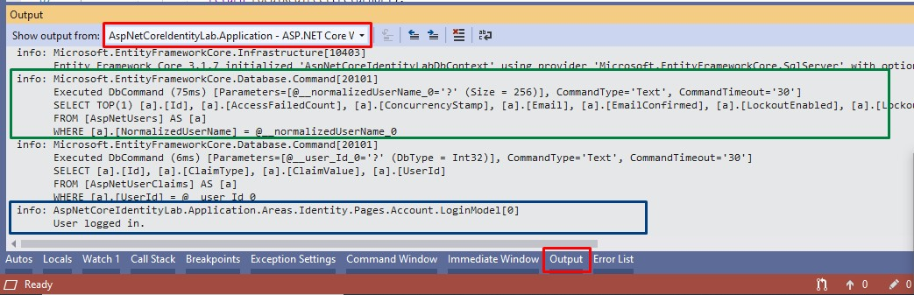

For more information please see the [documentation](https://docs.microsoft.com/en-us/aspnet/core/fundamentals/logging/?view=aspnetcore-3.1).

## References used

* [ASP.NET Core Authentication Official documentation](https://docs.microsoft.com/en-us/aspnet/core/security/authentication/?view=aspnetcore-3.1)

* [ASP.NET Core Authorization Official documentation](https://docs.microsoft.com/en-us/aspnet/core/security/authorization/introduction?view=aspnetcore-3.1)

* [Pluralsight - Authentication and Authorization in ASP.NET Core](https://www.pluralsight.com/courses/authentication-authorization-aspnet-core)

* [Pluralsight - ASP.NET Core Identity Deep Dive](https://www.pluralsight.com/courses/aspdotnet-core-identity-deep-dive)

* [Balta.io - Introdução ao ASP.NET Core Identity](https://balta.io/cursos/introducao-ao-aspnet-core-identity)

* [ASP.NET Core in Action book](https://livebook.manning.com/book/asp-net-core-in-action/about-this-book/)

* [John P Smith Blog - Authorization in ASP.NET Core](https://www.thereformedprogrammer.net/a-better-way-to-handle-authorization-in-asp-net-core/)

* [Chsakell's Blog - ASP.NET Core Identity Series](https://chsakell.com/2018/04/28/asp-net-core-identity-series-getting-started/)

* [Youtube - ASP.NET Core Identity tutorial](https://www.youtube.com/playlist?list=PLuIbNTr1XSlY8YmCyCfB4LCfkf4cl133b)

## Authors

* **Stenio Nobres** - [Github](https://github.com/stenionobres) | [LinkedIn](https://www.linkedin.com/in/stenionobres/)